# Adblock Compiler — System Architecture

> A comprehensive breakdown of the **adblock-compiler** system: modules, sub-modules, services, data flow, and deployment targets.

---

## Table of Contents

1. [High-Level Overview](#high-level-overview)
2. [System Context Diagram](#system-context-diagram)
3. [Core Compilation Pipeline](#core-compilation-pipeline)
4. [Module Map](#module-map)
5. [Detailed Module Breakdown](#detailed-module-breakdown)
   - [Compiler (`src/compiler/`)](#compiler-srccompiler)
   - [Platform Abstraction (`src/platform/`)](#platform-abstraction-srcplatform)
   - [Transformations (`src/transformations/`)](#transformations-srctransformations)
   - [Downloader (`src/downloader/`)](#downloader-srcdownloader)
   - [Configuration & Validation (`src/configuration/`, `src/config/`)](#configuration--validation)
   - [Storage (`src/storage/`)](#storage-srcstorage)
   - [Services (`src/services/`)](#services-srcservices)
   - [Queue (`src/queue/`)](#queue-srcqueue)
   - [Diagnostics & Tracing (`src/diagnostics/`)](#diagnostics--tracing-srcdiagnostics)
   - [Filters (`src/filters/`)](#filters-srcfilters)
   - [Formatters (`src/formatters/`)](#formatters-srcformatters)
   - [Diff (`src/diff/`)](#diff-srcdiff)
   - [Plugins (`src/plugins/`)](#plugins-srcplugins)
   - [Utilities (`src/utils/`)](#utilities-srcutils)
   - [CLI (`src/cli/`)](#cli-srccli)
   - [Deployment (`src/deployment/`)](#deployment-srcdeployment)
6. [Cloudflare Worker (`worker/`)](#cloudflare-worker-worker)
7. [Web UI (`public/`)](#web-ui-public)
8. [Cross-Cutting Concerns](#cross-cutting-concerns)
9. [Data Flow Diagrams](#data-flow-diagrams)
10. [Deployment Architecture](#deployment-architecture)
11. [Technology Stack](#technology-stack)

---

## High-Level Overview

The **adblock-compiler** is a *compiler-as-a-service* for adblock filter lists. It downloads filter list sources from remote URLs or local files, applies a configurable pipeline of transformations, and produces optimized, deduplicated output. It runs in three modes:

| Mode | Runtime | Entry Point |
|------|---------|-------------|
| **CLI** | Deno | `src/cli.ts` / `src/cli/CliApp.deno.ts` |
| **Library** | Deno / Node.js | `src/index.ts` (JSR: `@jk-com/adblock-compiler`) |
| **Edge API** | Cloudflare Workers | `worker/worker.ts` |

---

## System Context Diagram

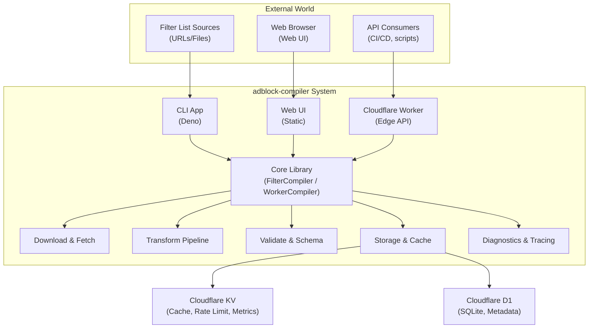

---

## Core Compilation Pipeline

Every compilation—CLI, library, or API—follows this pipeline:

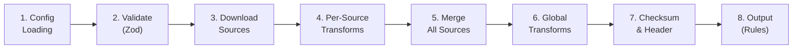

### Step-by-Step

| Step | Component | Description |
|------|-----------|-------------|
| 1 | `ConfigurationLoader` / API body | Load JSON configuration with source URLs and options |
| 2 | `ConfigurationValidator` (Zod) | Validate against `ConfigurationSchema` |
| 3 | `FilterDownloader` / `PlatformDownloader` | Fetch source content via HTTP, file system, or pre-fetched cache |
| 4 | `SourceCompiler` + `TransformationPipeline` | Apply per-source transformations (e.g., remove comments, validate) |
| 5 | `FilterCompiler` / `WorkerCompiler` | Merge rules from all sources, apply exclusions/inclusions |
| 6 | `TransformationPipeline` | Apply global transformations (e.g., deduplicate, compress) |
| 7 | `HeaderGenerator` + `checksum` util | Generate metadata header, compute checksum |
| 8 | `OutputWriter` / HTTP response / SSE stream | Write to file, return JSON, or stream via SSE |

---

## Module Map

```
src/
├── index.ts                    # Library entry point (all public exports)
├── version.ts                  # Canonical VERSION constant
├── cli.ts / cli.deno.ts        # CLI entry points
│
├── compiler/                   # 🔧 Core compilation orchestration
│   ├── FilterCompiler.ts       #    Main compiler (file system access)
│   ├── SourceCompiler.ts       #    Per-source compilation
│   ├── IncrementalCompiler.ts  #    Incremental (delta) compilation
│   ├── HeaderGenerator.ts      #    Filter list header generation
│   └── index.ts
│
├── platform/                   # 🌐 Platform abstraction layer
│   ├── WorkerCompiler.ts       #    Edge/Worker compiler (no FS)
│   ├── HttpFetcher.ts          #    HTTP content fetcher
│   ├── PreFetchedContentFetcher.ts  # In-memory content provider
│   ├── CompositeFetcher.ts     #    Chain-of-responsibility fetcher
│   ├── PlatformDownloader.ts   #    Platform-agnostic downloader
│   ├── types.ts                #    IContentFetcher interface
│   └── index.ts
│
├── transformations/            # ⚙️ Rule transformation pipeline
│   ├── base/Transformation.ts  #    Abstract base classes
│   ├── TransformationRegistry.ts  # Registry + Pipeline
│   ├── CompressTransformation.ts
│   ├── DeduplicateTransformation.ts
│   ├── ValidateTransformation.ts
│   ├── RemoveCommentsTransformation.ts
│   ├── RemoveModifiersTransformation.ts
│   ├── ConvertToAsciiTransformation.ts
│   ├── InvertAllowTransformation.ts
│   ├── TrimLinesTransformation.ts
│   ├── RemoveEmptyLinesTransformation.ts
│   ├── InsertFinalNewLineTransformation.ts
│   ├── ExcludeTransformation.ts
│   ├── IncludeTransformation.ts
│   ├── ConflictDetectionTransformation.ts
│   ├── RuleOptimizerTransformation.ts
│   ├── TransformationHooks.ts
│   └── index.ts
│
├── downloader/                 # 📥 Filter list downloading
│   ├── FilterDownloader.ts     #    Deno-native downloader with retries
│   ├── ContentFetcher.ts       #    File system + HTTP abstraction
│   ├── PreprocessorEvaluator.ts  # !#if / !#include directives
│   ├── ConditionalEvaluator.ts #    Boolean expression evaluator
│   └── index.ts
│
├── configuration/              # ✅ Configuration validation
│   ├── ConfigurationValidator.ts  # Zod-based validator
│   ├── schemas.ts              #    Zod schemas for all request types
│   └── index.ts
│
├── config/                     # ⚡ Centralized constants & defaults
│   └── defaults.ts             #    NETWORK, WORKER, STORAGE defaults
│
├── storage/                    # 💾 Persistence & caching
│   ├── IStorageAdapter.ts      #    Abstract storage interface
│   ├── PrismaStorageAdapter.ts #    Prisma ORM adapter (SQLite default)
│   ├── D1StorageAdapter.ts     #    Cloudflare D1 adapter
│   ├── CachingDownloader.ts    #    Intelligent caching downloader
│   ├── ChangeDetector.ts       #    Content change detection
│   ├── SourceHealthMonitor.ts  #    Source health tracking
│   └── types.ts                #    StorageEntry, CacheEntry, etc.
│
├── services/                   # 🛠️ Business logic services
│   ├── FilterService.ts        #    Filter wildcard preparation
│   ├── ASTViewerService.ts     #    Rule AST parsing & display
│   ├── AnalyticsService.ts     #    Cloudflare Analytics Engine
│   └── index.ts
│
├── queue/                      # 📬 Async job queue
│   ├── IQueueProvider.ts       #    Abstract queue interface
│   ├── CloudflareQueueProvider.ts  # Cloudflare Queues impl
│   └── index.ts
│
├── diagnostics/                # 🔍 Observability & tracing
│   ├── DiagnosticsCollector.ts #    Event aggregation
│   ├── TracingContext.ts       #    Correlation & span management
│   ├── OpenTelemetryExporter.ts  # OTel bridge
│   ├── types.ts                #    DiagnosticEvent, TraceSeverity
│   └── index.ts
│
├── filters/                    # 🔍 Rule filtering
│   ├── RuleFilter.ts           #    Exclusion/inclusion pattern matching
│   └── index.ts
│
├── formatters/                 # 📄 Output formatting
│   ├── OutputFormatter.ts      #    Adblock, hosts, dnsmasq, etc.
│   └── index.ts
│
├── diff/                       # 📊 Diff reporting
│   ├── DiffReport.ts           #    Compilation diff generation
│   └── index.ts
│
├── plugins/                    # 🔌 Plugin system
│   ├── PluginSystem.ts         #    Plugin registry & loading
│   └── index.ts
│
├── deployment/                 # 🚀 Deployment tracking
│   └── version.ts              #    Deployment history & records
│
├── schemas/                    # 📋 JSON schemas
│   └── configuration.schema.json
│
├── types/                      # 📐 Core type definitions
│   ├── index.ts                #    IConfiguration, ISource, enums
│   ├── validation.ts           #    Validation-specific types
│   └── websocket.ts            #    WebSocket message types
│
├── utils/                      # 🧰 Shared utilities
│   ├── RuleUtils.ts            #    Rule parsing & classification
│   ├── StringUtils.ts          #    String manipulation
│   ├── TldUtils.ts             #    Top-level domain utilities
│   ├── Wildcard.ts             #    Glob/wildcard pattern matching
│   ├── CircuitBreaker.ts       #    Circuit breaker pattern
│   ├── AsyncRetry.ts           #    Retry with exponential backoff
│   ├── ErrorUtils.ts           #    Typed error hierarchy
│   ├── EventEmitter.ts         #    CompilerEventEmitter
│   ├── Benchmark.ts            #    Performance benchmarking
│   ├── BooleanExpressionParser.ts  # Boolean expression evaluation
│   ├── AGTreeParser.ts         #    AdGuard rule AST parser
│   ├── ErrorReporter.ts        #    Multi-target error reporting
│   ├── logger.ts               #    Logger, StructuredLogger
│   ├── checksum.ts             #    Filter list checksums
│   ├── headerFilter.ts         #    Header stripping utilities
│   └── PathUtils.ts            #    Safe path resolution
│
└── cli/                        # 💻 CLI application
    ├── CliApp.deno.ts          #    Main CLI app (Deno-specific)
    ├── ArgumentParser.ts       #    CLI argument parsing
    ├── ConfigurationLoader.ts  #    Config file loading
    ├── OutputWriter.ts         #    File output writing
    └── index.ts

worker/                         # ☁️ Cloudflare Worker
├── worker.ts                   #    Worker entry point
├── router.ts                   #    Modular request router
├── websocket.ts                #    WebSocket handler
├── html.ts                     #    Static HTML serving
├── schemas.ts                  #    API request validation
├── types.ts                    #    Env bindings, request/response types
├── tail.ts                     #    Tail worker (log consumer)
├── handlers/                   #    Route handlers
│   ├── compile.ts              #    Compilation endpoints
│   ├── metrics.ts              #    Metrics endpoints
│   ├── queue.ts                #    Queue management
│   └── admin.ts                #    Admin/D1 endpoints
├── middleware/                  #    Request middleware
│   └── index.ts                #    Rate limit, auth, size validation
├── workflows/                  #    Durable execution workflows
│   ├── CompilationWorkflow.ts
│   ├── BatchCompilationWorkflow.ts
│   ├── CacheWarmingWorkflow.ts
│   ├── HealthMonitoringWorkflow.ts
│   ├── WorkflowEvents.ts
│   └── types.ts
└── utils/                      #    Worker utilities
    ├── response.ts             #    JsonResponse helper
    └── errorReporter.ts        #    Worker error reporter
```

---

## Detailed Module Breakdown

### Compiler (`src/compiler/`)

The orchestration layer that drives the entire compilation process.

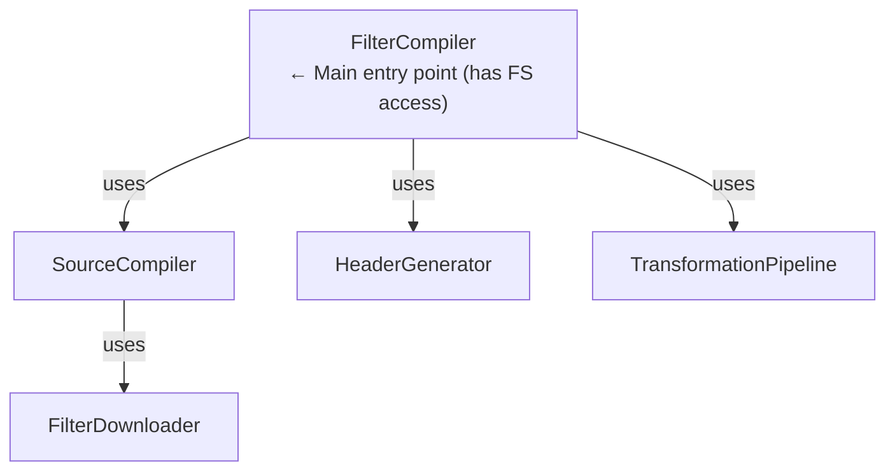

| Class | Responsibility |
|-------|---------------|
| **FilterCompiler** | Orchestrates full compilation: validation → download → transform → header → output. Has file system access via Deno. |
| **SourceCompiler** | Compiles a single source: downloads content, applies per-source transformations. |
| **IncrementalCompiler** | Wraps `FilterCompiler` with content-hash-based caching; only recompiles changed sources. Uses `ICacheStorage`. |
| **HeaderGenerator** | Generates metadata headers (title, description, version, timestamp, checksum placeholder). |

### Platform Abstraction (`src/platform/`)

Enables the compiler to run in environments **without file system access** (browsers, Cloudflare Workers, Deno Deploy).

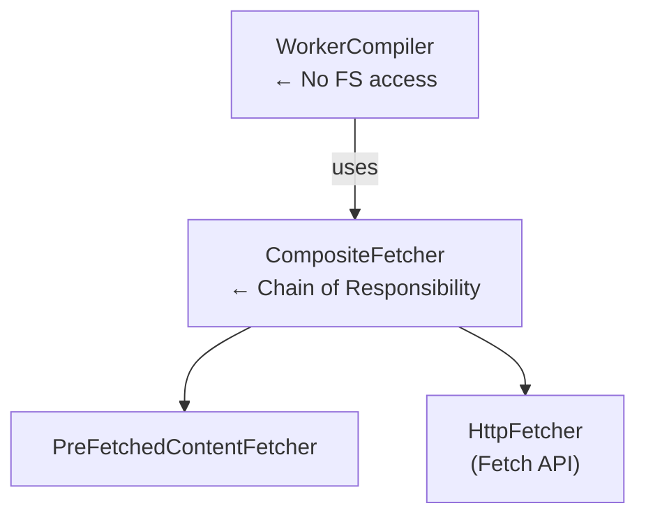

| Class | Responsibility |
|-------|---------------|
| **WorkerCompiler** | Edge-compatible compiler; delegates I/O to `IContentFetcher` chain. |
| **IContentFetcher** | Interface: `canHandle(source)` + `fetch(source)`. |
| **HttpFetcher** | Fetches via the standard `Fetch API`; works everywhere. |
| **PreFetchedContentFetcher** | Serves content from an in-memory map (for pre-fetched content from the worker). |
| **CompositeFetcher** | Tries fetchers in order; first match wins. |
| **PlatformDownloader** | Platform-agnostic downloader with preprocessor directive support. |

### Transformations (`src/transformations/`)

The transformation pipeline uses the **Strategy** and **Registry** patterns.

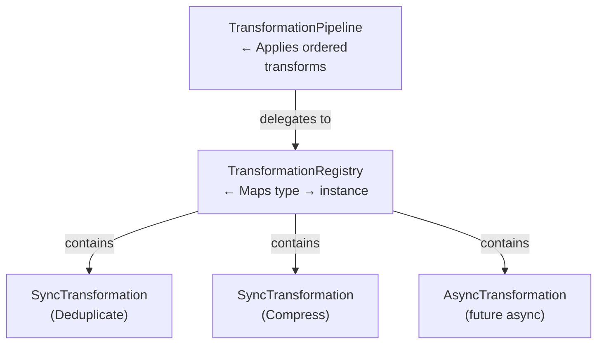

**Base Classes:**

| Class | Description |
|-------|-------------|
| `Transformation` | Abstract base; defines `execute(rules): Promise<string[]>` |
| `SyncTransformation` | For CPU-bound in-memory transforms; wraps sync method in `Promise.resolve()` |
| `AsyncTransformation` | For transforms needing I/O or external resources |

**Built-in Transformations:**

| Transformation | Type | Description |
|---------------|------|-------------|
| `RemoveComments` | Sync | Strips comment lines (`!`, `#`) |
| `Compress` | Sync | Converts hosts → adblock format, removes redundant rules |
| `RemoveModifiers` | Sync | Strips unsupported modifiers from rules |
| `Validate` | Sync | Validates rules for DNS-level blocking, removes IPs |
| `ValidateAllowIp` | Sync | Like Validate but keeps IP address rules |
| `Deduplicate` | Sync | Removes duplicate rules, preserves order |
| `InvertAllow` | Sync | Converts blocking rules to allow (exception) rules |
| `RemoveEmptyLines` | Sync | Strips blank lines |
| `TrimLines` | Sync | Removes leading/trailing whitespace |
| `InsertFinalNewLine` | Sync | Ensures output ends with newline |
| `ConvertToAscii` | Sync | Converts IDN/Unicode domains to punycode |
| `Exclude` | Sync | Applies exclusion patterns |
| `Include` | Sync | Applies inclusion patterns |
| `ConflictDetection` | Sync | Detects conflicting block/allow rules |
| `RuleOptimizer` | Sync | Optimizes and simplifies rules |

### Downloader (`src/downloader/`)

Handles fetching filter list content with preprocessor directive support.

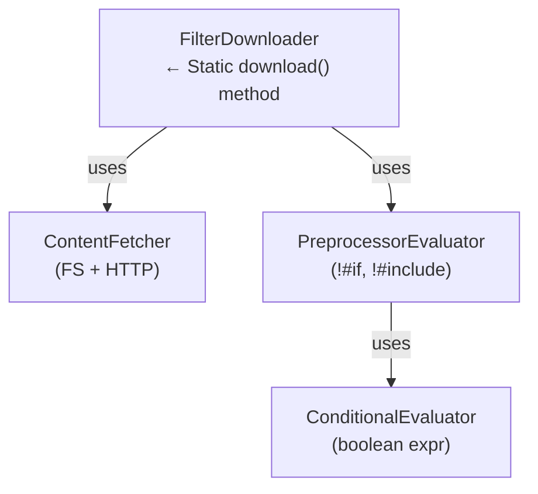

| Class | Responsibility |
|-------|---------------|
| **FilterDownloader** | Downloads from URLs or local files; supports retries, circuit breaker, exponential backoff. |
| **ContentFetcher** | Abstraction over `Deno.readTextFile` and `fetch()` with DI interfaces (`IFileSystem`, `IHttpClient`). |
| **PreprocessorEvaluator** | Processes `!#if`, `!#else`, `!#endif`, `!#include`, `!#safari_cb_affinity` directives. |
| **ConditionalEvaluator** | Evaluates boolean expressions with platform identifiers (e.g., `windows && !android`). |

### Configuration & Validation

**`src/configuration/`** — Runtime validation:

| Component | Description |
|-----------|-------------|
| `ConfigurationValidator` | Validates `IConfiguration` against Zod schemas; produces human-readable errors. |
| `schemas.ts` | Zod schemas for `IConfiguration`, `ISource`, `CompileRequest`, `BatchRequest`, HTTP options. |

**`src/config/`** — Centralized constants:

| Constant Group | Examples |
|---------------|----------|
| `NETWORK_DEFAULTS` | Timeout (30s), max retries (3), circuit breaker threshold (5) |
| `WORKER_DEFAULTS` | Rate limit (10 req/60s), cache TTL (1h), max batch size (10) |
| `STORAGE_DEFAULTS` | Cache TTL (1h), max memory entries (100) |
| `COMPILATION_DEFAULTS` | Default source type (`adblock`), max concurrent downloads (10) |
| `VALIDATION_DEFAULTS` | Max rule length (10K chars) |
| `PREPROCESSOR_DEFAULTS` | Max include depth (10) |

### Storage (`src/storage/`)

Pluggable persistence layer with multiple backends.

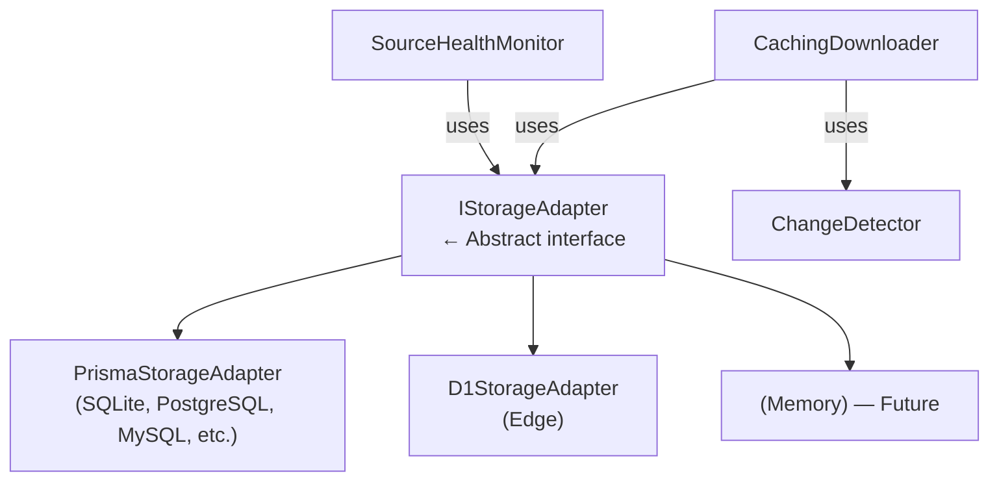

| Component | Description |
|-----------|-------------|
| **IStorageAdapter** | Interface with hierarchical key-value ops, TTL support, filter list caching, compilation history. |
| **PrismaStorageAdapter** | Prisma ORM backend: SQLite (default), PostgreSQL, MySQL, MongoDB, etc. |
| **D1StorageAdapter** | Cloudflare D1 (edge SQLite) backend. |
| **CachingDownloader** | Wraps any `IDownloader` with caching, change detection, and health monitoring. |
| **ChangeDetector** | Tracks content hashes to detect changes between compilations. |
| **SourceHealthMonitor** | Tracks fetch success/failure rates, latency, and health status per source. |

### Services (`src/services/`)

Higher-level business services.

| Service | Responsibility |
|---------|---------------|
| **FilterService** | Downloads exclusion/inclusion sources in parallel; prepares `Wildcard` patterns. |
| **ASTViewerService** | Parses adblock rules into structured AST using `@adguard/agtree`; provides category, type, syntax, properties. |
| **AnalyticsService** | Type-safe wrapper for Cloudflare Analytics Engine; tracks compilations, cache hits, rate limits, workflow events. |

### Queue (`src/queue/`)

Asynchronous job processing abstraction.

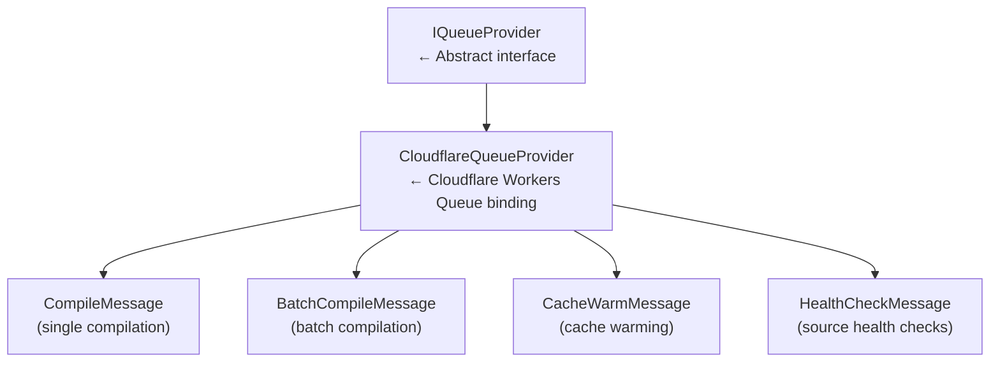

### Diagnostics & Tracing (`src/diagnostics/`)

End-to-end observability through the compilation pipeline.

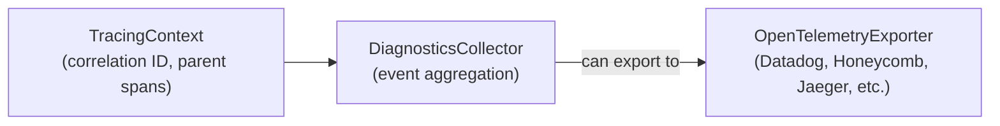

| Component | Description |
|-----------|-------------|
| **TracingContext** | Carries correlation ID, parent span, metadata through the pipeline. |
| **DiagnosticsCollector** | Records operation start/end, network events, cache events, performance metrics. |
| **OpenTelemetryExporter** | Bridges to OpenTelemetry's `Tracer` API for distributed tracing integration. |

### Filters (`src/filters/`)

| Component | Description |
|-----------|-------------|
| **RuleFilter** | Applies exclusion/inclusion wildcard patterns to rule sets. Partitions into plain strings (fast) vs. regex/wildcards (slower) for optimized matching. |

### Formatters (`src/formatters/`)

| Component | Description |
|-----------|-------------|
| **OutputFormatter** | Converts adblock rules to multiple output formats: adblock, hosts (`0.0.0.0`), dnsmasq, plain domain list. Extensible via `BaseFormatter`. |

### Diff (`src/diff/`)

| Component | Description |
|-----------|-------------|
| **DiffReport** | Generates rule-level and domain-level diff reports between two compilations. Outputs summary stats (added, removed, unchanged, % change). |

### Plugins (`src/plugins/`)

Extensibility system for custom transformations and downloaders.

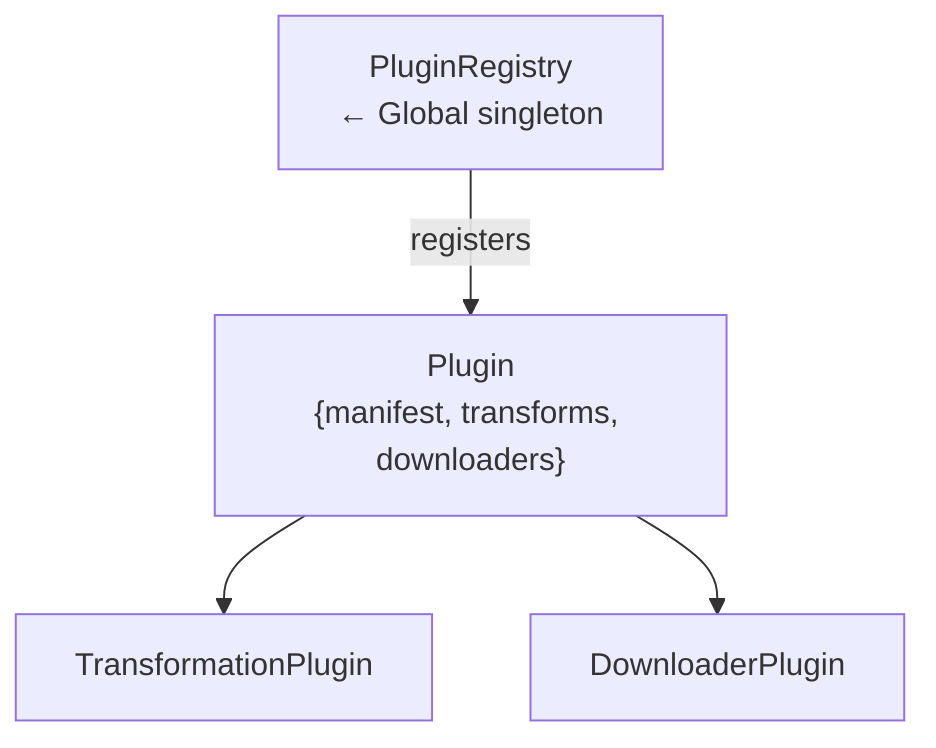

| Component | Description |
|-----------|-------------|
| **PluginRegistry** | Manages plugin lifecycle: load, init, register transformations, cleanup. |
| **Plugin** | Defines a manifest (name, version, author) + optional transformations and downloaders. |
| **PluginTransformationWrapper** | Wraps a `TransformationPlugin` function as a standard `Transformation` class. |

### Utilities (`src/utils/`)

Shared, reusable components used across all modules.

| Utility | Description |
|---------|-------------|
| **RuleUtils** | Rule classification: `isComment()`, `isAdblockRule()`, `isHostsRule()`, `parseAdblockRule()`, `parseHostsRule()`. |
| **StringUtils** | String manipulation: trimming, splitting, normalization. |
| **TldUtils** | TLD validation and extraction. |
| **Wildcard** | Glob-style pattern matching (`*`, `?`) compiled to regex. |
| **CircuitBreaker** | Three-state circuit breaker (Closed → Open → Half-Open) for fault tolerance. |
| **AsyncRetry** | Retry with exponential backoff and jitter. |
| **ErrorUtils** | Typed error hierarchy: `BaseError`, `CompilationError`, `NetworkError`, `SourceError`, `ValidationError`, `ConfigurationError`, `FileSystemError`. |
| **CompilerEventEmitter** | Type-safe event emission for compilation lifecycle. |
| **BenchmarkCollector** | Performance timing and phase tracking. |
| **BooleanExpressionParser** | Parses `!#if` condition expressions. |
| **AGTreeParser** | Wraps `@adguard/agtree` for rule AST parsing. |
| **ErrorReporter** | Multi-target error reporting (console, Cloudflare, Sentry, composite). |
| **Logger** / **StructuredLogger** | Leveled logging with module-specific overrides and JSON output. |
| **checksum** | Filter list checksum computation. |
| **PathUtils** | Safe path resolution to prevent directory traversal. |

### CLI (`src/cli/`)

Command-line interface for local compilation.

| Component | Description |
|-----------|-------------|
| **CliApp** | Main CLI application; parses args, loads config, runs `FilterCompiler`, writes output. |
| **ArgumentParser** | Parses command-line flags (input, output, verbose, etc.). |
| **ConfigurationLoader** | Loads and parses JSON configuration files. |
| **OutputWriter** | Writes compiled rules to the file system. |

### Deployment (`src/deployment/`)

| Component | Description |
|-----------|-------------|
| **version.ts** | Tracks deployment history with records (version, build number, git commit, status) stored in D1. |

---

## Cloudflare Worker (`worker/`)

The edge deployment target that exposes the compiler as an HTTP/WebSocket API.

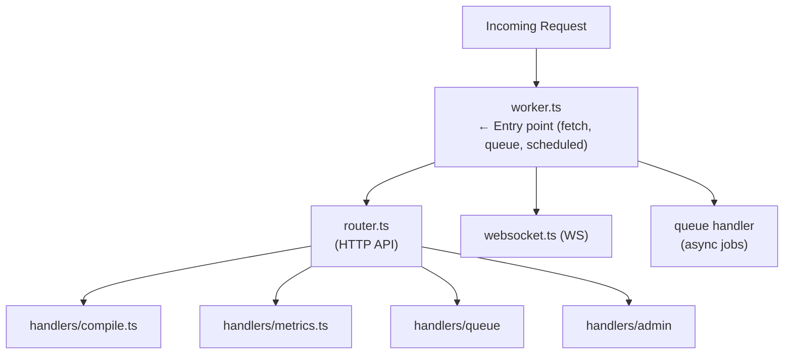

### API Endpoints

| Method | Path | Handler | Description |
|--------|------|---------|-------------|
| POST | `/api/compile` | `handleCompileJson` | Synchronous JSON compilation |
| POST | `/api/compile/stream` | `handleCompileStream` | SSE streaming compilation |
| POST | `/api/compile/async` | `handleCompileAsync` | Queue-based async compilation |
| POST | `/api/compile/batch` | `handleCompileBatch` | Batch sync compilation |
| POST | `/api/compile/batch/async` | `handleCompileBatchAsync` | Batch async compilation |
| POST | `/api/ast/parse` | `handleASTParseRequest` | Rule AST parsing |
| GET | `/api/version` | inline | Version info |
| GET | `/api/health` | inline | Health check |
| GET | `/api/metrics` | `handleMetrics` | Aggregated metrics |
| GET | `/api/queue/stats` | `handleQueueStats` | Queue statistics |
| GET | `/api/queue/results/:id` | `handleQueueResults` | Async job results |
| GET | `/ws` | `handleWebSocketUpgrade` | WebSocket compilation |

### Admin Endpoints (require `X-Admin-Key`)

| Method | Path | Handler |
|--------|------|---------|
| GET | `/api/admin/storage/stats` | D1 storage statistics |
| POST | `/api/admin/storage/query` | Raw SQL query |
| POST | `/api/admin/storage/clear-cache` | Clear cached data |
| POST | `/api/admin/storage/clear-expired` | Clean expired entries |
| GET | `/api/admin/storage/export` | Export all data |
| POST | `/api/admin/storage/vacuum` | Optimize database |
| GET | `/api/admin/storage/tables` | List D1 tables |

### Middleware Stack

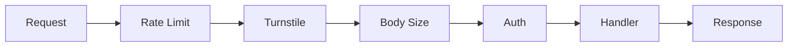

| Middleware | Description |
|-----------|-------------|
| `checkRateLimit` | KV-backed sliding window rate limiter (10 req/60s default) |
| `verifyTurnstileToken` | Cloudflare Turnstile CAPTCHA verification |
| `validateRequestSize` | Prevents DoS via oversized payloads (1MB default) |
| `verifyAdminAuth` | API key authentication for admin endpoints |

### Durable Workflows

Long-running, crash-resistant compilation pipelines using Cloudflare Workflows:

| Workflow | Description |
|----------|-------------|
| **CompilationWorkflow** | Full compilation with step-by-step checkpointing: validate → fetch → transform → header → cache. |
| **BatchCompilationWorkflow** | Processes multiple compilations with progress tracking. |
| **CacheWarmingWorkflow** | Pre-compiles popular configurations to warm the cache. |
| **HealthMonitoringWorkflow** | Periodically checks source availability and health. |

### Environment Bindings

| Binding | Type | Purpose |
|---------|------|---------|
| `COMPILATION_CACHE` | KV | Compiled rule caching |
| `RATE_LIMIT` | KV | Per-IP rate limit tracking |
| `METRICS` | KV | Endpoint metrics aggregation |
| `ADBLOCK_COMPILER_QUEUE` | Queue | Standard priority async jobs |
| `ADBLOCK_COMPILER_QUEUE_HIGH_PRIORITY` | Queue | High priority async jobs |
| `DB` | D1 | SQLite storage (admin, metadata) |
| `ANALYTICS_ENGINE` | Analytics Engine | Metrics & analytics |
| `ASSETS` | Fetcher | Static web UI assets |

---

## Web UI (`public/`)

Static HTML/JS/CSS frontend served from Cloudflare Workers or Pages.

| File | Description |
|------|-------------|
| `index.html` | Main landing page with documentation |
| `compiler.html` | Interactive compilation UI with SSE streaming |
| `admin-storage.html` | D1 storage administration dashboard |
| `test.html` | API testing interface |
| `validation-demo.html` | Configuration validation demo |
| `websocket-test.html` | WebSocket compilation testing |
| `e2e-tests.html` | End-to-end test runner |
| `js/theme.ts` | Dark/light theme toggle (ESM module) |
| `js/chart-setup.ts` | Chart.js configuration for metrics visualization |

---

## Cross-Cutting Concerns

### Error Handling

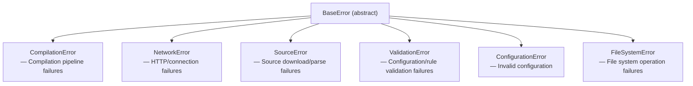

Each error carries: `code` (ErrorCode enum), `cause` (original error), `timestamp` (ISO string).

### Event System

The `ICompilerEvents` interface provides lifecycle hooks:

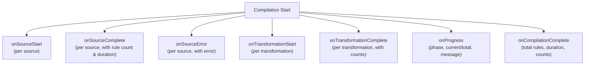

### Logging

Two logger implementations:

| Logger | Use Case |
|--------|----------|
| `Logger` | Console-based, leveled (trace → error), with optional prefix |
| `StructuredLogger` | JSON output for log aggregation (CloudWatch, Datadog, Splunk) |

Both implement `ILogger` (extends `IDetailedLogger`): `info()`, `warn()`, `error()`, `debug()`, `trace()`.

### Resilience Patterns

| Pattern | Implementation | Used By |
|---------|---------------|---------|
| Circuit Breaker | `CircuitBreaker.ts` (Closed → Open → Half-Open) | `FilterDownloader` |
| Retry with Backoff | `AsyncRetry.ts` (exponential + jitter) | `FilterDownloader` |
| Rate Limiting | KV-backed sliding window | Worker middleware |
| Request Deduplication | In-memory `Map<key, Promise>` | Worker compile handler |

---

## Data Flow Diagrams

### CLI Compilation Flow

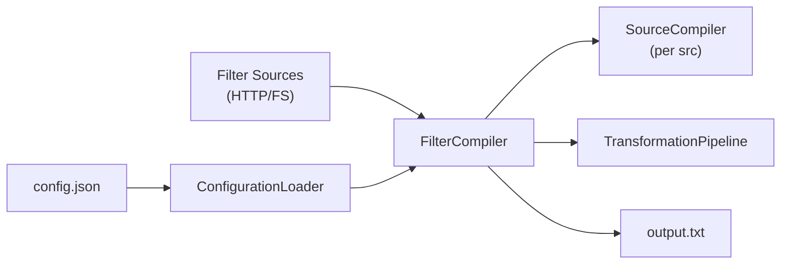

### Worker API Flow (SSE Streaming)

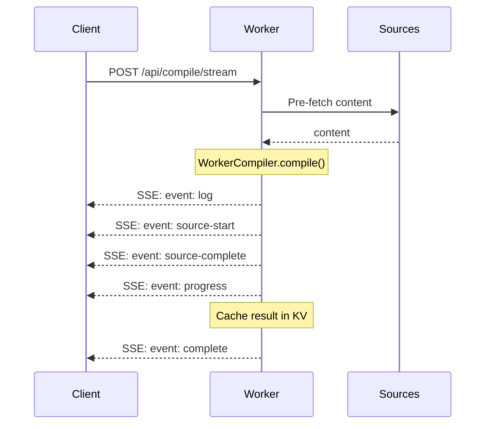

### Async Queue Flow

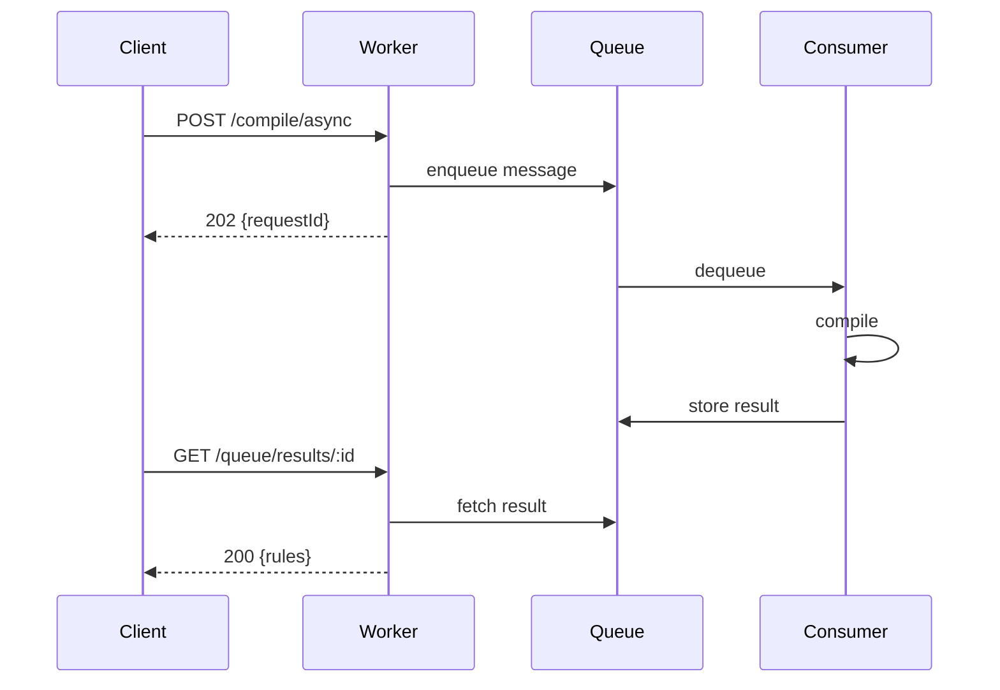

---

## Deployment Architecture

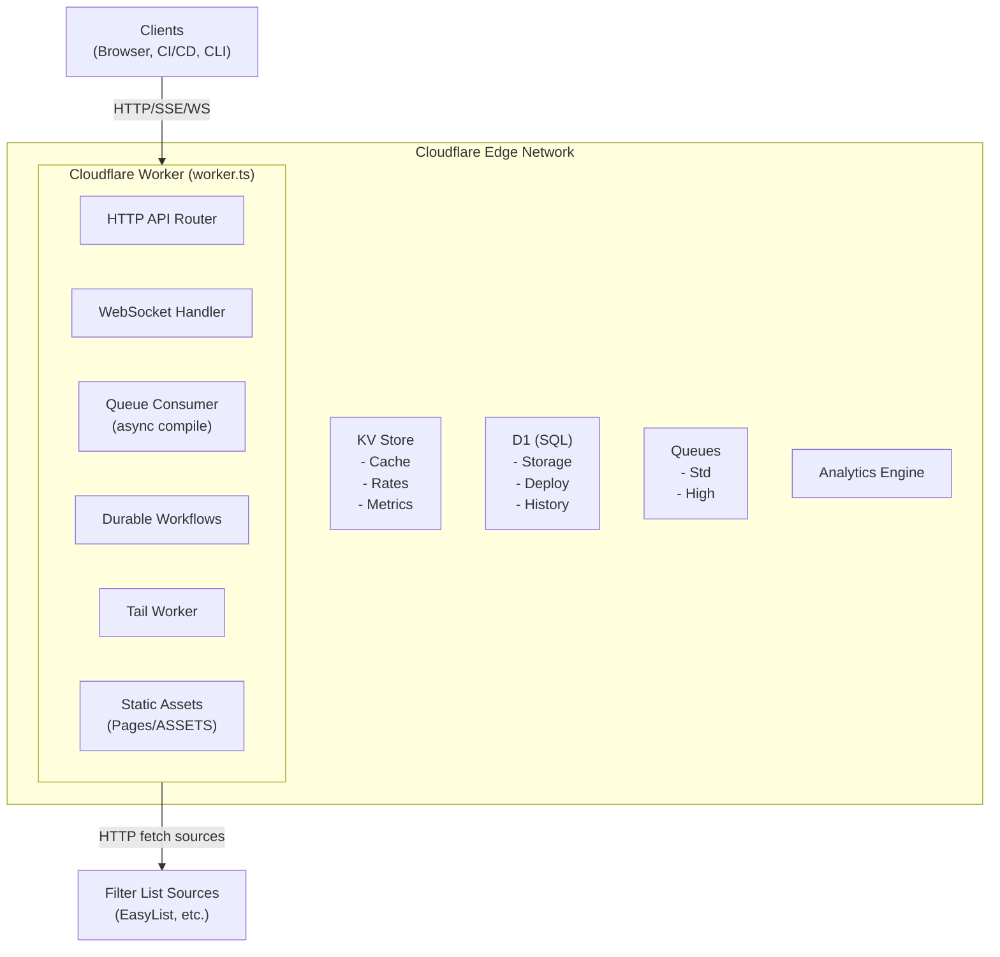

---

## Technology Stack

| Layer | Technology |
|-------|-----------|
| **Runtime** | Deno 2.6.7+ |
| **Language** | TypeScript (strict mode) |
| **Package Registry** | JSR (`@jk-com/adblock-compiler`) |
| **Edge Runtime** | Cloudflare Workers |
| **Validation** | Zod |
| **Rule Parsing** | `@adguard/agtree` |
| **ORM** | Prisma (optional, for local storage) |
| **Database** | SQLite (local), Cloudflare D1 (edge) |
| **Caching** | Cloudflare KV |
| **Queue** | Cloudflare Queues |
| **Analytics** | Cloudflare Analytics Engine |
| **Observability** | OpenTelemetry (optional), DiagnosticsCollector |
| **UI** | Static HTML + Tailwind CSS + Chart.js |
| **CI/CD** | GitHub Actions |
| **Containerization** | Docker + Docker Compose |
| **Formatting** | Deno built-in formatter |
| **Testing** | Deno built-in test framework + `@std/assert` |
