# Batch API Guide - Visual Learning Edition

> 📚 **A comprehensive visual guide to using the Batch Compilation API**

This guide provides detailed explanations and diagrams for working with batch compilations in the adblock-compiler API. Perfect for visual learners!

## Table of Contents

- [Overview](#overview)
- [Architecture Diagrams](#architecture-diagrams)
- [Batch Types](#batch-types)
- [API Endpoints](#api-endpoints)
- [Request/Response Flow](#requestresponse-flow)
- [Code Examples](#code-examples)
- [Best Practices](#best-practices)
- [Troubleshooting](#troubleshooting)

---

## Overview

The Batch API allows you to compile multiple filter lists in a single request. Behind the scenes, it uses **Cloudflare Queues** for reliable, scalable processing.

### Key Benefits

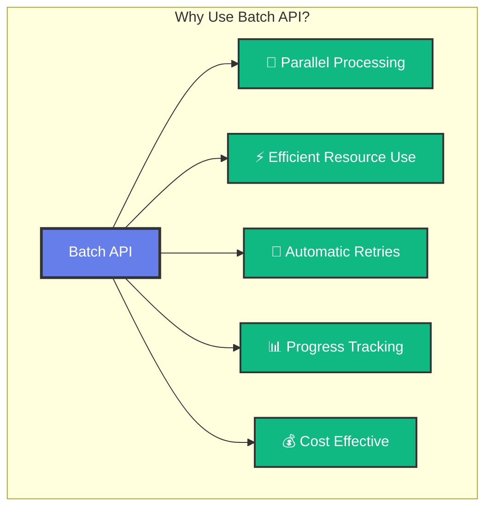
```mermaid
graph TB
    subgraph "Why Use Batch API?"
        A[Batch API] --> B[🚀 Parallel Processing]
        A --> C[⚡ Efficient Resource Use]
        A --> D[🔄 Automatic Retries]
        A --> E[📊 Progress Tracking]
        A --> F[💰 Cost Effective]
    end
    
    style A fill:#667eea,stroke:#333,stroke-width:3px,color:#fff
    style B fill:#10b981,stroke:#333,stroke-width:2px,color:#fff
    style C fill:#10b981,stroke:#333,stroke-width:2px,color:#fff
    style D fill:#10b981,stroke:#333,stroke-width:2px,color:#fff
    style E fill:#10b981,stroke:#333,stroke-width:2px,color:#fff
    style F fill:#10b981,stroke:#333,stroke-width:2px,color:#fff
```

---

## Architecture Diagrams

### High-Level System Architecture

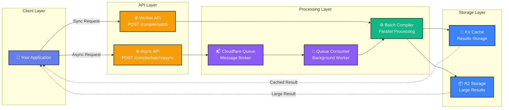
```mermaid
graph LR
    subgraph "Client Layer"
        Client[👤 Your Application]
    end
    
    subgraph "API Layer"
        API[🌐 Worker API<br/>POST /compile/batch]
        AAPI[🌐 Async API<br/>POST /compile/batch/async]
    end
    
    subgraph "Processing Layer"
        Compiler[⚙️ Batch Compiler<br/>Parallel Processing]
        Queue[📬 Cloudflare Queue<br/>Message Broker]
        Consumer[🔄 Queue Consumer<br/>Background Worker]
    end
    
    subgraph "Storage Layer"
        Cache[💾 KV Cache<br/>Results Storage]
        R2[📦 R2 Storage<br/>Large Results]
    end
    
    Client -->|Sync Request| API
    Client -->|Async Request| AAPI
    
    API --> Compiler
    AAPI --> Queue
    Queue --> Consumer
    Consumer --> Compiler
    
    Compiler --> Cache
    Compiler --> R2
    Cache -.->|Cached Result| Client
    R2 -.->|Large Result| Client
    
    style Client fill:#667eea,stroke:#333,stroke-width:2px,color:#fff
    style API fill:#f59e0b,stroke:#333,stroke-width:2px,color:#fff
    style AAPI fill:#f59e0b,stroke:#333,stroke-width:2px,color:#fff
    style Compiler fill:#10b981,stroke:#333,stroke-width:2px,color:#fff
    style Queue fill:#8b5cf6,stroke:#333,stroke-width:2px,color:#fff
    style Consumer fill:#8b5cf6,stroke:#333,stroke-width:2px,color:#fff
    style Cache fill:#3b82f6,stroke:#333,stroke-width:2px,color:#fff
    style R2 fill:#3b82f6,stroke:#333,stroke-width:2px,color:#fff
```

### Queue Processing Pipeline

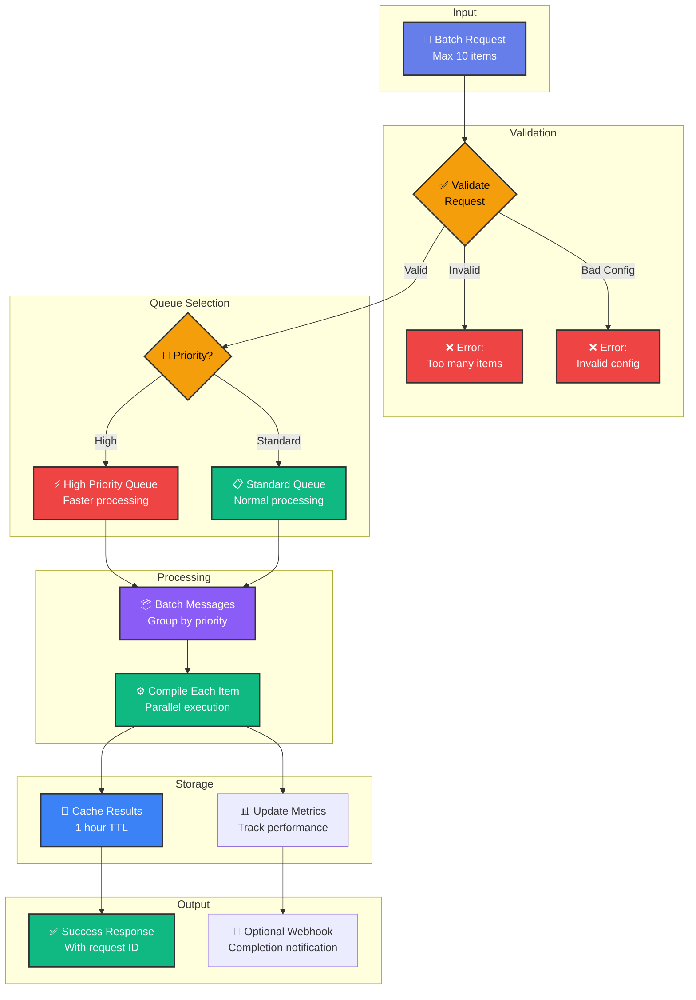
```mermaid
graph TB
    subgraph "Input"
        REQ[📝 Batch Request<br/>Max 10 items]
    end
    
    subgraph "Validation"
        VAL{✅ Validate<br/>Request}
        ERR1[❌ Error:<br/>Too many items]
        ERR2[❌ Error:<br/>Invalid config]
    end
    
    subgraph "Queue Selection"
        PRIORITY{🎯 Priority?}
        HPQ[⚡ High Priority Queue<br/>Faster processing]
        SPQ[📋 Standard Queue<br/>Normal processing]
    end
    
    subgraph "Processing"
        BATCH[📦 Batch Messages<br/>Group by priority]
        PROCESS[⚙️ Compile Each Item<br/>Parallel execution]
    end
    
    subgraph "Storage"
        CACHE[💾 Cache Results<br/>1 hour TTL]
        METRICS[📊 Update Metrics<br/>Track performance]
    end
    
    subgraph "Output"
        RESPONSE[✅ Success Response<br/>With request ID]
        NOTIFY[🔔 Optional Webhook<br/>Completion notification]
    end
    
    REQ --> VAL
    VAL -->|Valid| PRIORITY
    VAL -->|Invalid| ERR1
    VAL -->|Bad Config| ERR2
    
    PRIORITY -->|High| HPQ
    PRIORITY -->|Standard| SPQ
    
    HPQ --> BATCH
    SPQ --> BATCH
    BATCH --> PROCESS
    PROCESS --> CACHE
    PROCESS --> METRICS
    CACHE --> RESPONSE
    METRICS --> NOTIFY
    
    style REQ fill:#667eea,stroke:#333,stroke-width:2px,color:#fff
    style VAL fill:#f59e0b,stroke:#333,stroke-width:2px,color:#000
    style PRIORITY fill:#f59e0b,stroke:#333,stroke-width:2px,color:#000
    style HPQ fill:#ef4444,stroke:#333,stroke-width:2px,color:#fff
    style SPQ fill:#10b981,stroke:#333,stroke-width:2px,color:#fff
    style BATCH fill:#8b5cf6,stroke:#333,stroke-width:2px,color:#fff
    style PROCESS fill:#10b981,stroke:#333,stroke-width:2px,color:#fff
    style CACHE fill:#3b82f6,stroke:#333,stroke-width:2px,color:#fff
    style RESPONSE fill:#10b981,stroke:#333,stroke-width:2px,color:#fff
    style ERR1 fill:#ef4444,stroke:#333,stroke-width:2px,color:#fff
    style ERR2 fill:#ef4444,stroke:#333,stroke-width:2px,color:#fff
```

---

## Batch Types

### Synchronous vs Asynchronous Comparison


```mermaid
graph TB
    subgraph "Synchronous Batch"
        SYNC_REQ[📤 POST /compile/batch]
        SYNC_WAIT[⏳ Wait for completion<br/>Max 30 seconds]
        SYNC_RESP[📥 Immediate response<br/>With all results]
        
        SYNC_REQ --> SYNC_WAIT --> SYNC_RESP
    end
    
    subgraph "Asynchronous Batch"
        ASYNC_REQ[📤 POST /compile/batch/async]
        ASYNC_ACK[⚡ Immediate acknowledgment<br/>202 Accepted]
        ASYNC_QUEUE[📬 Background processing<br/>No time limit]
        ASYNC_CHECK[🔍 GET /queue/results/:id<br/>Check status]
        ASYNC_RESP[📥 Get results when ready]
        
        ASYNC_REQ --> ASYNC_ACK
        ASYNC_ACK --> ASYNC_QUEUE
        ASYNC_QUEUE --> ASYNC_CHECK
        ASYNC_CHECK --> ASYNC_RESP
    end
    
    style SYNC_REQ fill:#f59e0b,stroke:#333,stroke-width:2px,color:#fff
    style SYNC_WAIT fill:#ef4444,stroke:#333,stroke-width:2px,color:#fff
    style SYNC_RESP fill:#10b981,stroke:#333,stroke-width:2px,color:#fff
    style ASYNC_REQ fill:#f59e0b,stroke:#333,stroke-width:2px,color:#fff
    style ASYNC_ACK fill:#10b981,stroke:#333,stroke-width:2px,color:#fff
    style ASYNC_QUEUE fill:#8b5cf6,stroke:#333,stroke-width:2px,color:#fff
    style ASYNC_CHECK fill:#3b82f6,stroke:#333,stroke-width:2px,color:#fff
    style ASYNC_RESP fill:#10b981,stroke:#333,stroke-width:2px,color:#fff
```

### When to Use Each Type

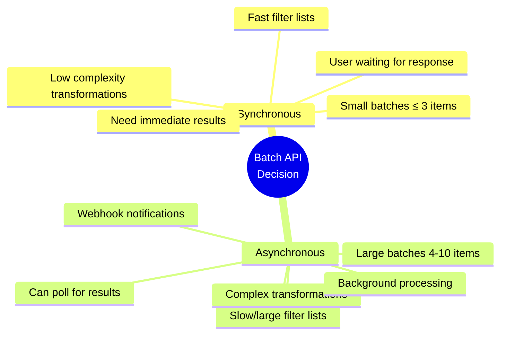
```mermaid
mindmap
    root((Batch API<br/>Decision))
        Synchronous
            Small batches ≤ 3 items
            Fast filter lists
            Need immediate results
            Low complexity transformations
            User waiting for response
        Asynchronous
            Large batches 4-10 items
            Slow/large filter lists
            Can poll for results
            Complex transformations
            Background processing
            Webhook notifications
```

---

## API Endpoints

### Endpoint Overview

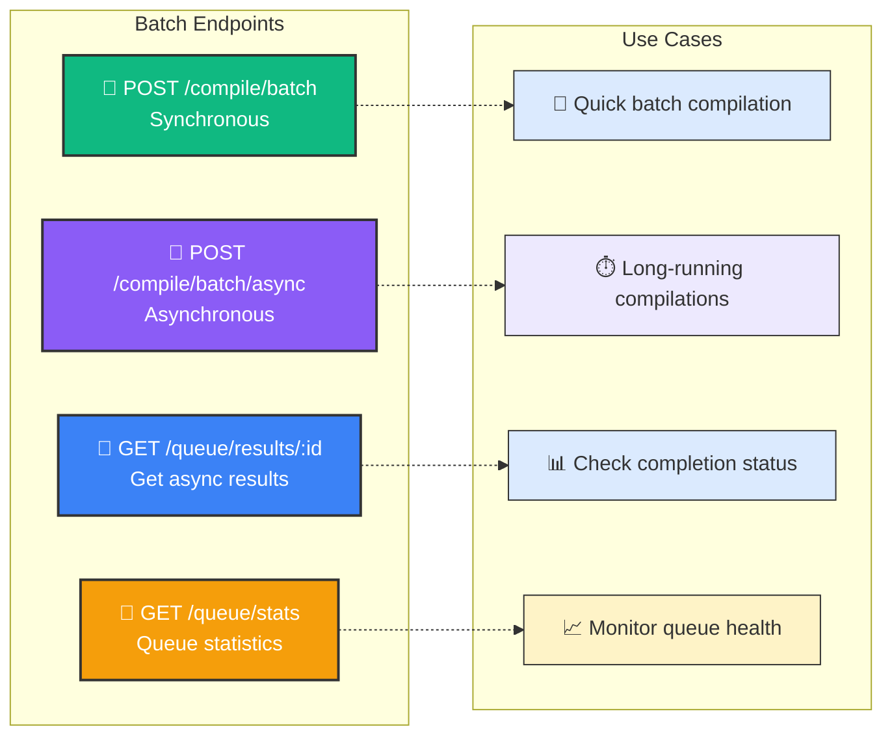
```mermaid
graph LR
    subgraph "Batch Endpoints"
        direction TB
        E1[📍 POST /compile/batch<br/>Synchronous]
        E2[📍 POST /compile/batch/async<br/>Asynchronous]
        E3[📍 GET /queue/results/:id<br/>Get async results]
        E4[📍 GET /queue/stats<br/>Queue statistics]
    end
    
    subgraph "Use Cases"
        direction TB
        U1[🎯 Quick batch compilation]
        U2[⏱️ Long-running compilations]
        U3[📊 Check completion status]
        U4[📈 Monitor queue health]
    end
    
    E1 -.-> U1
    E2 -.-> U2
    E3 -.-> U3
    E4 -.-> U4
    
    style E1 fill:#10b981,stroke:#333,stroke-width:2px,color:#fff
    style E2 fill:#8b5cf6,stroke:#333,stroke-width:2px,color:#fff
    style E3 fill:#3b82f6,stroke:#333,stroke-width:2px,color:#fff
    style E4 fill:#f59e0b,stroke:#333,stroke-width:2px,color:#fff
    style U1 fill:#dbeafe,stroke:#333,stroke-width:1px
    style U2 fill:#ede9fe,stroke:#333,stroke-width:1px
    style U3 fill:#dbeafe,stroke:#333,stroke-width:1px
    style U4 fill:#fef3c7,stroke:#333,stroke-width:1px
```

### Request Structure Diagram

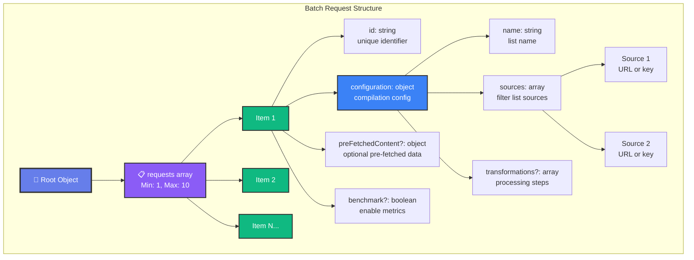
```mermaid
graph TB
    subgraph "Batch Request Structure"
        ROOT[🔷 Root Object]
        REQUESTS[📋 requests array<br/>Min: 1, Max: 10]
        
        ROOT --> REQUESTS
        
        REQUESTS --> ITEM1[Item 1]
        REQUESTS --> ITEM2[Item 2]
        REQUESTS --> ITEMN[Item N...]
        
        ITEM1 --> ID1[id: string<br/>unique identifier]
        ITEM1 --> CFG1[configuration: object<br/>compilation config]
        ITEM1 --> PRE1[preFetchedContent?: object<br/>optional pre-fetched data]
        ITEM1 --> BMK1[benchmark?: boolean<br/>enable metrics]
        
        CFG1 --> NAME[name: string<br/>list name]
        CFG1 --> SOURCES[sources: array<br/>filter list sources]
        CFG1 --> TRANS[transformations?: array<br/>processing steps]
        
        SOURCES --> SRC1[Source 1<br/>URL or key]
        SOURCES --> SRC2[Source 2<br/>URL or key]
    end
    
    style ROOT fill:#667eea,stroke:#333,stroke-width:3px,color:#fff
    style REQUESTS fill:#8b5cf6,stroke:#333,stroke-width:2px,color:#fff
    style ITEM1 fill:#10b981,stroke:#333,stroke-width:2px,color:#fff
    style ITEM2 fill:#10b981,stroke:#333,stroke-width:2px,color:#fff
    style ITEMN fill:#10b981,stroke:#333,stroke-width:2px,color:#fff
    style CFG1 fill:#3b82f6,stroke:#333,stroke-width:2px,color:#fff
```

---

## Request/Response Flow

### Synchronous Batch Flow (Detailed)

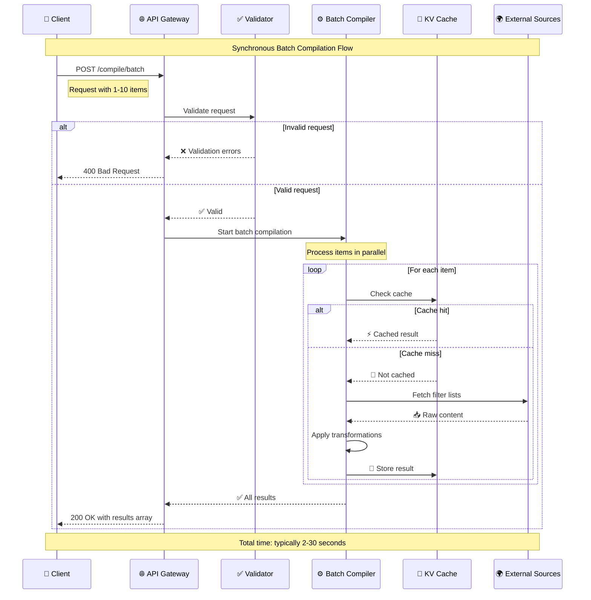
```mermaid
sequenceDiagram
    participant Client as 👤 Client
    participant API as 🌐 API Gateway
    participant Validator as ✅ Validator
    participant Compiler as ⚙️ Batch Compiler
    participant Cache as 💾 KV Cache
    participant Sources as 🌍 External Sources
    
    Note over Client,Sources: Synchronous Batch Compilation Flow
    
    Client->>API: POST /compile/batch
    Note right of Client: Request with 1-10 items
    
    API->>Validator: Validate request
    
    alt Invalid request
        Validator-->>API: ❌ Validation errors
        API-->>Client: 400 Bad Request
    else Valid request
        Validator-->>API: ✅ Valid
        
        API->>Compiler: Start batch compilation
        
        Note over Compiler: Process items in parallel
        
        loop For each item
            Compiler->>Cache: Check cache
            
            alt Cache hit
                Cache-->>Compiler: ⚡ Cached result
            else Cache miss
                Cache-->>Compiler: 🚫 Not cached
                
                Compiler->>Sources: Fetch filter lists
                Sources-->>Compiler: 📥 Raw content
                
                Compiler->>Compiler: Apply transformations
                Compiler->>Cache: 💾 Store result
            end
        end
        
        Compiler-->>API: ✅ All results
        API-->>Client: 200 OK with results array
    end
    
    Note over Client,Sources: Total time: typically 2-30 seconds
```

### Asynchronous Batch Flow (Detailed)

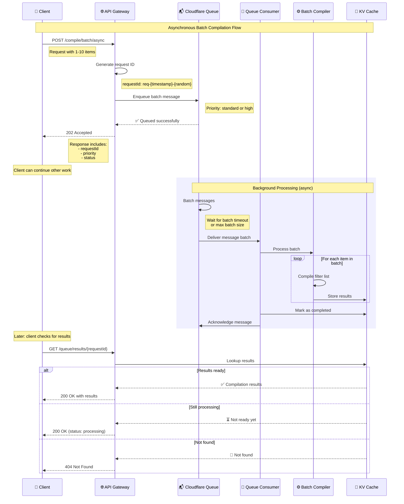
```mermaid
sequenceDiagram
    participant Client as 👤 Client
    participant API as 🌐 API Gateway
    participant Queue as 📬 Cloudflare Queue
    participant Worker as 🔄 Queue Consumer
    participant Compiler as ⚙️ Batch Compiler
    participant Cache as 💾 KV Cache
    
    Note over Client,Cache: Asynchronous Batch Compilation Flow
    
    Client->>API: POST /compile/batch/async
    Note right of Client: Request with 1-10 items
    
    API->>API: Generate request ID
    Note right of API: requestId: req-{timestamp}-{random}
    
    API->>Queue: Enqueue batch message
    Note right of Queue: Priority: standard or high
    
    Queue-->>API: ✅ Queued successfully
    API-->>Client: 202 Accepted
    Note left of API: Response includes:<br/>- requestId<br/>- priority<br/>- status
    
    Note over Client: Client can continue other work
    
    rect rgb(240, 240, 255)
        Note over Queue,Cache: Background Processing (async)
        
        Queue->>Queue: Batch messages
        Note right of Queue: Wait for batch timeout<br/>or max batch size
        
        Queue->>Worker: Deliver message batch
        
        Worker->>Compiler: Process batch
        
        loop For each item in batch
            Compiler->>Compiler: Compile filter list
            Compiler->>Cache: Store results
        end
        
        Worker->>Cache: Mark as completed
        Worker->>Queue: Acknowledge message
    end
    
    Note over Client: Later: client checks for results
    
    Client->>API: GET /queue/results/{requestId}
    API->>Cache: Lookup results
    
    alt Results ready
        Cache-->>API: ✅ Compilation results
        API-->>Client: 200 OK with results
    else Still processing
        Cache-->>API: ⏳ Not ready yet
        API-->>Client: 200 OK (status: processing)
    else Not found
        Cache-->>API: 🚫 Not found
        API-->>Client: 404 Not Found
    end
```

### Priority Queue Routing

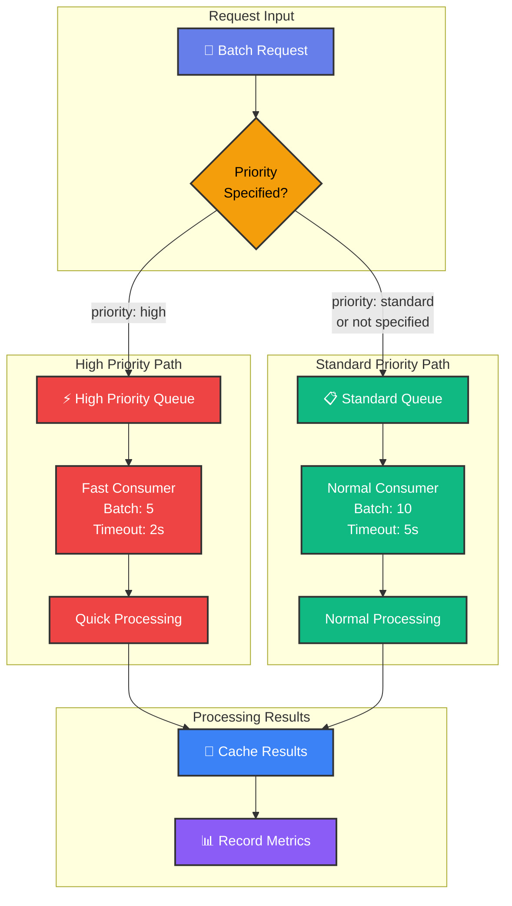
```mermaid
graph TB
    subgraph "Request Input"
        REQ[📨 Batch Request]
        PRIO{Priority<br/>Specified?}
    end
    
    subgraph "High Priority Path"
        HPQ[⚡ High Priority Queue]
        HPC[Fast Consumer<br/>Batch: 5<br/>Timeout: 2s]
        HPP[Quick Processing]
    end
    
    subgraph "Standard Priority Path"
        SPQ[📋 Standard Queue]
        SPC[Normal Consumer<br/>Batch: 10<br/>Timeout: 5s]
        SPP[Normal Processing]
    end
    
    subgraph "Processing Results"
        CACHE[💾 Cache Results]
        METRICS[📊 Record Metrics]
    end
    
    REQ --> PRIO
    PRIO -->|priority: high| HPQ
    PRIO -->|priority: standard<br/>or not specified| SPQ
    
    HPQ --> HPC
    HPC --> HPP
    
    SPQ --> SPC
    SPC --> SPP
    
    HPP --> CACHE
    SPP --> CACHE
    CACHE --> METRICS
    
    style REQ fill:#667eea,stroke:#333,stroke-width:2px,color:#fff
    style PRIO fill:#f59e0b,stroke:#333,stroke-width:2px,color:#000
    style HPQ fill:#ef4444,stroke:#333,stroke-width:2px,color:#fff
    style HPC fill:#ef4444,stroke:#333,stroke-width:2px,color:#fff
    style HPP fill:#ef4444,stroke:#333,stroke-width:2px,color:#fff
    style SPQ fill:#10b981,stroke:#333,stroke-width:2px,color:#fff
    style SPC fill:#10b981,stroke:#333,stroke-width:2px,color:#fff
    style SPP fill:#10b981,stroke:#333,stroke-width:2px,color:#fff
    style CACHE fill:#3b82f6,stroke:#333,stroke-width:2px,color:#fff
    style METRICS fill:#8b5cf6,stroke:#333,stroke-width:2px,color:#fff
```

---

## Code Examples

### Example 1: Simple Synchronous Batch

**Scenario:** Compile 3 filter lists and get immediate results

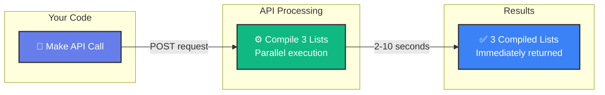
```mermaid
graph LR
    subgraph "Your Code"
        CODE[📝 Make API Call]
    end
    
    subgraph "API Processing"
        PROC[⚙️ Compile 3 Lists<br/>Parallel execution]
    end
    
    subgraph "Results"
        RES[✅ 3 Compiled Lists<br/>Immediately returned]
    end
    
    CODE -->|POST request| PROC
    PROC -->|2-10 seconds| RES
    
    style CODE fill:#667eea,stroke:#333,stroke-width:2px,color:#fff
    style PROC fill:#10b981,stroke:#333,stroke-width:2px,color:#fff
    style RES fill:#3b82f6,stroke:#333,stroke-width:2px,color:#fff
```

```javascript
// JavaScript/TypeScript example
const batchRequest = {
    requests: [
        {
            id: 'adguard-dns',
            configuration: {
                name: 'AdGuard DNS Filter',
                sources: [
                    {
                        source: 'https://adguardteam.github.io/AdGuardSDNSFilter/Filters/filter.txt',
                        transformations: ['RemoveComments', 'Validate']
                    }
                ],
                transformations: ['Deduplicate', 'RemoveEmptyLines']
            },
            benchmark: true
        },
        {
            id: 'easylist',
            configuration: {
                name: 'EasyList',
                sources: [
                    {
                        source: 'https://easylist.to/easylist/easylist.txt',
                        transformations: ['RemoveComments', 'Compress']
                    }
                ],
                transformations: ['Deduplicate']
            }
        },
        {
            id: 'custom-rules',
            configuration: {
                name: 'Custom Rules',
                sources: [
                    { source: 'my-custom-rules' }
                ]
            },
            preFetchedContent: {
                'my-custom-rules': '||ads.example.com^\n||tracking.example.com^'
            }
        }
    ]
};

// Send synchronous batch request
const response = await fetch('https://adblock-compiler.jayson-knight.workers.dev/compile/batch', {
    method: 'POST',
    headers: {
        'Content-Type': 'application/json'
    },
    body: JSON.stringify(batchRequest)
});

const results = await response.json();

// Process results
console.log('Batch compilation complete!');
results.results.forEach(result => {
    console.log(`${result.id}: ${result.ruleCount} rules`);
    console.log(`Compilation time: ${result.metrics?.totalDurationMs}ms`);
});
```

**Expected Response:**

```json
{
    "success": true,
    "results": [
        {
            "id": "adguard-dns",
            "success": true,
            "rules": ["||ads.com^", "||tracker.net^", "..."],
            "ruleCount": 45234,
            "metrics": {
                "totalDurationMs": 2341,
                "sourceCount": 1,
                "transformationMetrics": [...]
            },
            "compiledAt": "2026-01-14T07:30:15.123Z"
        },
        {
            "id": "easylist",
            "success": true,
            "rules": ["||ad.example.com^", "..."],
            "ruleCount": 67891,
            "metrics": {
                "totalDurationMs": 3567
            },
            "compiledAt": "2026-01-14T07:30:16.234Z"
        },
        {
            "id": "custom-rules",
            "success": true,
            "rules": ["||ads.example.com^", "||tracking.example.com^"],
            "ruleCount": 2,
            "metrics": {
                "totalDurationMs": 45
            },
            "compiledAt": "2026-01-14T07:30:15.456Z"
        }
    ]
}
```

### Example 2: Asynchronous Batch with Polling

**Scenario:** Queue 10 large filter lists for background processing

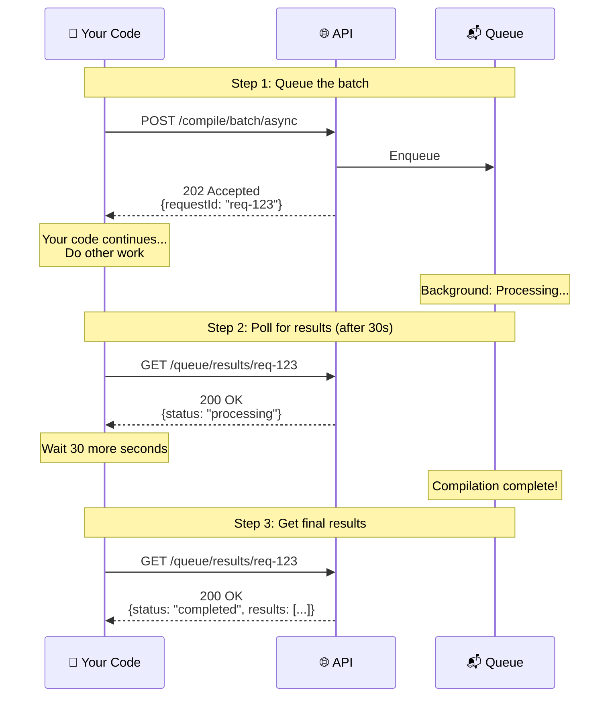
```mermaid
sequenceDiagram
    participant Code as 📝 Your Code
    participant API as 🌐 API
    participant Queue as 📬 Queue
    
    Note over Code,Queue: Step 1: Queue the batch
    Code->>API: POST /compile/batch/async
    API->>Queue: Enqueue
    API-->>Code: 202 Accepted<br/>{requestId: "req-123"}
    
    Note over Code: Your code continues...<br/>Do other work
    
    Note over Queue: Background: Processing...
    
    Note over Code,Queue: Step 2: Poll for results (after 30s)
    Code->>API: GET /queue/results/req-123
    API-->>Code: 200 OK<br/>{status: "processing"}
    
    Note over Code: Wait 30 more seconds
    
    Note over Queue: Compilation complete!
    
    Note over Code,Queue: Step 3: Get final results
    Code->>API: GET /queue/results/req-123
    API-->>Code: 200 OK<br/>{status: "completed", results: [...]}
```

```javascript
// JavaScript/TypeScript example with async/await
async function compileBatchAsync() {
    // Step 1: Queue the batch
    const batchRequest = {
        requests: [
            // ... 10 compilation requests
            { id: 'list-1', configuration: { /* ... */ } },
            { id: 'list-2', configuration: { /* ... */ } },
            { id: 'list-3', configuration: { /* ... */ } },
            // ... up to list-10
        ]
    };
    
    const queueResponse = await fetch(
        'https://adblock-compiler.jayson-knight.workers.dev/compile/batch/async',
        {
            method: 'POST',
            headers: { 'Content-Type': 'application/json' },
            body: JSON.stringify(batchRequest)
        }
    );
    
    const queueData = await queueResponse.json();
    console.log('Batch queued:', queueData.requestId);
    
    // Step 2: Poll for results
    const requestId = queueData.requestId;
    let results = null;
    let attempts = 0;
    const maxAttempts = 10;
    
    while (!results && attempts < maxAttempts) {
        // Wait 30 seconds between polls
        await new Promise(resolve => setTimeout(resolve, 30000));
        
        const statusResponse = await fetch(
            `https://adblock-compiler.jayson-knight.workers.dev/queue/results/${requestId}`
        );
        
        const statusData = await statusResponse.json();
        
        if (statusData.status === 'completed') {
            results = statusData.results;
            console.log('Batch complete! Got results for', results.length, 'items');
        } else if (statusData.status === 'failed') {
            throw new Error('Batch compilation failed: ' + statusData.error);
        } else {
            console.log('Still processing... attempt', ++attempts);
        }
    }
    
    if (!results) {
        throw new Error('Timeout waiting for results');
    }
    
    return results;
}

// Usage
try {
    const results = await compileBatchAsync();
    results.forEach(result => {
        console.log(`${result.id}: ${result.ruleCount} rules`);
    });
} catch (error) {
    console.error('Batch compilation error:', error);
}
```

### Example 3: Python with Requests Library

```python
import requests
import time
from typing import List, Dict

BASE_URL = 'https://adblock-compiler.jayson-knight.workers.dev'

def compile_batch_async(requests_data: List[Dict]) -> List[Dict]:
    """
    Compile multiple filter lists asynchronously
    
    Args:
        requests_data: List of compilation requests (max 10)
    
    Returns:
        List of compilation results
    """
    
    # Step 1: Queue the batch
    response = requests.post(
        f'{BASE_URL}/compile/batch/async',
        json={'requests': requests_data}
    )
    response.raise_for_status()
    
    queue_data = response.json()
    request_id = queue_data['requestId']
    print(f'📬 Batch queued: {request_id}')
    print(f'⚡ Priority: {queue_data["priority"]}')
    
    # Step 2: Poll for results
    max_attempts = 20
    poll_interval = 30  # seconds
    
    for attempt in range(max_attempts):
        print(f'⏳ Checking status (attempt {attempt + 1}/{max_attempts})...')
        
        response = requests.get(f'{BASE_URL}/queue/results/{request_id}')
        response.raise_for_status()
        
        data = response.json()
        
        if data.get('status') == 'completed':
            print('✅ Batch compilation complete!')
            return data['results']
        elif data.get('status') == 'failed':
            raise Exception(f'Batch failed: {data.get("error")}')
        else:
            if attempt < max_attempts - 1:
                print(f'⌛ Still processing, waiting {poll_interval} seconds...')
                time.sleep(poll_interval)
    
    raise TimeoutError('Timeout waiting for batch completion')


# Example usage
if __name__ == '__main__':
    batch_requests = [
        {
            'id': 'adguard',
            'configuration': {
                'name': 'AdGuard DNS',
                'sources': [
                    {
                        'source': 'https://adguardteam.github.io/AdGuardSDNSFilter/Filters/filter.txt'
                    }
                ],
                'transformations': ['Deduplicate', 'RemoveEmptyLines']
            },
            'benchmark': True
        },
        {
            'id': 'easylist',
            'configuration': {
                'name': 'EasyList',
                'sources': [
                    {
                        'source': 'https://easylist.to/easylist/easylist.txt'
                    }
                ],
                'transformations': ['Deduplicate']
            }
        }
    ]
    
    try:
        results = compile_batch_async(batch_requests)
        
        print('\n📊 Results Summary:')
        for result in results:
            print(f"  {result['id']}: {result['ruleCount']} rules")
            print(f"    Time: {result['metrics']['totalDurationMs']}ms")
    
    except Exception as e:
        print(f'❌ Error: {e}')
```

### Example 4: cURL Commands

```bash
# Example: Synchronous batch compilation
curl -X POST https://adblock-compiler.jayson-knight.workers.dev/compile/batch \
  -H "Content-Type: application/json" \
  -d '{
    "requests": [
      {
        "id": "test-1",
        "configuration": {
          "name": "Test List 1",
          "sources": [
            {
              "source": "my-rules-1"
            }
          ]
        },
        "preFetchedContent": {
          "my-rules-1": "||ads.com^\n||tracker.net^"
        }
      },
      {
        "id": "test-2",
        "configuration": {
          "name": "Test List 2",
          "sources": [
            {
              "source": "my-rules-2"
            }
          ]
        },
        "preFetchedContent": {
          "my-rules-2": "||spam.org^\n||malware.biz^"
        }
      }
    ]
  }'
```

```bash
# Example: Asynchronous batch compilation

# Step 1: Queue the batch
curl -X POST https://adblock-compiler.jayson-knight.workers.dev/compile/batch/async \
  -H "Content-Type: application/json" \
  -d '{
    "requests": [
      {
        "id": "large-list-1",
        "configuration": {
          "name": "Large Filter List",
          "sources": [
            {
              "source": "https://example.com/large-list.txt"
            }
          ],
          "transformations": ["Deduplicate", "Compress"]
        }
      }
    ]
  }'

# Response will include a requestId, e.g.:
# {
#   "success": true,
#   "requestId": "req-1704931200000-abc123",
#   "priority": "standard"
# }

# Step 2: Check status (wait 30 seconds, then run this)
curl https://adblock-compiler.jayson-knight.workers.dev/queue/results/req-1704931200000-abc123

# If still processing, you'll get:
# {
#   "success": true,
#   "status": "processing"
# }

# When complete, you'll get full results:
# {
#   "success": true,
#   "status": "completed",
#   "results": [...]
# }
```

---

## Best Practices

### Batch Size Optimization

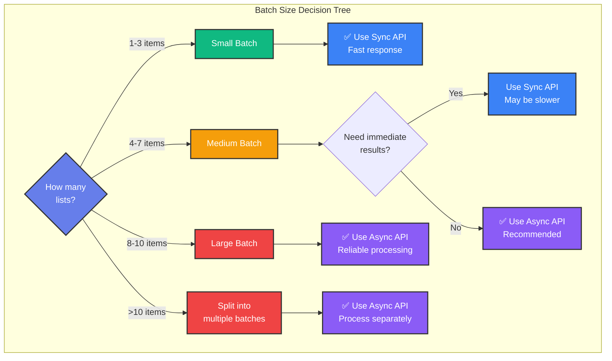
```mermaid
graph TB
    subgraph "Batch Size Decision Tree"
        START{How many<br/>lists?}
        
        START -->|1-3 items| SMALL[Small Batch]
        START -->|4-7 items| MEDIUM[Medium Batch]
        START -->|8-10 items| LARGE[Large Batch]
        START -->|>10 items| SPLIT[Split into<br/>multiple batches]
        
        SMALL --> SYNC1[✅ Use Sync API<br/>Fast response]
        MEDIUM --> CHOICE{Need immediate<br/>results?}
        LARGE --> ASYNC1[✅ Use Async API<br/>Reliable processing]
        SPLIT --> ASYNC2[✅ Use Async API<br/>Process separately]
        
        CHOICE -->|Yes| SYNC2[Use Sync API<br/>May be slower]
        CHOICE -->|No| ASYNC3[✅ Use Async API<br/>Recommended]
    end
    
    style START fill:#667eea,stroke:#333,stroke-width:2px,color:#fff
    style SMALL fill:#10b981,stroke:#333,stroke-width:2px,color:#fff
    style MEDIUM fill:#f59e0b,stroke:#333,stroke-width:2px,color:#fff
    style LARGE fill:#ef4444,stroke:#333,stroke-width:2px,color:#fff
    style SPLIT fill:#ef4444,stroke:#333,stroke-width:2px,color:#fff
    style SYNC1 fill:#3b82f6,stroke:#333,stroke-width:2px,color:#fff
    style SYNC2 fill:#3b82f6,stroke:#333,stroke-width:2px,color:#fff
    style ASYNC1 fill:#8b5cf6,stroke:#333,stroke-width:2px,color:#fff
    style ASYNC2 fill:#8b5cf6,stroke:#333,stroke-width:2px,color:#fff
    style ASYNC3 fill:#8b5cf6,stroke:#333,stroke-width:2px,color:#fff
```

### Error Handling Strategy

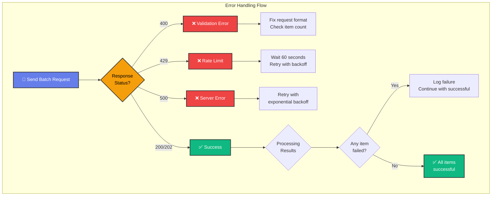
```mermaid
graph TB
    subgraph "Error Handling Flow"
        REQ[📨 Send Batch Request]
        
        REQ --> CHECK{Response<br/>Status?}
        
        CHECK -->|400| VAL_ERR[❌ Validation Error]
        CHECK -->|429| RATE_ERR[❌ Rate Limit]
        CHECK -->|500| SRV_ERR[❌ Server Error]
        CHECK -->|200/202| SUCCESS[✅ Success]
        
        VAL_ERR --> FIX1[Fix request format<br/>Check item count]
        RATE_ERR --> WAIT1[Wait 60 seconds<br/>Retry with backoff]
        SRV_ERR --> RETRY1[Retry with<br/>exponential backoff]
        
        SUCCESS --> PROCESS{Processing<br/>Results}
        
        PROCESS --> ITEM_ERR{Any item<br/>failed?}
        ITEM_ERR -->|Yes| LOG[Log failure<br/>Continue with successful]
        ITEM_ERR -->|No| DONE[✅ All items<br/>successful]
    end
    
    style REQ fill:#667eea,stroke:#333,stroke-width:2px,color:#fff
    style CHECK fill:#f59e0b,stroke:#333,stroke-width:2px,color:#000
    style VAL_ERR fill:#ef4444,stroke:#333,stroke-width:2px,color:#fff
    style RATE_ERR fill:#ef4444,stroke:#333,stroke-width:2px,color:#fff
    style SRV_ERR fill:#ef4444,stroke:#333,stroke-width:2px,color:#fff
    style SUCCESS fill:#10b981,stroke:#333,stroke-width:2px,color:#fff
    style DONE fill:#10b981,stroke:#333,stroke-width:2px,color:#fff
```

### Caching Strategy

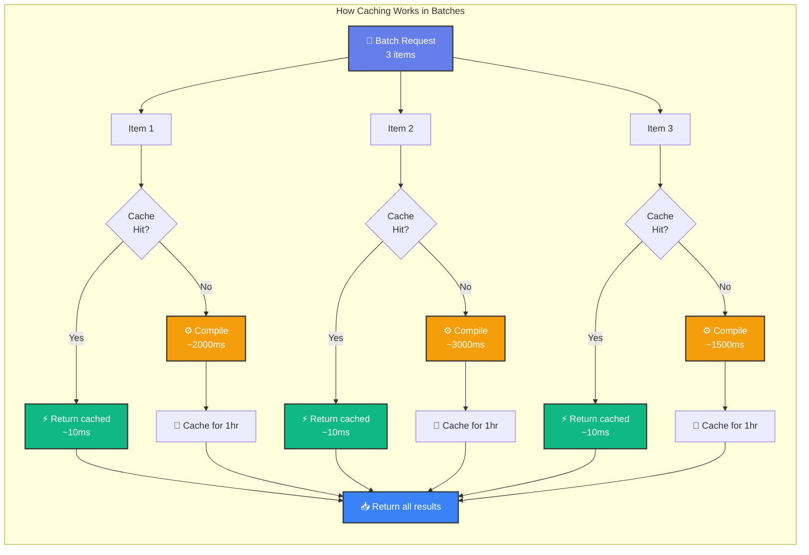
```mermaid
graph LR
    subgraph "How Caching Works in Batches"
        REQ[📨 Batch Request<br/>3 items]
        
        REQ --> ITEM1[Item 1]
        REQ --> ITEM2[Item 2]
        REQ --> ITEM3[Item 3]
        
        ITEM1 --> CACHE1{Cache<br/>Hit?}
        ITEM2 --> CACHE2{Cache<br/>Hit?}
        ITEM3 --> CACHE3{Cache<br/>Hit?}
        
        CACHE1 -->|Yes| HIT1[⚡ Return cached<br/>~10ms]
        CACHE1 -->|No| COMPILE1[⚙️ Compile<br/>~2000ms]
        
        CACHE2 -->|Yes| HIT2[⚡ Return cached<br/>~10ms]
        CACHE2 -->|No| COMPILE2[⚙️ Compile<br/>~3000ms]
        
        CACHE3 -->|Yes| HIT3[⚡ Return cached<br/>~10ms]
        CACHE3 -->|No| COMPILE3[⚙️ Compile<br/>~1500ms]
        
        HIT1 --> RESULT
        COMPILE1 --> STORE1[💾 Cache for 1hr]
        STORE1 --> RESULT
        
        HIT2 --> RESULT
        COMPILE2 --> STORE2[💾 Cache for 1hr]
        STORE2 --> RESULT
        
        HIT3 --> RESULT
        COMPILE3 --> STORE3[💾 Cache for 1hr]
        STORE3 --> RESULT[📥 Return all results]
    end
    
    style REQ fill:#667eea,stroke:#333,stroke-width:2px,color:#fff
    style HIT1 fill:#10b981,stroke:#333,stroke-width:2px,color:#fff
    style HIT2 fill:#10b981,stroke:#333,stroke-width:2px,color:#fff
    style HIT3 fill:#10b981,stroke:#333,stroke-width:2px,color:#fff
    style COMPILE1 fill:#f59e0b,stroke:#333,stroke-width:2px,color:#fff
    style COMPILE2 fill:#f59e0b,stroke:#333,stroke-width:2px,color:#fff
    style COMPILE3 fill:#f59e0b,stroke:#333,stroke-width:2px,color:#fff
    style RESULT fill:#3b82f6,stroke:#333,stroke-width:2px,color:#fff
```

### Performance Tips

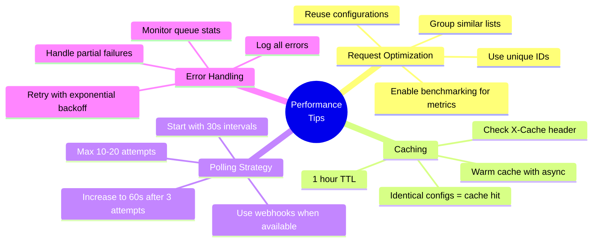
```mermaid
mindmap
    root((Performance<br/>Tips))
        Request Optimization
            Use unique IDs
            Group similar lists
            Enable benchmarking for metrics
            Reuse configurations
        Caching
            Identical configs = cache hit
            1 hour TTL
            Check X-Cache header
            Warm cache with async
        Polling Strategy
            Start with 30s intervals
            Increase to 60s after 3 attempts
            Max 10-20 attempts
            Use webhooks when available
        Error Handling
            Retry with exponential backoff
            Handle partial failures
            Log all errors
            Monitor queue stats
```

---

## Troubleshooting

### Common Issues and Solutions

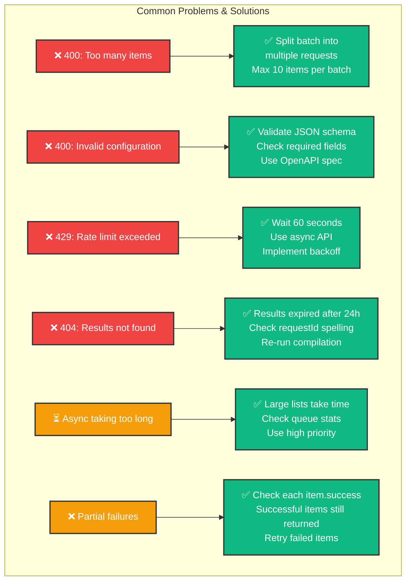
```mermaid
graph TB
    subgraph "Common Problems & Solutions"
        P1[❌ 400: Too many items]
        P2[❌ 400: Invalid configuration]
        P3[❌ 429: Rate limit exceeded]
        P4[❌ 404: Results not found]
        P5[⏳ Async taking too long]
        P6[❌ Partial failures]
        
        P1 --> S1[✅ Split batch into<br/>multiple requests<br/>Max 10 items per batch]
        P2 --> S2[✅ Validate JSON schema<br/>Check required fields<br/>Use OpenAPI spec]
        P3 --> S3[✅ Wait 60 seconds<br/>Use async API<br/>Implement backoff]
        P4 --> S4[✅ Results expired after 24h<br/>Check requestId spelling<br/>Re-run compilation]
        P5 --> S5[✅ Large lists take time<br/>Check queue stats<br/>Use high priority]
        P6 --> S6[✅ Check each item.success<br/>Successful items still returned<br/>Retry failed items]
    end
    
    style P1 fill:#ef4444,stroke:#333,stroke-width:2px,color:#fff
    style P2 fill:#ef4444,stroke:#333,stroke-width:2px,color:#fff
    style P3 fill:#ef4444,stroke:#333,stroke-width:2px,color:#fff
    style P4 fill:#ef4444,stroke:#333,stroke-width:2px,color:#fff
    style P5 fill:#f59e0b,stroke:#333,stroke-width:2px,color:#fff
    style P6 fill:#f59e0b,stroke:#333,stroke-width:2px,color:#fff
    style S1 fill:#10b981,stroke:#333,stroke-width:2px,color:#fff
    style S2 fill:#10b981,stroke:#333,stroke-width:2px,color:#fff
    style S3 fill:#10b981,stroke:#333,stroke-width:2px,color:#fff
    style S4 fill:#10b981,stroke:#333,stroke-width:2px,color:#fff
    style S5 fill:#10b981,stroke:#333,stroke-width:2px,color:#fff
    style S6 fill:#10b981,stroke:#333,stroke-width:2px,color:#fff
```

### Debugging Workflow

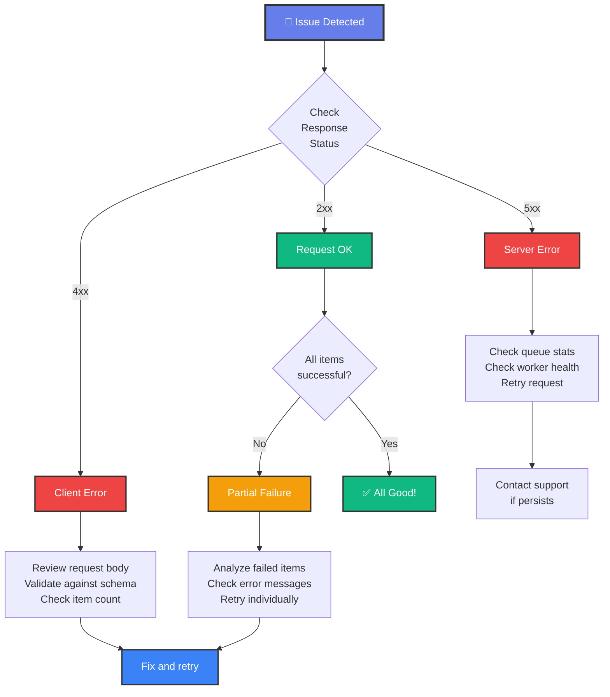
```mermaid
graph TB
    START[🐛 Issue Detected]
    
    START --> STEP1{Check<br/>Response<br/>Status}
    
    STEP1 -->|4xx| CLIENT[Client Error]
    STEP1 -->|5xx| SERVER[Server Error]
    STEP1 -->|2xx| SUCCESS[Request OK]
    
    CLIENT --> CHECK_REQ[Review request body<br/>Validate against schema<br/>Check item count]
    SERVER --> CHECK_STATUS[Check queue stats<br/>Check worker health<br/>Retry request]
    SUCCESS --> CHECK_RESULTS{All items<br/>successful?}
    
    CHECK_RESULTS -->|No| PARTIAL[Partial Failure]
    CHECK_RESULTS -->|Yes| GOOD[✅ All Good!]
    
    PARTIAL --> ANALYZE[Analyze failed items<br/>Check error messages<br/>Retry individually]
    
    CHECK_REQ --> FIX[Fix and retry]
    CHECK_STATUS --> CONTACT[Contact support<br/>if persists]
    ANALYZE --> FIX
    
    style START fill:#667eea,stroke:#333,stroke-width:3px,color:#fff
    style CLIENT fill:#ef4444,stroke:#333,stroke-width:2px,color:#fff
    style SERVER fill:#ef4444,stroke:#333,stroke-width:2px,color:#fff
    style SUCCESS fill:#10b981,stroke:#333,stroke-width:2px,color:#fff
    style GOOD fill:#10b981,stroke:#333,stroke-width:2px,color:#fff
    style PARTIAL fill:#f59e0b,stroke:#333,stroke-width:2px,color:#fff
    style FIX fill:#3b82f6,stroke:#333,stroke-width:2px,color:#fff
```

### Queue Status Monitoring

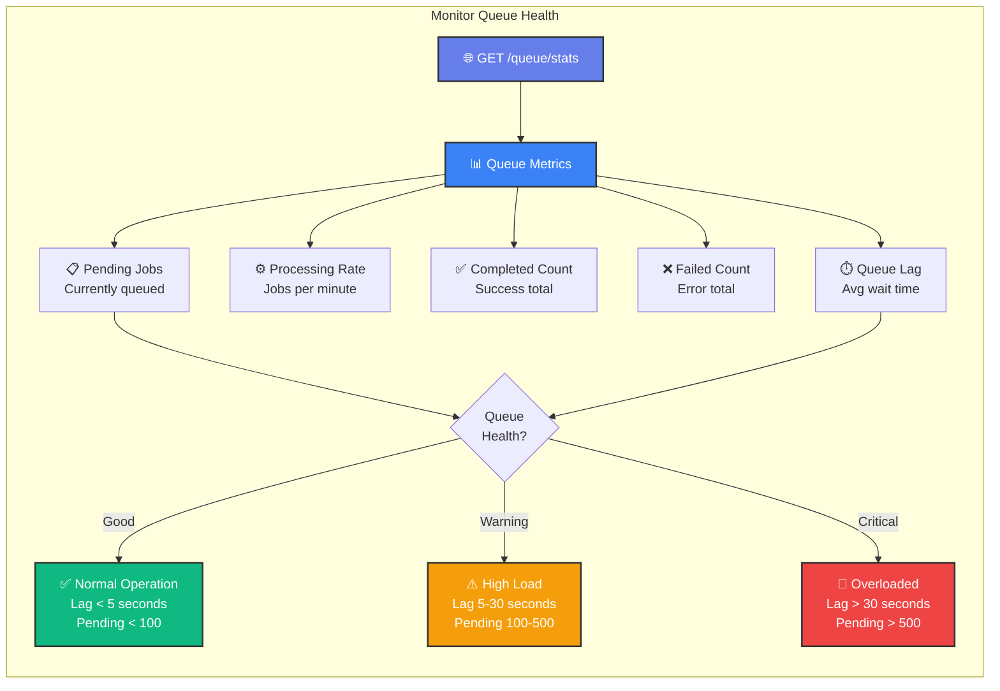
```mermaid
graph LR
    subgraph "Monitor Queue Health"
        API[🌐 GET /queue/stats]
        
        API --> METRICS[📊 Queue Metrics]
        
        METRICS --> PENDING[📋 Pending Jobs<br/>Currently queued]
        METRICS --> PROCESSING[⚙️ Processing Rate<br/>Jobs per minute]
        METRICS --> COMPLETED[✅ Completed Count<br/>Success total]
        METRICS --> FAILED[❌ Failed Count<br/>Error total]
        METRICS --> LAG[⏱️ Queue Lag<br/>Avg wait time]
        
        PENDING --> HEALTH{Queue<br/>Health?}
        LAG --> HEALTH
        
        HEALTH -->|Good| OK[✅ Normal Operation<br/>Lag < 5 seconds<br/>Pending < 100]
        HEALTH -->|Warning| WARN[⚠️ High Load<br/>Lag 5-30 seconds<br/>Pending 100-500]
        HEALTH -->|Critical| CRIT[🚨 Overloaded<br/>Lag > 30 seconds<br/>Pending > 500]
    end
    
    style API fill:#667eea,stroke:#333,stroke-width:2px,color:#fff
    style METRICS fill:#3b82f6,stroke:#333,stroke-width:2px,color:#fff
    style OK fill:#10b981,stroke:#333,stroke-width:2px,color:#fff
    style WARN fill:#f59e0b,stroke:#333,stroke-width:2px,color:#fff
    style CRIT fill:#ef4444,stroke:#333,stroke-width:2px,color:#fff
```

---

## Quick Reference

### API Endpoints Summary

| Endpoint | Method | Purpose | Returns |
|----------|--------|---------|---------|
| `/compile/batch` | POST | Synchronous batch compilation | Immediate results |
| `/compile/batch/async` | POST | Asynchronous batch compilation | Request ID |
| `/queue/results/:id` | GET | Get async results | Results or status |
| `/queue/stats` | GET | Queue statistics | Metrics |

### Request Limits

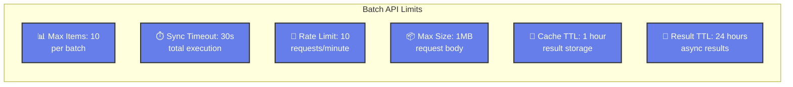
```mermaid
graph LR
    subgraph "Batch API Limits"
        L1[📊 Max Items: 10<br/>per batch]
        L2[⏱️ Sync Timeout: 30s<br/>total execution]
        L3[🚦 Rate Limit: 10<br/>requests/minute]
        L4[📦 Max Size: 1MB<br/>request body]
        L5[💾 Cache TTL: 1 hour<br/>result storage]
        L6[📁 Result TTL: 24 hours<br/>async results]
    end
    
    style L1 fill:#667eea,stroke:#333,stroke-width:2px,color:#fff
    style L2 fill:#667eea,stroke:#333,stroke-width:2px,color:#fff
    style L3 fill:#667eea,stroke:#333,stroke-width:2px,color:#fff
    style L4 fill:#667eea,stroke:#333,stroke-width:2px,color:#fff
    style L5 fill:#667eea,stroke:#333,stroke-width:2px,color:#fff
    style L6 fill:#667eea,stroke:#333,stroke-width:2px,color:#fff
```

### Decision Matrix

```mermaid
graph TB
    subgraph "Choose the Right API"
        Q1{How many<br/>filter lists?}
        Q2{Need results<br/>immediately?}
        Q3{Lists are<br/>large/slow?}
        
        Q1 -->|1| SINGLE[Use /compile]
        Q1 -->|2-10| Q2
        Q1 -->|>10| MULTI[Split into<br/>multiple batches]
        
        Q2 -->|Yes| Q3
        Q2 -->|No| ASYNC_B[✅ /compile/batch/async]
        
        Q3 -->|Yes| ASYNC_B2[✅ /compile/batch/async]
        Q3 -->|No| SYNC_B[✅ /compile/batch]
    end
    
    style Q1 fill:#f59e0b,stroke:#333,stroke-width:2px,color:#000
    style Q2 fill:#f59e0b,stroke:#333,stroke-width:2px,color:#000
    style Q3 fill:#f59e0b,stroke:#333,stroke-width:2px,color:#000
    style SINGLE fill:#3b82f6,stroke:#333,stroke-width:2px,color:#fff
    style SYNC_B fill:#10b981,stroke:#333,stroke-width:2px,color:#fff
    style ASYNC_B fill:#8b5cf6,stroke:#333,stroke-width:2px,color:#fff
    style ASYNC_B2 fill:#8b5cf6,stroke:#333,stroke-width:2px,color:#fff
    style MULTI fill:#ef4444,stroke:#333,stroke-width:2px,color:#fff
```

---

## Related Documentation

- [Queue Support Documentation](./QUEUE_SUPPORT.md) - Detailed queue configuration
- [Workflow Diagrams](./WORKFLOW_DIAGRAMS.md) - Additional system diagrams
- [API Quick Reference](./api/QUICK_REFERENCE.md) - API endpoints overview
- [OpenAPI Specification](../openapi.yaml) - Complete API schema

---

## Need Help?

- 📖 [Full Documentation](./README.md)
- 🐛 [GitHub Issues](https://github.com/jaypatrick/adblock-compiler/issues)
- 💬 [Discussions](https://github.com/jaypatrick/adblock-compiler/discussions)
- 🌐 [Live Demo](https://adblock-compiler.jayson-knight.workers.dev/)

---

*Last updated: 2026-01-14*
