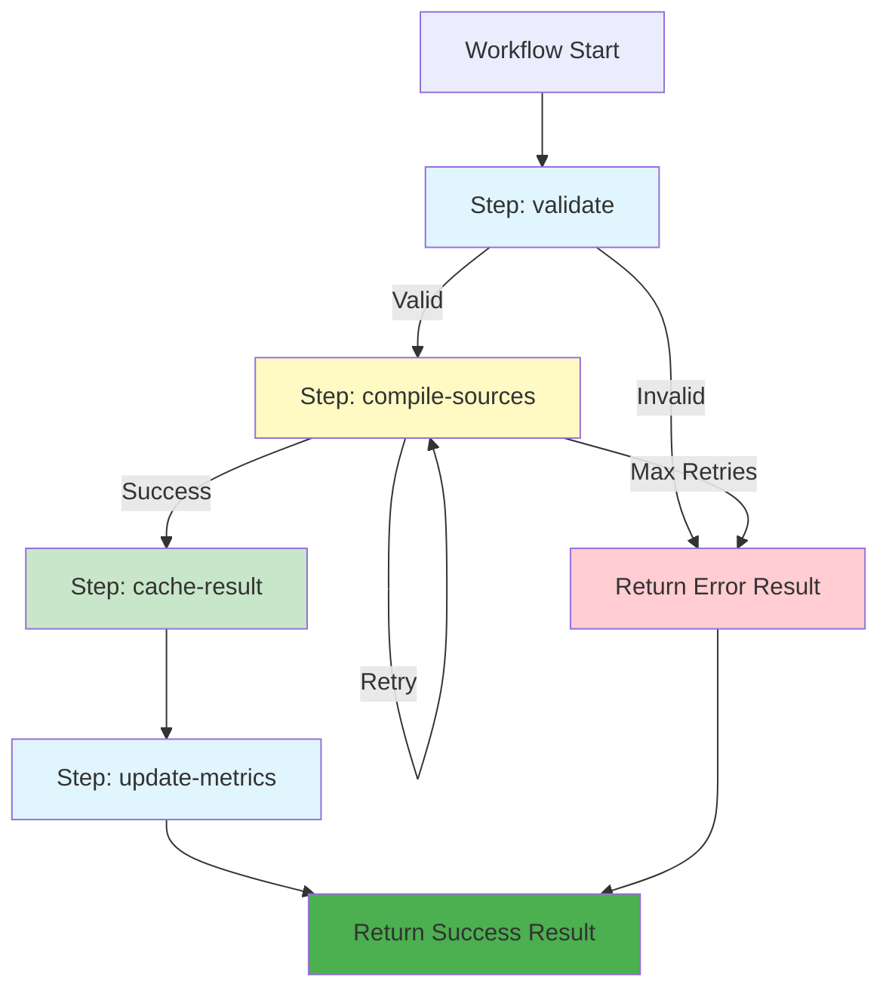
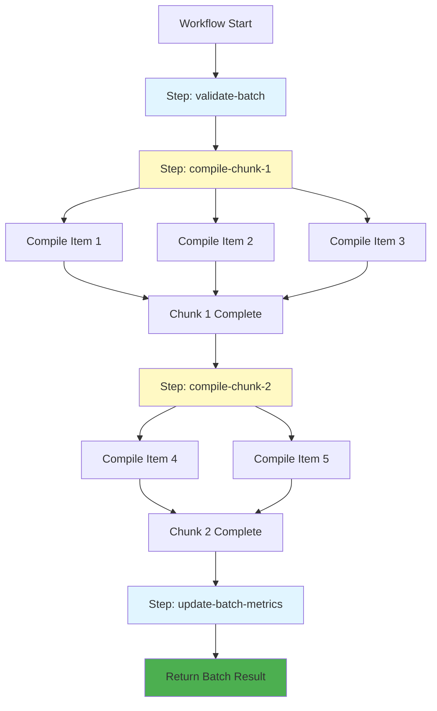
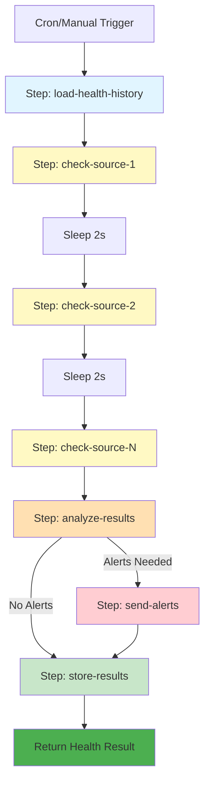

# Cloudflare Workflows

This document describes the Cloudflare Workflows implementation in the adblock-compiler, providing durable execution for compilation, batch processing, cache warming, and health monitoring.

## Table of Contents

- [Overview](#overview)
- [Benefits over Queue-Based Processing](#benefits-over-queue-based-processing)
- [Available Workflows](#available-workflows)
  - [CompilationWorkflow](#compilationworkflow)
  - [BatchCompilationWorkflow](#batchcompilationworkflow)
  - [CacheWarmingWorkflow](#cachewarmingworkflow)
  - [HealthMonitoringWorkflow](#healthmonitoringworkflow)
- [API Endpoints](#api-endpoints)
- [Real-Time Events](#workflow-events-real-time-progress)
- [Scheduled Workflows (Cron)](#scheduled-workflows-cron)
- [Workflow Status & Monitoring](#workflow-status--monitoring)
- [Configuration](#configuration)
- [Error Handling & Recovery](#error-handling--recovery)

---

## Overview

Cloudflare Workflows provide durable execution for long-running operations. Unlike traditional queue-based processing, workflows offer:

- **Automatic state persistence** between steps
- **Crash recovery** - resumes from the last successful step
- **Built-in retry** with configurable policies
- **Observable step-by-step progress**
- **Reliable scheduled execution** with cron triggers

## Benefits over Queue-Based Processing

| Feature | Queue-Based | Workflows |
|---------|-------------|-----------|
| State Persistence | Manual (KV) | Automatic |
| Crash Recovery | Re-process entire message | Resume from checkpoint |
| Step Visibility | Limited | Full step-by-step |
| Retry Logic | Custom implementation | Built-in with backoff |
| Long-running Tasks | 30s limit | Up to 15 minutes per step |
| Scheduled Execution | External scheduler | Native cron triggers |

---

## Available Workflows

### CompilationWorkflow

Handles single async compilation requests with durable state between steps.

**Steps:**
1. `validate` - Validate configuration
2. `compile-sources` - Fetch and compile all sources
3. `cache-result` - Compress and store in KV
4. `update-metrics` - Update workflow metrics

**Parameters:**
```typescript
interface CompilationParams {
  requestId: string;           // Unique tracking ID
  configuration: IConfiguration; // Filter list config
  preFetchedContent?: Record<string, string>; // Optional pre-fetched content
  benchmark?: boolean;         // Include benchmark metrics
  priority?: 'standard' | 'high';
  queuedAt: number;           // Timestamp
}
```

**API Endpoint:** `POST /workflow/compile`

```bash
curl -X POST http://localhost:8787/workflow/compile \
  -H "Content-Type: application/json" \
  -d '{
    "configuration": {
      "name": "My Filter List",
      "sources": [
        {"source": "https://easylist.to/easylist/easylist.txt", "name": "EasyList"}
      ],
      "transformations": ["Deduplicate", "RemoveEmptyLines"]
    },
    "priority": "high"
  }'
```

**Response:**
```json
{
  "success": true,
  "message": "Compilation workflow started",
  "workflowId": "wf-compile-abc123",
  "workflowType": "compilation",
  "requestId": "wf-compile-abc123",
  "configName": "My Filter List"
}
```

---

### BatchCompilationWorkflow

Processes multiple compilations with per-chunk durability and crash recovery.

**Steps:**
1. `validate-batch` - Validate all configurations
2. `compile-chunk-N` - Process chunks of 3 compilations in parallel
3. `update-batch-metrics` - Update aggregate metrics

**Parameters:**
```typescript
interface BatchCompilationParams {
  batchId: string;
  requests: Array<{
    id: string;
    configuration: IConfiguration;
    preFetchedContent?: Record<string, string>;
    benchmark?: boolean;
  }>;
  priority?: 'standard' | 'high';
  queuedAt: number;
}
```

**API Endpoint:** `POST /workflow/batch`

```bash
curl -X POST http://localhost:8787/workflow/batch \
  -H "Content-Type: application/json" \
  -d '{
    "requests": [
      {
        "id": "request-1",
        "configuration": {
          "name": "EasyList",
          "sources": [{"source": "https://easylist.to/easylist/easylist.txt"}]
        }
      },
      {
        "id": "request-2",
        "configuration": {
          "name": "EasyPrivacy",
          "sources": [{"source": "https://easylist.to/easylist/easyprivacy.txt"}]
        }
      }
    ],
    "priority": "standard"
  }'
```

---

### CacheWarmingWorkflow

Pre-populates the cache with popular filter lists. Runs on schedule or manual trigger.

**Steps:**
1. `check-cache-status` - Identify configurations needing refresh
2. `warm-chunk-N` - Compile and cache configurations in chunks
3. `update-warming-metrics` - Track warming statistics

**Default Popular Configurations:**
- EasyList
- EasyPrivacy
- AdGuard Base

**Parameters:**
```typescript
interface CacheWarmingParams {
  runId: string;
  configurations: IConfiguration[]; // Empty = use defaults
  scheduled: boolean;
}
```

**API Endpoint:** `POST /workflow/cache-warm`

```bash
# Trigger with default configurations
curl -X POST http://localhost:8787/workflow/cache-warm \
  -H "Content-Type: application/json" \
  -d '{}'

# Trigger with custom configurations
curl -X POST http://localhost:8787/workflow/cache-warm \
  -H "Content-Type: application/json" \
  -d '{
    "configurations": [
      {
        "name": "Custom List",
        "sources": [{"source": "https://example.com/filters.txt"}]
      }
    ]
  }'
```

**Cron Schedule:** Every 6 hours (`0 */6 * * *`)

---

### HealthMonitoringWorkflow

Monitors filter source availability and alerts on failures.

**Steps:**
1. `load-health-history` - Load recent health check history
2. `check-source-N` - Check each source individually
3. `analyze-results` - Detect consecutive failures for alerting
4. `send-alerts` - Send alerts if threshold exceeded
5. `store-results` - Persist health data

**Default Sources Monitored:**
- EasyList (expected: 50,000+ rules)
- EasyPrivacy (expected: 10,000+ rules)
- AdGuard Base (expected: 30,000+ rules)
- AdGuard Tracking Protection (expected: 10,000+ rules)
- Peter Lowe's List (expected: 2,000+ rules)

**Health Thresholds:**
- Max response time: 30 seconds
- Failure threshold: 3 consecutive failures before alerting

**Parameters:**
```typescript
interface HealthMonitoringParams {
  runId: string;
  sources: Array<{
    name: string;
    url: string;
    expectedMinRules?: number;
  }>; // Empty = use defaults
  alertOnFailure: boolean;
}
```

**API Endpoint:** `POST /workflow/health-check`

```bash
# Trigger with default sources
curl -X POST http://localhost:8787/workflow/health-check \
  -H "Content-Type: application/json" \
  -d '{"alertOnFailure": true}'

# Check custom sources
curl -X POST http://localhost:8787/workflow/health-check \
  -H "Content-Type: application/json" \
  -d '{
    "sources": [
      {"name": "My Source", "url": "https://example.com/filters.txt", "expectedMinRules": 100}
    ],
    "alertOnFailure": true
  }'
```

**Cron Schedule:** Every hour (`0 * * * *`)

---

## API Endpoints

### Workflow Management

| Method | Endpoint | Description |
|--------|----------|-------------|
| POST | `/workflow/compile` | Start compilation workflow |
| POST | `/workflow/batch` | Start batch compilation workflow |
| POST | `/workflow/cache-warm` | Trigger cache warming |
| POST | `/workflow/health-check` | Trigger health monitoring |
| GET | `/workflow/status/:type/:id` | Get workflow instance status |
| GET | `/workflow/events/:id` | Get real-time progress events |
| GET | `/workflow/metrics` | Get aggregate workflow metrics |
| GET | `/health/latest` | Get latest health check results |

### Status Endpoint

Get the status of a running or completed workflow:

```bash
curl http://localhost:8787/workflow/status/compilation/wf-compile-abc123
```

**Response:**
```json
{
  "success": true,
  "workflowType": "compilation",
  "workflowId": "wf-compile-abc123",
  "status": "complete",
  "output": {
    "success": true,
    "requestId": "wf-compile-abc123",
    "configName": "My Filter List",
    "ruleCount": 45000,
    "totalDurationMs": 2500
  }
}
```

**Workflow Status Values:**
- `queued` - Waiting to start
- `running` - Currently executing
- `paused` - Manually paused
- `complete` - Successfully finished
- `errored` - Failed with error
- `terminated` - Manually stopped
- `unknown` - Status unavailable

### Metrics Endpoint

Get aggregate metrics for all workflows:

```bash
curl http://localhost:8787/workflow/metrics
```

**Response:**
```json
{
  "compilation": {
    "totalRuns": 150,
    "successfulRuns": 145,
    "failedRuns": 5,
    "avgDurationMs": 3200,
    "lastRunAt": "2024-01-15T10:30:00Z"
  },
  "batch": {
    "totalRuns": 25,
    "totalCompilations": 100,
    "avgDurationMs": 15000
  },
  "cacheWarming": {
    "totalRuns": 48,
    "scheduledRuns": 46,
    "manualRuns": 2,
    "totalConfigsWarmed": 144
  },
  "health": {
    "totalChecks": 168,
    "totalSourcesChecked": 840,
    "totalHealthy": 820,
    "alertsTriggered": 3
  }
}
```

### Latest Health Results

Get the most recent health check results:

```bash
curl http://localhost:8787/health/latest
```

**Response:**
```json
{
  "success": true,
  "timestamp": "2024-01-15T10:00:00Z",
  "runId": "cron-health-abc123",
  "results": [
    {
      "name": "EasyList",
      "url": "https://easylist.to/easylist/easylist.txt",
      "healthy": true,
      "statusCode": 200,
      "responseTimeMs": 450,
      "ruleCount": 72500
    },
    {
      "name": "EasyPrivacy",
      "url": "https://easylist.to/easylist/easyprivacy.txt",
      "healthy": true,
      "statusCode": 200,
      "responseTimeMs": 380,
      "ruleCount": 18200
    }
  ],
  "summary": {
    "total": 5,
    "healthy": 5,
    "unhealthy": 0
  }
}
```

### Workflow Events (Real-Time Progress)

Get real-time progress events for a running workflow:

```bash
# Get all events for a workflow
curl http://localhost:8787/workflow/events/wf-compile-abc123

# Get events since a specific timestamp (for polling)
curl "http://localhost:8787/workflow/events/wf-compile-abc123?since=2024-01-15T10:30:00.000Z"
```

**Response:**
```json
{
  "success": true,
  "workflowId": "wf-compile-abc123",
  "workflowType": "compilation",
  "startedAt": "2024-01-15T10:30:00.000Z",
  "completedAt": "2024-01-15T10:30:05.000Z",
  "progress": 100,
  "isComplete": true,
  "events": [
    {
      "type": "workflow:started",
      "workflowId": "wf-compile-abc123",
      "workflowType": "compilation",
      "timestamp": "2024-01-15T10:30:00.000Z",
      "data": {"configName": "My Filter List", "sourceCount": 2}
    },
    {
      "type": "workflow:step:started",
      "workflowId": "wf-compile-abc123",
      "workflowType": "compilation",
      "timestamp": "2024-01-15T10:30:00.100Z",
      "step": "validate"
    },
    {
      "type": "workflow:progress",
      "workflowId": "wf-compile-abc123",
      "workflowType": "compilation",
      "timestamp": "2024-01-15T10:30:00.500Z",
      "progress": 25,
      "message": "Configuration validated"
    },
    {
      "type": "workflow:completed",
      "workflowId": "wf-compile-abc123",
      "workflowType": "compilation",
      "timestamp": "2024-01-15T10:30:05.000Z",
      "data": {"ruleCount": 45000, "totalDurationMs": 5000}
    }
  ]
}
```

**Event Types:**
| Type | Description |
|------|-------------|
| `workflow:started` | Workflow execution began |
| `workflow:step:started` | A workflow step started |
| `workflow:step:completed` | A workflow step finished successfully |
| `workflow:step:failed` | A workflow step failed |
| `workflow:progress` | Progress update with percentage and message |
| `workflow:completed` | Workflow finished successfully |
| `workflow:failed` | Workflow failed with error |
| `source:fetch:started` | Source fetch operation started |
| `source:fetch:completed` | Source fetch completed with rule count |
| `transformation:started` | Transformation step started |
| `transformation:completed` | Transformation completed |
| `cache:stored` | Result cached to KV |
| `health:check:started` | Health check started for a source |
| `health:check:completed` | Health check completed |

**Polling for Real-Time Updates:**

To monitor workflow progress in real-time, poll the events endpoint:

```javascript
async function pollWorkflowEvents(workflowId) {
    let lastTimestamp = null;

    while (true) {
        const url = `/workflow/events/${workflowId}`;
        const params = lastTimestamp ? `?since=${encodeURIComponent(lastTimestamp)}` : '';

        const response = await fetch(url + params);
        const data = await response.json();

        if (data.events?.length > 0) {
            for (const event of data.events) {
                console.log(`[${event.type}] ${event.message || event.step || ''}`);
                lastTimestamp = event.timestamp;
            }
        }

        if (data.isComplete) {
            console.log('Workflow completed!');
            break;
        }

        await new Promise(resolve => setTimeout(resolve, 2000));
    }
}
```

---

## Scheduled Workflows (Cron)

Workflows can be triggered automatically via cron schedules defined in `wrangler.toml`:

```toml
[triggers]
crons = [
    "0 */6 * * *",   # Cache warming: every 6 hours
    "0 * * * *",     # Health monitoring: every hour
]
```

The `scheduled()` handler routes cron events to the appropriate workflow:

| Cron Pattern | Workflow | Purpose |
|--------------|----------|---------|
| `0 */6 * * *` | CacheWarmingWorkflow | Pre-warm popular filter list caches |
| `0 * * * *` | HealthMonitoringWorkflow | Monitor source availability |

---

## Configuration

### wrangler.toml

```toml
# Workflow bindings
[[workflows]]
name = "compilation-workflow"
binding = "COMPILATION_WORKFLOW"
class_name = "CompilationWorkflow"

[[workflows]]
name = "batch-compilation-workflow"
binding = "BATCH_COMPILATION_WORKFLOW"
class_name = "BatchCompilationWorkflow"

[[workflows]]
name = "cache-warming-workflow"
binding = "CACHE_WARMING_WORKFLOW"
class_name = "CacheWarmingWorkflow"

[[workflows]]
name = "health-monitoring-workflow"
binding = "HEALTH_MONITORING_WORKFLOW"
class_name = "HealthMonitoringWorkflow"

# Cron triggers
[triggers]
crons = [
    "0 */6 * * *",
    "0 * * * *",
]
```

### Step Configuration

Each workflow step can have custom retry and timeout settings:

```typescript
await step.do('step-name', {
    retries: {
        limit: 3,                    // Max retries
        delay: '30 seconds',         // Initial delay
        backoff: 'exponential',      // Backoff strategy
    },
    timeout: '5 minutes',            // Step timeout
}, async () => {
    // Step logic
});
```

---

## Error Handling & Recovery

### Automatic Retry

Each step has configurable retry policies:

- **Compilation steps:** 2 retries with 30s exponential backoff, 5 minute timeout
- **Cache steps:** 2 retries with 2s delay
- **Health checks:** 2 retries with 5s delay, 2 minute timeout

### Crash Recovery

If a workflow crashes mid-execution:
1. Cloudflare detects the failure
2. Workflow resumes from the last completed step
3. State is automatically restored
4. Processing continues without re-running completed steps

### Dead Letter Handling

Failed workflows after max retries are logged with:
- Full error details
- Step that failed
- Workflow parameters
- Timestamp

Alerts can be configured via the health monitoring workflow to notify on persistent failures.

---

## Workflow Diagrams

### Compilation Workflow



### Batch Workflow with Chunking



### Health Monitoring Workflow



---

## Notes

- Workflows are available when deployed to Cloudflare Workers
- Local development may use stubs for workflow bindings
- Metrics are stored in the `METRICS` KV namespace
- Cached results use the `COMPILATION_CACHE` KV namespace
- Health history is retained for 30 days
- Workflow instances can be monitored in the Cloudflare dashboard
