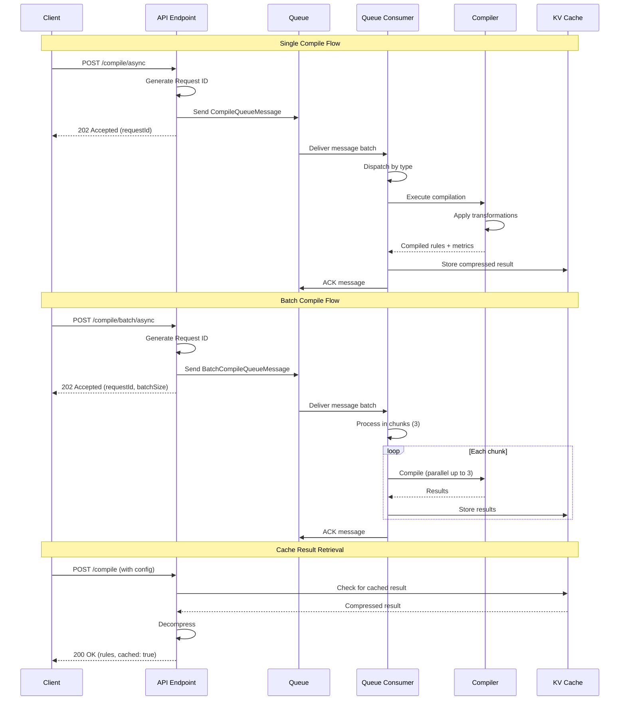
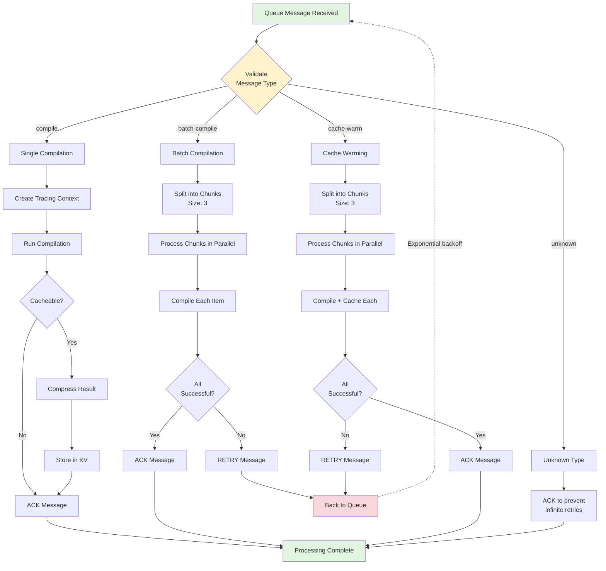
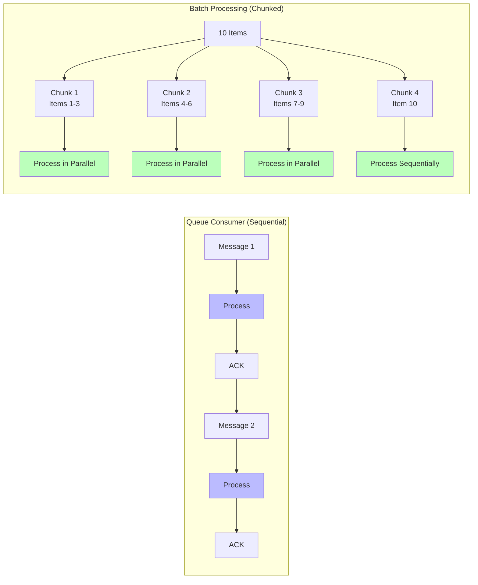
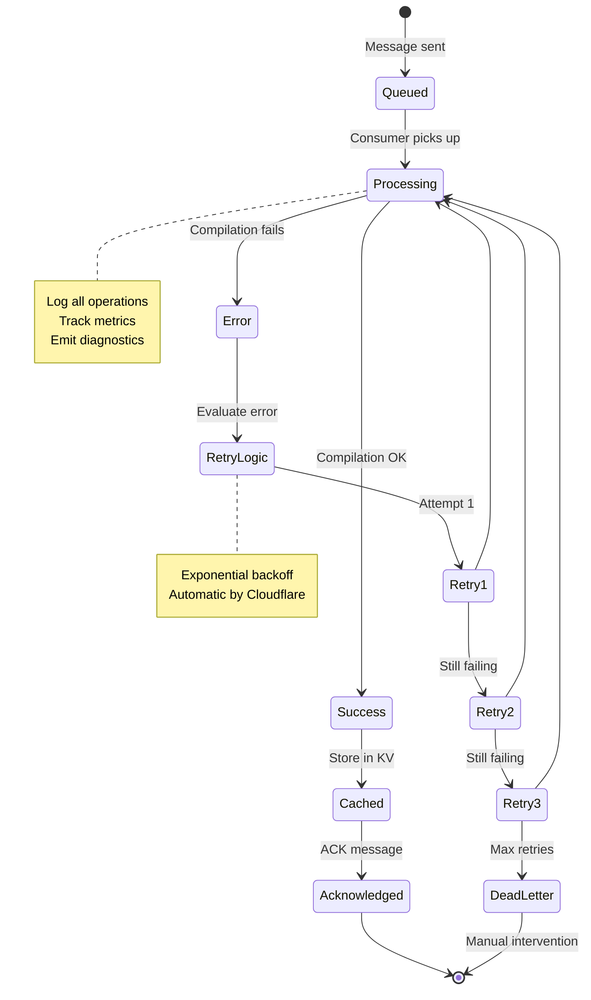
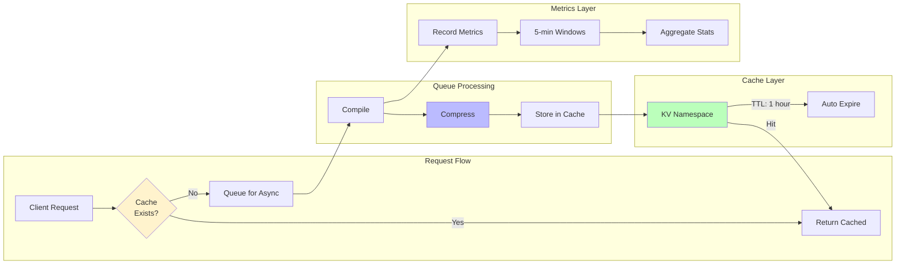

# Cloudflare Queue Architecture

This document describes the architecture of the Cloudflare Queue integration for asynchronous filter list compilation.

## Queue Flow Diagram

```mermaid
graph TB
    subgraph "Client Layer"
        CLIENT[Client/Browser]
    end

    subgraph "API Endpoints"
        ASYNC_EP[POST /compile/async]
        BATCH_EP[POST /compile/batch/async]
        SYNC_EP[POST /compile]
    end

    subgraph "Queue Producer"
        ENQUEUE[Queue Message Producer]
        GEN_ID[Generate Request ID]
        CREATE_MSG[Create Queue Message]
    end

    subgraph "Cloudflare Queue"
        QUEUE[(adblock-compiler-worker-queue)]
        QUEUE_BATCH[Message Batching<br/>max_batch_size: 10<br/>max_batch_timeout: 5s]
    end

    subgraph "Queue Consumer"
        CONSUMER[Queue Consumer Handler]
        DISPATCHER[Message Type Dispatcher]
        COMPILE_PROC[Process Compile Message]
        BATCH_PROC[Process Batch Message]
        CACHE_PROC[Process Cache Warm Message]
        CHUNK_PROC[Chunk Processor<br/>Concurrency: 3]
    end

    subgraph "Compilation Layer"
        COMPILER[WorkerCompiler]
        TRACING[Tracing Context]
        DIAGNOSTICS[Diagnostics Collector]
    end

    subgraph "Storage Layer"
        KV_CACHE[(KV: COMPILATION_CACHE<br/>TTL: 1 hour)]
        KV_METRICS[(KV: METRICS<br/>Aggregation: 5 min)]
        COMPRESS[Gzip Compression<br/>~70-80% reduction]
    end

    subgraph "Monitoring Layer"
        TAIL[Tail Worker]
        CONSOLE[Console Logs]
        ANALYTICS[Analytics Engine]
    end

    CLIENT -->|POST request| ASYNC_EP
    CLIENT -->|POST request| BATCH_EP
    CLIENT -->|GET cached result| SYNC_EP

    ASYNC_EP -->|Single compilation| ENQUEUE
    BATCH_EP -->|Batch compilations| ENQUEUE

    ENQUEUE --> GEN_ID
    GEN_ID --> CREATE_MSG
    CREATE_MSG -->|send()| QUEUE

    QUEUE --> QUEUE_BATCH
    QUEUE_BATCH -->|Batched messages| CONSUMER

    CONSUMER --> DISPATCHER
    DISPATCHER -->|type: 'compile'| COMPILE_PROC
    DISPATCHER -->|type: 'batch-compile'| BATCH_PROC
    DISPATCHER -->|type: 'cache-warm'| CACHE_PROC

    COMPILE_PROC --> COMPILER
    BATCH_PROC --> CHUNK_PROC
    CACHE_PROC --> CHUNK_PROC
    CHUNK_PROC --> COMPILE_PROC

    COMPILER --> TRACING
    COMPILER --> DIAGNOSTICS

    COMPILE_PROC --> COMPRESS
    COMPRESS --> KV_CACHE

    COMPILE_PROC -->|Metrics| KV_METRICS
    COMPILE_PROC -->|Diagnostics| TAIL
    COMPILE_PROC -->|Logs| CONSOLE

    SYNC_EP -.->|Read cache| KV_CACHE

    DIAGNOSTICS -.->|Events| TAIL
    CONSOLE -.->|Stream| TAIL
    TAIL -.->|Process logs| ANALYTICS

    style QUEUE fill:#f9f,stroke:#333,stroke-width:4px
    style CONSUMER fill:#bbf,stroke:#333,stroke-width:4px
    style KV_CACHE fill:#bfb,stroke:#333,stroke-width:2px
    style COMPILER fill:#fbb,stroke:#333,stroke-width:2px
```

## Message Types Flow



## Processing Architecture



## Concurrency Control



## Error Handling and Retry Logic



## Data Flow and Caching Strategy



## Monitoring and Observability

```mermaid
graph TB
    subgraph "Logging Strategy"
        QUEUE_LOG[Queue Handler Logs]
        COMPILE_LOG[Compilation Logs]
        CACHE_LOG[Cache Operation Logs]
        ERROR_LOG[Error Logs]
    end

    subgraph "Log Prefixes"
        PREFIX1["[QUEUE:HANDLER]"]
        PREFIX2["[QUEUE:COMPILE]"]
        PREFIX3["[QUEUE:BATCH]"]
        PREFIX4["[QUEUE:CACHE-WARM]"]
        PREFIX5["[QUEUE:CHUNKS]"]
        PREFIX6["[API:ASYNC]"]
        PREFIX7["[API:BATCH-ASYNC]"]
    end

    subgraph "Metrics Tracked"
        M1[Processing Time]
        M2[Success/Failure Ratio]
        M3[Compression Ratio]
        M4[Queue Depth]
        M5[Cache Hit Rate]
        M6[Batch Size Stats]
    end

    subgraph "Diagnostics"
        D1[Source Download Events]
        D2[Transformation Events]
        D3[Validation Events]
        D4[Performance Events]
    end

    QUEUE_LOG --> PREFIX1
    COMPILE_LOG --> PREFIX2
    CACHE_LOG --> PREFIX6

    COMPILE_LOG --> M1
    COMPILE_LOG --> M2
    COMPILE_LOG --> M3

    D1 --> TAIL[Tail Worker]
    D2 --> TAIL
    D3 --> TAIL
    D4 --> TAIL

    M1 --> ANALYTICS[Analytics Engine]
    M2 --> ANALYTICS
    M5 --> ANALYTICS

    style TAIL fill:#f9f
    style ANALYTICS fill:#bbf
```



## Key Features

### 1. Asynchronous Processing
- Non-blocking API endpoints
- Immediate 202 Accepted response
- Background compilation via queue

### 2. Concurrency Control
- Sequential message processing to avoid overwhelming resources
- Chunked batch processing (max 3 parallel compilations per chunk)
- Configurable chunk size

### 3. Caching Strategy
- Gzip compression reduces storage by 70-80%
- 1-hour TTL for compiled results
- Cache key based on configuration hash
- No caching for pre-fetched content

### 4. Error Handling
- Automatic retry with exponential backoff
- Message acknowledgment on success
- Retry on failure
- Unknown message types acknowledged to prevent infinite loops

### 5. Monitoring and Diagnostics
- Structured console logging with prefixes
- Detailed metrics tracking
- Diagnostic events emitted to tail worker
- Performance timing at every stage

### 6. Scalability
- Queue handles unlimited backpressure
- No rate limiting on async endpoints
- Horizontal scaling via queue
- Batch processing for efficiency

## Configuration

### Queue Settings (wrangler.toml)
```toml
[[queues.producers]]
 queue = "adblock-compiler-worker-queue"
 binding = "ADBLOCK_COMPILER_QUEUE"

[[queues.consumers]]
 queue = "adblock-compiler-worker-queue"
 max_batch_size = 10
 max_batch_timeout = 5
 dead_letter_queue = "dead-letter-queue"
```

### Resource Limits
- **Batch Size**: Up to 100 requests per batch
- **Chunk Size**: 3 concurrent compilations
- **Message Timeout**: 5 seconds before batch delivery
- **Cache TTL**: 3600 seconds (1 hour)

### Performance Characteristics
- **Enqueue Time**: < 100ms
- **Processing Time**: 5-30 seconds per compilation (varies by filter list size)
- **Compression Ratio**: 70-80% reduction
- **Cache Hit Rate**: High for repeated configurations

## Usage Examples

### Single Async Compilation
```bash
curl -X POST https://worker.dev/compile/async \
  -H "Content-Type: application/json" \
  -d '{
    "configuration": {
      "name": "My Filter",
      "sources": [{"source": "https://example.com/filters.txt"}]
    }
  }'
```

Response:
```json
{
  "success": true,
  "message": "Compilation job queued successfully",
  "requestId": "compile-1234567890-abc123"
}
```

### Batch Async Compilation
```bash
curl -X POST https://worker.dev/compile/batch/async \
  -H "Content-Type: application/json" \
  -d '{
    "requests": [
      {
        "id": "filter-1",
        "configuration": {
          "name": "Filter 1",
          "sources": [{"source": "https://example.com/filter1.txt"}]
        }
      },
      {
        "id": "filter-2",
        "configuration": {
          "name": "Filter 2",
          "sources": [{"source": "https://example.com/filter2.txt"}]
        }
      }
    ]
  }'
```

Response:
```json
{
  "success": true,
  "message": "Batch of 2 compilation jobs queued successfully",
  "requestId": "batch-1234567890-def456",
  "batchSize": 2
}
```

## Troubleshooting

### Queue Not Processing
1. Check queue exists: `wrangler queues list`
2. Verify queue bindings in `wrangler.toml`
3. Check worker logs: `wrangler tail`

### Messages Failing
1. Check error logs for specific failure reasons
2. Verify source URLs are accessible
3. Check KV namespace bindings

### Performance Issues
1. Increase `max_batch_size` for higher throughput
2. Adjust chunk size for batch processing
3. Monitor queue depth and consumer lag

## Related Documentation

- [QUEUE_SUPPORT.md](./QUEUE_SUPPORT.md) - Detailed usage guide
- [IMPLEMENTATION_SUMMARY.md](./IMPLEMENTATION_SUMMARY.md) - Implementation details
- [Cloudflare Queues Documentation](https://developers.cloudflare.com/queues/)
