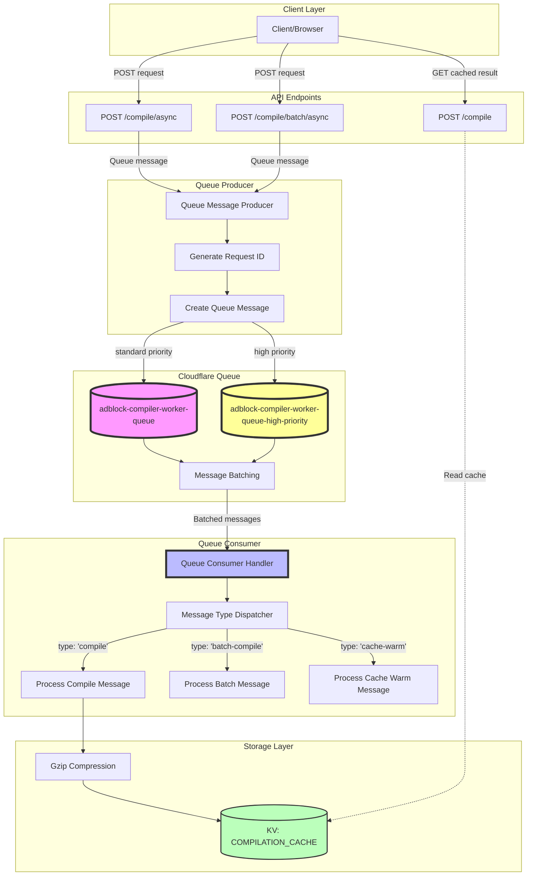
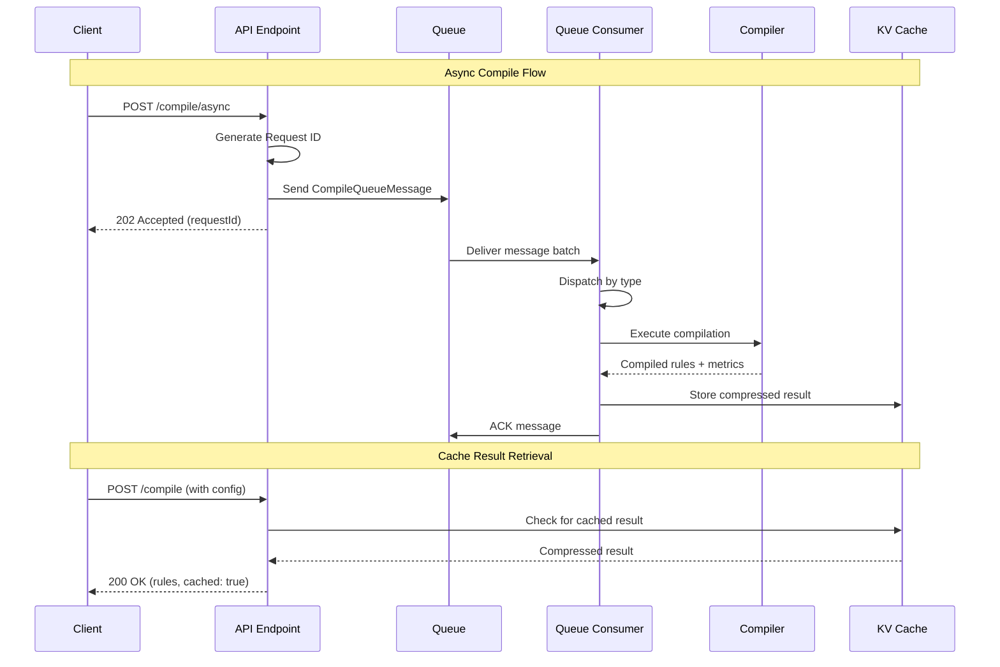
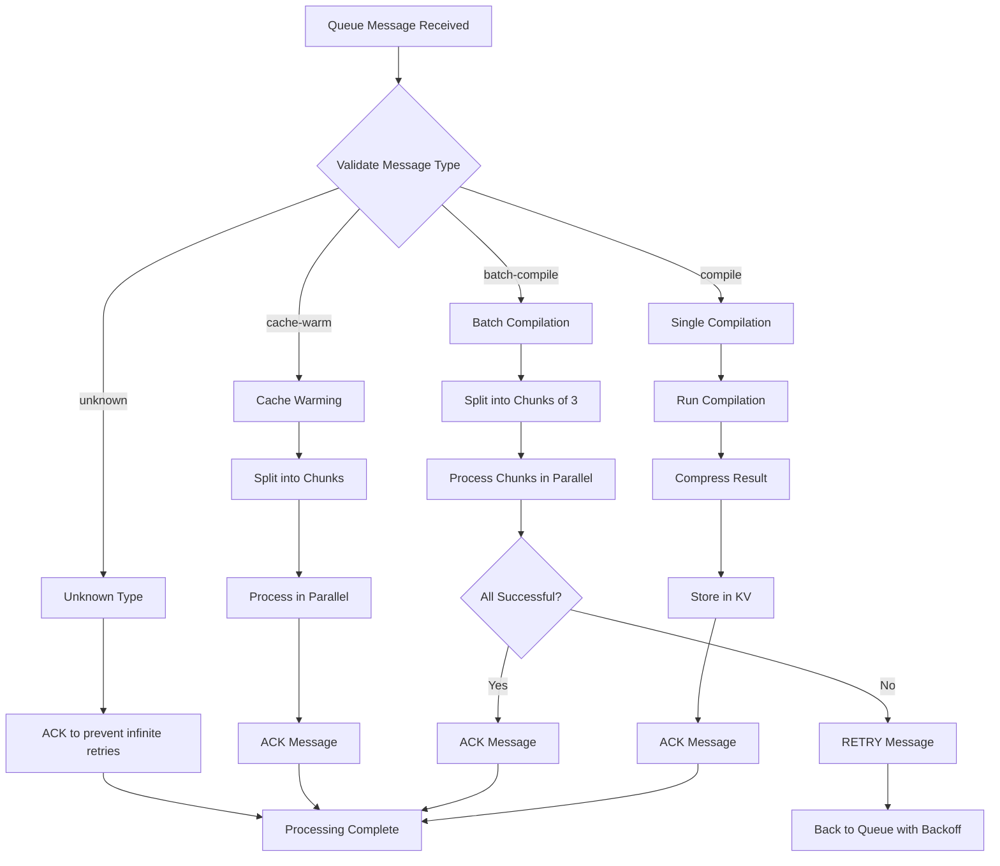

# Cloudflare Queue Support

This document describes how to use the Cloudflare Queue integration for async compilation jobs.

## Overview

The adblock-compiler worker now supports asynchronous compilation through Cloudflare Queues. This is useful for:

- **Long-running compilations** - Offload CPU-intensive work to background processing
- **Batch operations** - Process multiple compilations without blocking
- **Cache warming** - Pre-compile popular filter lists asynchronously
- **Rate limit bypass** - Queue requests that would otherwise be rate-limited
- **Priority processing** - Premium users and urgent compilations get faster processing

**See Also:** [Queue Architecture Diagram](./QUEUE_ARCHITECTURE.md) for visual representation of the queue flow.

## Queue Configuration

The worker uses two queues for different priority levels:

```toml
# Standard priority queue
[[queues.producers]]
 queue = "adblock-compiler-worker-queue"
 binding = "ADBLOCK_COMPILER_QUEUE"

# High priority queue for premium users
[[queues.producers]]
 queue = "adblock-compiler-worker-queue-high-priority"
 binding = "ADBLOCK_COMPILER_QUEUE_HIGH_PRIORITY"

# Standard queue consumer
[[queues.consumers]]
 queue = "adblock-compiler-worker-queue"
 max_batch_size = 10
 max_batch_timeout = 5
 dead_letter_queue = "dead-letter-queue"

# High priority queue consumer (faster processing)
[[queues.consumers]]
 queue = "adblock-compiler-worker-queue-high-priority"
 max_batch_size = 5     # smaller batches for faster response
 max_batch_timeout = 2  # shorter timeout for quicker processing
 dead_letter_queue = "dead-letter-queue"
```

## Priority Levels

The worker supports two priority levels:

- **`standard`** (default) - Normal processing speed, larger batches
- **`high`** - Faster processing with smaller batches and shorter timeouts

High priority jobs are routed to a separate queue with optimized settings for faster turnaround.

## API Endpoints

### POST /compile/async

Queue a single compilation job for asynchronous processing.

**Request Body:**

```json
{
    "configuration": {
        "name": "My Filter List",
        "sources": [
            {
                "source": "https://example.com/filters.txt"
            }
        ],
        "transformations": ["Deduplicate", "RemoveEmptyLines"]
    },
    "benchmark": true,
    "priority": "high"
}
```

**Fields:**

- `configuration` (required) - Compilation configuration
- `benchmark` (optional) - Enable benchmarking
- `priority` (optional) - Priority level: `"standard"` (default) or `"high"`

**Response (202 Accepted):**

```json
{
    "success": true,
    "message": "Compilation job queued successfully",
    "note": "The compilation will be processed asynchronously and cached when complete",
    "requestId": "compile-1704931200000-abc123",
    "priority": "high"
}
```

### POST /compile/batch/async

Queue multiple compilation jobs for asynchronous processing.

**Request Body:**

```json
{
    "requests": [
        {
            "id": "filter-1",
            "configuration": {
                "name": "Filter List 1",
                "sources": [
                    {
                        "source": "https://example.com/filter1.txt"
                    }
                ]
            }
        },
        {
            "id": "filter-2",
            "configuration": {
                "name": "Filter List 2",
                "sources": [
                    {
                        "source": "https://example.com/filter2.txt"
                    }
                ]
            }
        }
    ],
    "priority": "high"
}
```

**Fields:**

- `requests` (required) - Array of compilation requests
- `priority` (optional) - Priority level for the entire batch: `"standard"` (default) or `"high"`

**Response (202 Accepted):**

```json
{
    "success": true,
    "message": "Batch of 2 compilation jobs queued successfully",
    "note": "The compilations will be processed asynchronously and cached when complete",
    "requestId": "batch-1704931200000-def456",
    "batchSize": 2,
    "priority": "high"
}
```

**Limits:**

- Maximum 100 requests per batch
- No rate limiting (queue handles backpressure)

## Queue Message Types

The worker processes three types of queue messages, all supporting optional priority:

### 1. Compile Message

Single compilation job with optional pre-fetched content, benchmarking, and priority.

```typescript
{
  type: 'compile',
  requestId: 'compile-123',
  timestamp: 1704931200000,
  priority: 'high',  // or 'standard' (default)
  configuration: { /* IConfiguration */ },
  preFetchedContent?: { /* url: content */ },
  benchmark?: boolean
}
```

### 2. Batch Compile Message

Multiple compilation jobs processed in parallel with optional priority.

```typescript
{
  type: 'batch-compile',
  requestId: 'batch-123',
  timestamp: 1704931200000,
  priority: 'high',  // or 'standard' (default)
  requests: [
    {
      id: 'req-1',
      configuration: { /* IConfiguration */ },
      preFetchedContent?: { /* url: content */ },
      benchmark?: boolean
    },
    // ... more requests
  ]
}
```

### 3. Cache Warm Message

Pre-compile multiple configurations to warm the cache with optional priority.

```typescript
{
  type: 'cache-warm',
  requestId: 'warm-123',
  timestamp: 1704931200000,
  priority: 'high',  // or 'standard' (default)
  configurations: [
    { /* IConfiguration */ },
    // ... more configurations
  ]
}
```

## How It Works

1. **Request** - Client sends a POST request to `/compile/async` or `/compile/batch/async` with optional `priority` field
2. **Routing** - Worker routes the message to the appropriate queue based on priority level
3. **Response** - Worker immediately returns `202 Accepted` with the priority level
4. **Processing** - Queue consumer processes the message asynchronously
5. **Caching** - Compiled results are cached in KV storage
6. **Retrieval** - Client can later retrieve cached results via `/compile` endpoint

## Retry Behavior

The queue consumer automatically retries failed messages:

- **Success** - Message is acknowledged and removed from queue
- **Failure** - Message is retried with exponential backoff
- **Unknown Type** - Message is acknowledged to prevent infinite retries

## Benefits

### Compared to Synchronous Endpoints

| Feature       | Sync (`/compile`)     | Async (`/compile/async`)        |
| ------------- | --------------------- | ------------------------------- |
| Response Time | Waits for compilation | Immediate (202 Accepted)        |
| Rate Limiting | Yes (10 req/min)      | No (queue handles backpressure) |
| CPU Usage     | Blocks worker         | Background processing           |
| Use Case      | Interactive requests  | Batch operations, pre-warming   |

### Use Cases

**Cache Warming**

```bash
# Pre-compile popular filter lists during low-traffic periods
curl -X POST https://your-worker.dev/compile/async \
  -H "Content-Type: application/json" \
  -d '{
    "configuration": {
      "name": "AdGuard DNS filter",
      "sources": [{
        "source": "https://adguardteam.github.io/AdGuardSDNSFilter/Filters/filter.txt"
      }]
    }
  }'
```

**Batch Processing**

```bash
# Process multiple filter lists without blocking
curl -X POST https://your-worker.dev/compile/batch/async \
  -H "Content-Type: application/json" \
  -d '{
    "requests": [
      {"id": "adguard", "configuration": {...}},
      {"id": "easylist", "configuration": {...}},
      {"id": "easyprivacy", "configuration": {...}}
    ]
  }'
```

## Monitoring and Tracing

Queue processing includes comprehensive logging and diagnostics for observability.

### Logging Prefixes

All queue operations use structured logging with prefixes for easy filtering:

- `[QUEUE:HANDLER]` - Queue consumer batch processing
- `[QUEUE:COMPILE]` - Individual compilation processing
- `[QUEUE:BATCH]` - Batch compilation processing
- `[QUEUE:CACHE-WARM]` - Cache warming processing
- `[QUEUE:CHUNKS]` - Chunk-based parallel processing
- `[API:ASYNC]` - Async API endpoint operations
- `[API:BATCH-ASYNC]` - Batch async API endpoint operations

### Log Monitoring

Queue processing is logged to the console and can be monitored via:

- **Cloudflare Dashboard** > Workers & Pages > Your Worker > Logs
- **Tail Worker** (if configured) - Real-time log streaming
- **Analytics Engine** (if configured) - Aggregated metrics
- **Wrangler CLI** - `wrangler tail` for live log streaming

### Example Log Output

```
[API:ASYNC] Queueing compilation for "AdGuard DNS filter"
[API:ASYNC] Queued successfully in 45ms (requestId: compile-1704931200000-abc123)

[QUEUE:HANDLER] Processing batch of 3 messages
[QUEUE:HANDLER] Processing message 1/3, type: compile, requestId: compile-1704931200000-abc123

[QUEUE:COMPILE] Starting compilation for "AdGuard DNS filter" (requestId: compile-1704931200000-abc123)
[QUEUE:COMPILE] Cache key: cache:a1b2c3d4e5f6g7h8...
[QUEUE:COMPILE] Compilation completed in 2345ms, 12500 rules generated
[QUEUE:COMPILE] Emitting 15 diagnostic events
[QUEUE:COMPILE] Cached compilation in 123ms (1234567 -> 345678 bytes, 72.0% compression)
[QUEUE:COMPILE] Total processing time: 2468ms for "AdGuard DNS filter"

[QUEUE:HANDLER] Message 1/3 completed in 2470ms and acknowledged
[QUEUE:HANDLER] Batch complete: 3 messages processed in 7234ms (avg 2411ms per message). Acked: 3, Retried: 0, Unknown: 0
```

### Tracing and Diagnostics

Each compilation includes a tracing context that captures:

- **Metadata**: Endpoint, config name, request ID, timestamp
- **Diagnostic Events**: Source downloads, transformations, validation
- **Performance Metrics**: Duration, rule counts, compression ratios
- **Error Details**: Stack traces, error messages, retry attempts

Diagnostic events are emitted to the tail worker for centralized monitoring:

```javascript
{
  "eventType": "source:complete",
  "sourceIndex": 0,
  "ruleCount": 12500,
  "durationMs": 1234,
  "metadata": {
    "endpoint": "queue/compile",
    "configName": "AdGuard DNS filter",
    "requestId": "compile-1704931200000-abc123"
  }
}
```

### Performance Metrics

The following metrics are logged for each operation:

- **Enqueue Time**: Time to queue the message
- **Processing Time**: Total compilation duration
- **Compression Ratio**: Storage reduction percentage
- **Cache Operations**: Time to compress and store
- **Success/Failure Rate**: Per message and per batch
- **Chunk Processing**: Parallel processing statistics

### Monitoring Tools

1. **Real-time Logs**
   ```bash
   # Stream logs in real-time
   wrangler tail

   # Filter by prefix
   wrangler tail | grep "QUEUE:COMPILE"
   ```

2. **Cloudflare Dashboard**
   - Navigate to Workers & Pages > Your Worker
   - View Logs tab for historical logs
   - Use Analytics tab for aggregated metrics

3. **Tail Worker Integration**
   - Configured in `wrangler.toml`
   - Processes all console logs
   - Can export to external services

## Error Handling

Errors during queue processing are:

1. Logged to console with full error details
2. Message is retried automatically with exponential backoff
3. After max retries, message is sent to dead letter queue (if configured)
4. Error metrics are tracked and reported

### Error Log Example

```
[QUEUE:COMPILE] Processing failed after 5234ms for "Invalid Filter": 
  Error: Source download failed: Network timeout
[QUEUE:HANDLER] Message 2/5 failed after 5236ms, will retry: 
  Error: Source download failed: Network timeout
```

## Performance Considerations

### Queue Configuration

- **Standard queue**: Processes messages in batches (max 10), timeout 5 seconds
- **High-priority queue**: Smaller batches (max 5), shorter timeout (2 seconds) for faster response
- Batch compilations process requests in chunks of 3 in parallel
- Cache TTL is 1 hour (configurable in worker code)

### Processing Times

- Large filter lists may take several seconds to compile
- High-priority jobs are processed faster due to smaller batch sizes
- Compression reduces storage by 70-80%
- Gzip compression/decompression adds ~100ms overhead

### Priority Queue Benefits

- **High priority**: Faster turnaround time, ideal for premium users or urgent requests
- **Standard priority**: Higher throughput, ideal for batch operations and scheduled jobs

## Local Development

To test queue functionality locally (including priority):

```bash
# Start the worker in development mode
npm run dev

# In another terminal, send a standard priority request
curl -X POST http://localhost:8787/compile/async \
  -H "Content-Type: application/json" \
  -d '{
    "configuration": {
      "name": "Test",
      "sources": [{"source": "https://example.com/test.txt"}]
    }
  }'

# Send a high priority request
curl -X POST http://localhost:8787/compile/async \
  -H "Content-Type: application/json" \
  -d '{
    "configuration": {
      "name": "Urgent Test",
      "sources": [{"source": "https://example.com/urgent.txt"}]
    },
    "priority": "high"
  }'
```

**Note:** Local development mode simulates queue behavior but doesn't persist messages.

## Deployment

Ensure both queues are created before deploying:

```bash
# Create the standard priority queue (first time only)
wrangler queues create adblock-compiler-worker-queue

# Create the high priority queue (first time only)
wrangler queues create adblock-compiler-worker-queue-high-priority

# Deploy the worker
npm run deploy
```

## Troubleshooting

**Queue not processing messages**

- Check queue configuration in `wrangler.toml`
- Verify both queues exist: `wrangler queues list`
- Check worker logs for errors

**Messages failing repeatedly**

- Check error logs for specific failure reasons
- Verify source URLs are accessible
- Check KV namespace bindings are correct

**Slow processing**

- Increase `max_batch_size` in `wrangler.toml`
- Consider scaling worker resources
- Review filter list sizes and complexity

## Architecture

### Queue Flow Diagram



### Message Flow Sequence



### Processing Flow



## Key Features

- **Asynchronous Processing**: Non-blocking API endpoints with immediate 202 response
- **Priority Queues**: Two-tier system for standard and high-priority processing
- **Concurrency Control**: Chunked batch processing (max 3 parallel compilations)
- **Caching**: Gzip compression reduces storage by 70-80%
- **Error Handling**: Automatic retry with exponential backoff
- **Monitoring**: Structured logging with prefixes for easy filtering

## Further Reading

- [Cloudflare Queues Documentation](https://developers.cloudflare.com/queues/)
- [Workers KV Documentation](https://developers.cloudflare.com/kv/)
- [Adblock Compiler API Documentation](../README.md)
