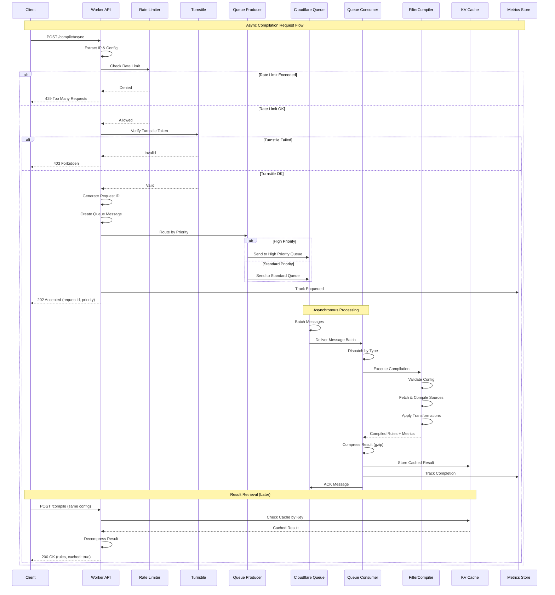
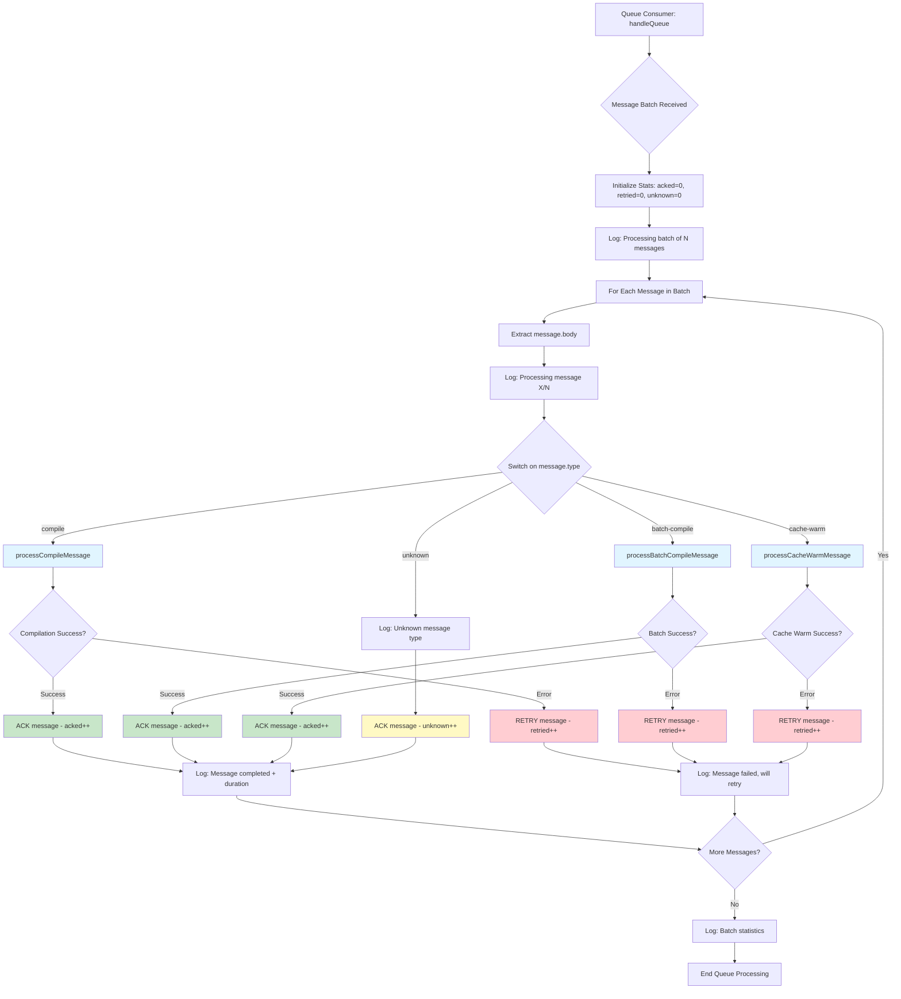
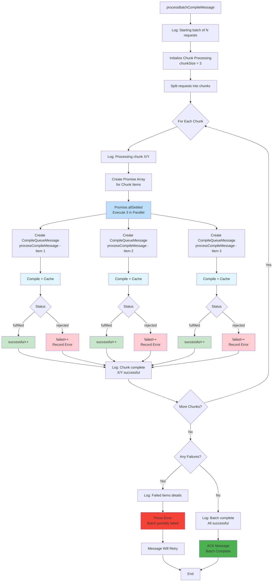
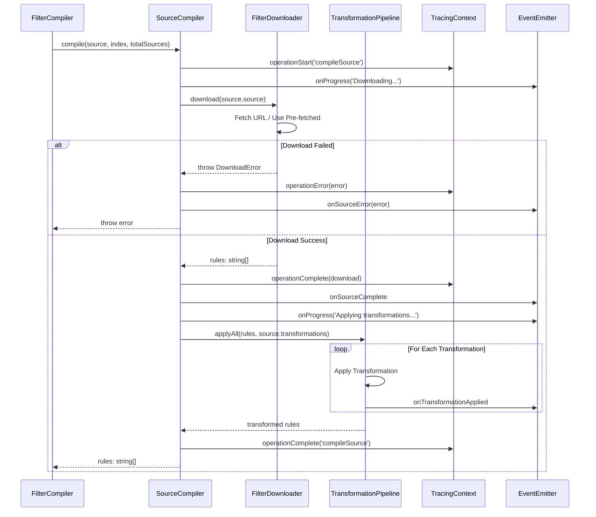
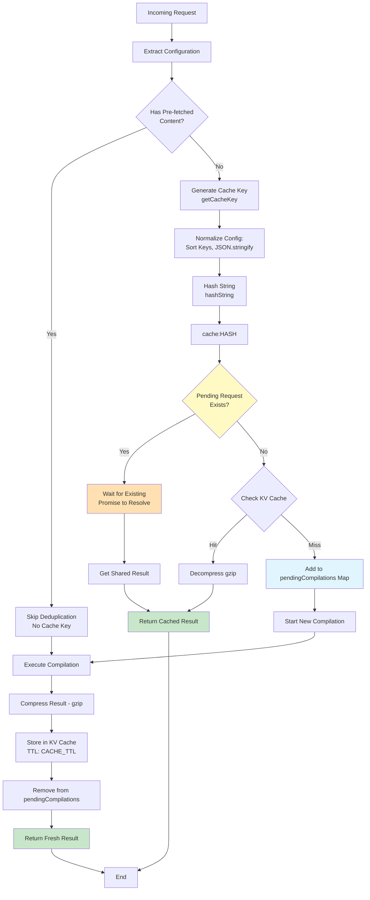
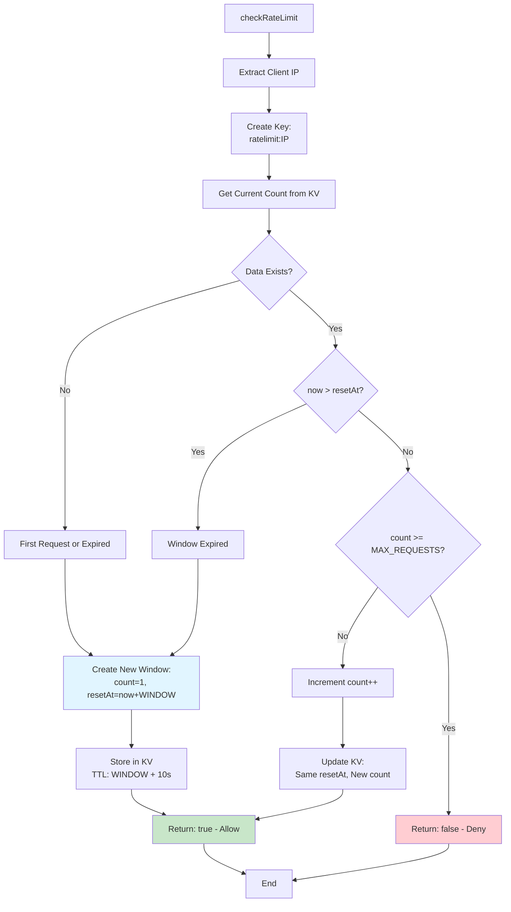
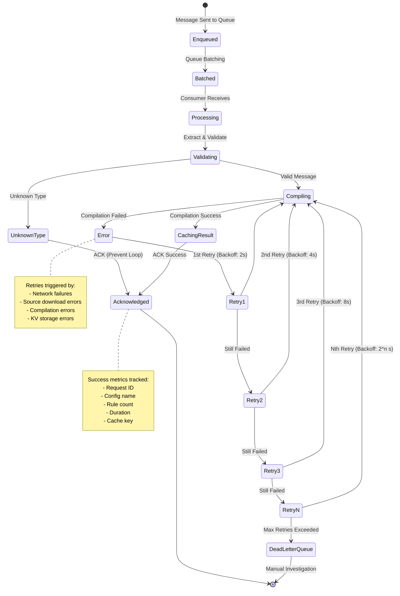
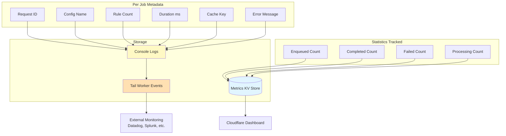

# Workflow Diagrams

This document contains comprehensive workflow diagrams for the adblock-compiler system, including queuing, compilation, and other key processes.

## Table of Contents
- [Queue System Workflows](#queue-system-workflows)
  - [Async Compilation Flow](#async-compilation-flow)
  - [Queue Message Processing](#queue-message-processing)
  - [Priority Queue Routing](#priority-queue-routing)
  - [Batch Processing Flow](#batch-processing-flow)
  - [Cache Warming Flow](#cache-warming-flow)
- [Compilation Workflows](#compilation-workflows)
  - [Filter Compilation Process](#filter-compilation-process)
  - [Source Compilation](#source-compilation)
  - [Request Deduplication](#request-deduplication)
- [Supporting Processes](#supporting-processes)
  - [Rate Limiting](#rate-limiting)
  - [Caching Strategy](#caching-strategy)
  - [Error Handling & Retry](#error-handling--retry)

---

## Queue System Workflows

### Async Compilation Flow

Complete end-to-end flow for asynchronous compilation requests.



### Queue Message Processing

Internal queue consumer flow showing message type dispatch and processing.



### Priority Queue Routing

Shows how messages are routed to different queues based on priority level.

```mermaid
flowchart LR
    Client[Client Request] --> API[API Endpoint]
    
    API --> Extract[Extract Priority Field]
    Extract --> DefaultCheck{Priority Specified?}
    
    DefaultCheck -->|No| SetDefault[Set priority = 'standard']
    DefaultCheck -->|Yes| Validate{Validate Priority}
    
    SetDefault --> Route
    Validate -->|Invalid| SetDefault
    Validate -->|Valid| Route[Route Message]
    
    Route --> PriorityCheck{priority === 'high'?}
    
    PriorityCheck -->|Yes| HighQueue[(High Priority Queue)]
    PriorityCheck -->|No| StandardQueue[(Standard Queue)]
    
    HighQueue --> HighConsumer[High Priority Consumer]
    StandardQueue --> StandardConsumer[Standard Consumer]
    
    HighConsumer --> HighConfig[Config: max_batch_size=5<br/>max_batch_timeout=2s]
    StandardConsumer --> StandardConfig[Config: max_batch_size=10<br/>max_batch_timeout=5s]
    
    HighConfig --> Process[Process Messages]
    StandardConfig --> Process
    
    Process --> Result[Compilation Complete]
    
    style HighQueue fill:#ff9800
    style StandardQueue fill:#4caf50
    style HighConsumer fill:#ffe0b2
    style StandardConsumer fill:#c8e6c9
    style Result fill:#e1f5ff
```



### Batch Processing Flow

Detailed flow showing how batch compilations are processed with chunking.



### Cache Warming Flow

Process for pre-warming the cache with popular filter lists.

```mermaid
flowchart TD
    Start[processCacheWarmMessage] --> Extract[Extract configurations array]
    
    Extract --> LogStart[Log: Starting cache warming<br/>for N configurations]
    
    LogStart --> InitStats[Initialize:<br/>successful=0, failed=0, failures=[]]
    
    InitStats --> ChunkLoop[Process in Chunks of 3]
    
    ChunkLoop --> Chunk1{Chunk 1}
    Chunk1 --> Config1A[Configuration A]
    Chunk1 --> Config1B[Configuration B]
    Chunk1 --> Config1C[Configuration C]
    
    Config1A --> Compile1A[Create CompileQueueMessage<br/>Generate Request ID]
    Config1B --> Compile1B[Create CompileQueueMessage<br/>Generate Request ID]
    Config1C --> Compile1C[Create CompileQueueMessage<br/>Generate Request ID]
    
    Compile1A --> Process1A[processCompileMessage:<br/>Validate, Fetch, Compile]
    Compile1B --> Process1B[processCompileMessage:<br/>Validate, Fetch, Compile]
    Compile1C --> Process1C[processCompileMessage:<br/>Validate, Fetch, Compile]
    
    Process1A --> Cache1A[Cache Result in KV]
    Process1B --> Cache1B[Cache Result in KV]
    Process1C --> Cache1C[Cache Result in KV]
    
    Cache1A --> Result1A{Success?}
    Cache1B --> Result1B{Success?}
    Cache1C --> Result1C{Success?}
    
    Result1A -->|Yes| Inc1A[successful++]
    Result1A -->|No| Fail1A[failed++, Record Error]
    Result1B -->|Yes| Inc1B[successful++]
    Result1B -->|No| Fail1B[failed++, Record Error]
    Result1C -->|Yes| Inc1C[successful++]
    Result1C -->|No| Fail1C[failed++, Record Error]
    
    Inc1A --> ChunkDone
    Fail1A --> ChunkDone
    Inc1B --> ChunkDone
    Fail1B --> ChunkDone
    Inc1C --> ChunkDone
    Fail1C --> ChunkDone
    
    ChunkDone[Log: Chunk complete] --> MoreChunks{More Chunks?}
    
    MoreChunks -->|Yes| ChunkLoop
    MoreChunks -->|No| FinalCheck{Any Failures?}
    
    FinalCheck -->|Yes| LogErrors[Log: Failed configurations<br/>with details]
    FinalCheck -->|No| LogComplete[Log: Cache warming complete<br/>All successful]
    
    LogErrors --> ThrowError[Throw Error:<br/>Partially Failed]
    LogComplete --> Success[Cache Ready for<br/>Future Requests]
    
    ThrowError --> Retry[Message Retried]
    Success --> End[End]
    Retry --> End
    
    style Process1A fill:#e1f5ff
    style Process1B fill:#e1f5ff
    style Process1C fill:#e1f5ff
    style Cache1A fill:#fff9c4
    style Cache1B fill:#fff9c4
    style Cache1C fill:#fff9c4
    style Inc1A fill:#c8e6c9
    style Inc1B fill:#c8e6c9
    style Inc1C fill:#c8e6c9
    style Fail1A fill:#ffcdd2
    style Fail1B fill:#ffcdd2
    style Fail1C fill:#ffcdd2
    style Success fill:#4caf50
```

---

## Compilation Workflows

### Filter Compilation Process

Core compilation flow from configuration to final rules.

```mermaid
flowchart TD
    Start[FilterCompiler.compileWithMetrics] --> InitBenchmark{Benchmark Enabled?}
    
    InitBenchmark -->|Yes| CreateCollector[Create BenchmarkCollector]
    InitBenchmark -->|No| NoBenchmark[collector = null]
    
    CreateCollector --> StartTrace
    NoBenchmark --> StartTrace[Start Tracing: compileFilterList]
    
    StartTrace --> ValidateConfig[Validate Configuration]
    ValidateConfig --> ValidationCheck{Valid?}
    
    ValidationCheck -->|No| LogValidationError[Emit operationError<br/>Log Error]
    ValidationCheck -->|Yes| TraceValidation[Emit operationComplete<br/>valid: true]
    
    LogValidationError --> ThrowError[Throw ConfigurationError]
    
    TraceValidation --> LogConfig[Log Configuration JSON]
    LogConfig --> ExtractSources[Extract configuration.sources]
    
    ExtractSources --> StartSourceTrace[Start Tracing: compileSources]
    StartSourceTrace --> ParallelSources[Promise.all: Compile Sources in Parallel]
    
    ParallelSources --> Source1[SourceCompiler.compile<br/>Source 0 of N]
    ParallelSources --> Source2[SourceCompiler.compile<br/>Source 1 of N]
    ParallelSources --> Source3[SourceCompiler.compile<br/>Source N-1 of N]
    
    Source1 --> Rules1[rules: string[]]
    Source2 --> Rules2[rules: string[]]
    Source3 --> Rules3[rules: string[]]
    
    Rules1 --> CompleteTrace
    Rules2 --> CompleteTrace
    Rules3 --> CompleteTrace[Emit operationComplete<br/>totalRules count]
    
    CompleteTrace --> CombineResults[Combine Source Results<br/>Maintain Order]
    
    CombineResults --> AddHeaders[Add Source Headers]
    AddHeaders --> ApplyTransforms[Apply Transformations]
    
    ApplyTransforms --> Transform1[Transformation 1]
    Transform1 --> Transform2[Transformation 2]
    Transform2 --> TransformN[Transformation N]
    
    TransformN --> CompleteCompilation[Emit operationComplete:<br/>compileFilterList]
    
    CompleteCompilation --> GenerateHeader[Generate List Header]
    GenerateHeader --> AddChecksum[Add Checksum to Header]
    
    AddChecksum --> FinalRules[Combine: Header + Rules]
    FinalRules --> CollectMetrics{Benchmark?}
    
    CollectMetrics -->|Yes| StopCollector[collector.stop<br/>Gather Metrics]
    CollectMetrics -->|No| NoMetrics[metrics = undefined]
    
    StopCollector --> ReturnResult
    NoMetrics --> ReturnResult[Return: CompilationResult<br/>rules, metrics, diagnostics]
    
    ReturnResult --> End[End]
    ThrowError --> End
    
    style ParallelSources fill:#bbdefb
    style Source1 fill:#e1f5ff
    style Source2 fill:#e1f5ff
    style Source3 fill:#e1f5ff
    style ApplyTransforms fill:#fff9c4
    style ReturnResult fill:#c8e6c9
    style ThrowError fill:#ffcdd2
```

### Source Compilation

Individual source processing within the compiler.



### Request Deduplication

In-flight request deduplication using cache keys.



---

## Supporting Processes

### Rate Limiting

Rate limiting check for incoming requests.



### Caching Strategy

Comprehensive caching flow with compression.

```mermaid
flowchart LR
    subgraph "Write Path"
        CompileComplete[Compilation Complete] --> CreateResult[Create CompilationResult:<br/>success, rules, ruleCount, metrics, compiledAt]
        CreateResult --> MeasureSize[Measure Uncompressed Size]
        MeasureSize --> Compress[Compress with gzip]
        Compress --> MeasureCompressed[Measure Compressed Size]
        MeasureCompressed --> CalcRatio[Calculate Compression Ratio:<br/>70-80% typical]
        CalcRatio --> StoreKV[Store in KV:<br/>Key: cache:HASH<br/>TTL: 3600s]
        StoreKV --> LogCache[Log: Cache stored<br/>Size & Compression]
    end
    
    subgraph "Read Path"
        Request[Incoming Request] --> GenerateKey[Generate Cache Key]
        GenerateKey --> LookupKV[Lookup in KV]
        LookupKV --> Found{Found?}
        Found -->|No| CacheMiss[Cache Miss]
        Found -->|Yes| ReadCompressed[Read Compressed Data]
        ReadCompressed --> Decompress[Decompress gzip]
        Decompress --> ParseJSON[Parse JSON]
        ParseJSON --> ReturnCached[Return Result<br/>cached: true]
        CacheMiss --> CompileNew[Start New Compilation]
    end
    
    LogCache -.->|Later Request| Request
    
    style Compress fill:#fff9c4
    style StoreKV fill:#e1f5ff
    style ReturnCached fill:#c8e6c9
    style CacheMiss fill:#ffcdd2
```



### Error Handling & Retry

Queue message retry strategy with exponential backoff.



---

## Queue Statistics & Monitoring

Queue statistics tracking for observability.



---

## Message Type Reference

Quick reference for the three queue message types:

| Message Type | Purpose | Processing | Chunking |
|--------------|---------|------------|----------|
| **compile** | Single compilation job | Direct compilation → cache | N/A |
| **batch-compile** | Multiple compilations | Parallel chunks of 3 | Yes (3 items) |
| **cache-warm** | Pre-compile popular lists | Parallel chunks of 3 | Yes (3 items) |

## Priority Level Comparison

| Priority | Queue | max_batch_size | max_batch_timeout | Use Case |
|----------|-------|----------------|-------------------|----------|
| **standard** | `adblock-compiler-worker-queue` | 10 | 5s | Batch operations, scheduled jobs |
| **high** | `adblock-compiler-worker-queue-high-priority` | 5 | 2s | Premium users, urgent requests |

---

## Notes

- All queue processing is asynchronous and non-blocking
- Parallel processing is limited to chunks of 3 to prevent resource exhaustion
- Cache TTL is 1 hour (3600s) by default
- Compression typically achieves 70-80% size reduction
- Rate limiting window is 60 seconds with max 10 requests per IP
- All operations include comprehensive logging with structured prefixes
- Diagnostic events are emitted to tail worker for centralized monitoring
- Error recovery uses exponential backoff with automatic retry
- Unknown message types are acknowledged to prevent infinite retry loops
