# Workflow Diagrams

This document contains comprehensive workflow diagrams for the adblock-compiler system, including Cloudflare Workflows, queue-based processing, compilation pipelines, and supporting processes.

## Table of Contents

- [System Architecture Overview](#system-architecture-overview)
- [Cloudflare Workflows](#cloudflare-workflows)
  - [Workflow System Architecture](#workflow-system-architecture)
  - [CompilationWorkflow](#compilationworkflow)
  - [BatchCompilationWorkflow](#batchcompilationworkflow)
  - [CacheWarmingWorkflow](#cachewarmingworkflow)
  - [HealthMonitoringWorkflow](#healthmonitoringworkflow)
  - [Workflow Events & Progress Tracking](#workflow-events--progress-tracking)
- [Queue System Workflows](#queue-system-workflows)
  - [Async Compilation Flow](#async-compilation-flow)
  - [Queue Message Processing](#queue-message-processing)
  - [Priority Queue Routing](#priority-queue-routing)
  - [Batch Processing Flow](#batch-processing-flow)
  - [Cache Warming Flow](#cache-warming-flow)
- [Compilation Workflows](#compilation-workflows)
  - [Filter Compilation Process](#filter-compilation-process)
  - [Source Compilation](#source-compilation)
  - [Transformation Pipeline](#transformation-pipeline)
  - [Request Deduplication](#request-deduplication)
- [Supporting Processes](#supporting-processes)
  - [Rate Limiting](#rate-limiting)
  - [Caching Strategy](#caching-strategy)
  - [Error Handling & Retry](#error-handling--retry)

---

## System Architecture Overview

High-level view of all processing systems and their interactions.

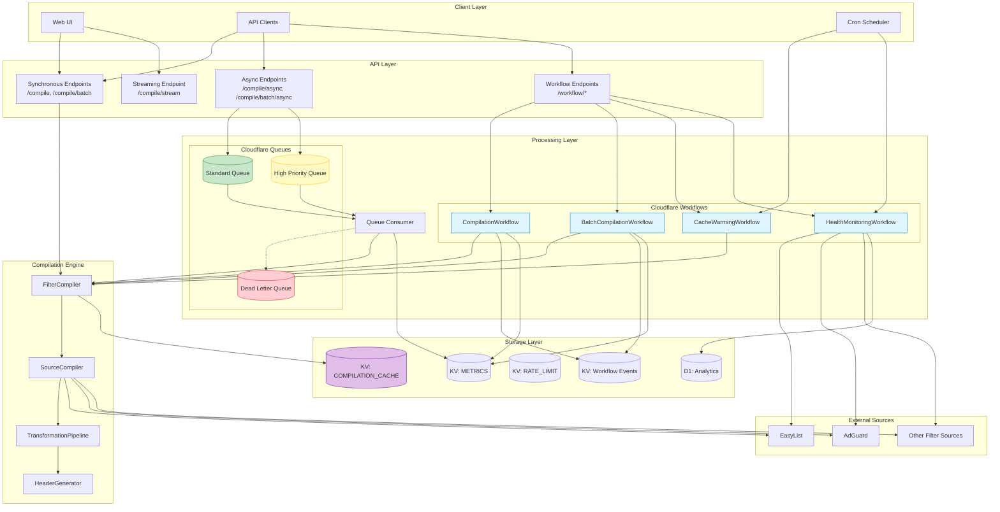

### Processing Path Comparison

| Path | Entry Point | Persistence | Crash Recovery | Best For |
|------|-------------|-------------|----------------|----------|
| **Synchronous** | `/compile` | None | N/A | Interactive requests |
| **Queue-Based** | `/compile/async` | Queue | Message retry | Batch operations |
| **Workflows** | `/workflow/*` | Per-step | Resume from checkpoint | Long-running, critical |
| **Streaming** | `/compile/stream` | None | N/A | Real-time progress |

---

## Cloudflare Workflows

Cloudflare Workflows provide durable execution with automatic state persistence, crash recovery, and observable progress.

### Workflow System Architecture

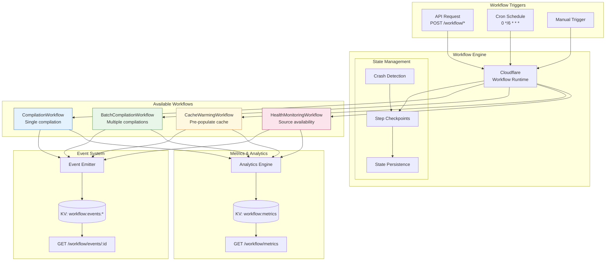

### CompilationWorkflow

Handles single asynchronous compilation requests with durable state between steps.

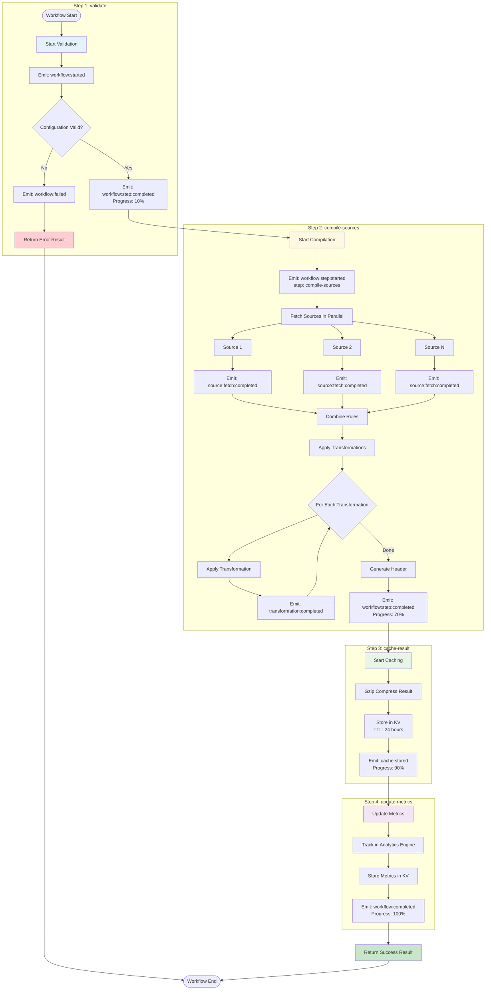

**Retry Configuration:**

| Step | Retries | Delay | Backoff | Timeout |
|------|---------|-------|---------|---------|
| validate | 1 | 1s | linear | 30s |
| compile-sources | 3 | 30s | exponential | 5m |
| cache-result | 2 | 2s | linear | 30s |
| update-metrics | 1 | 1s | linear | 10s |

### BatchCompilationWorkflow

Processes multiple compilations with per-chunk durability and crash recovery.

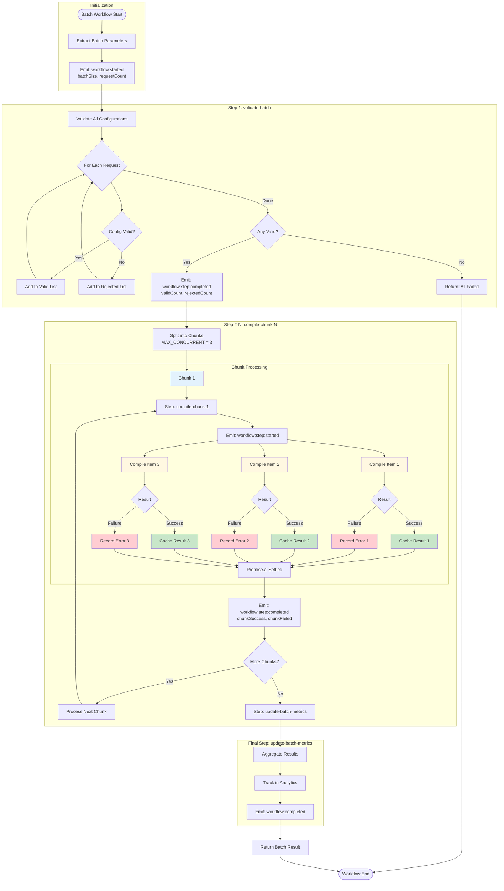

**Crash Recovery Scenario:**

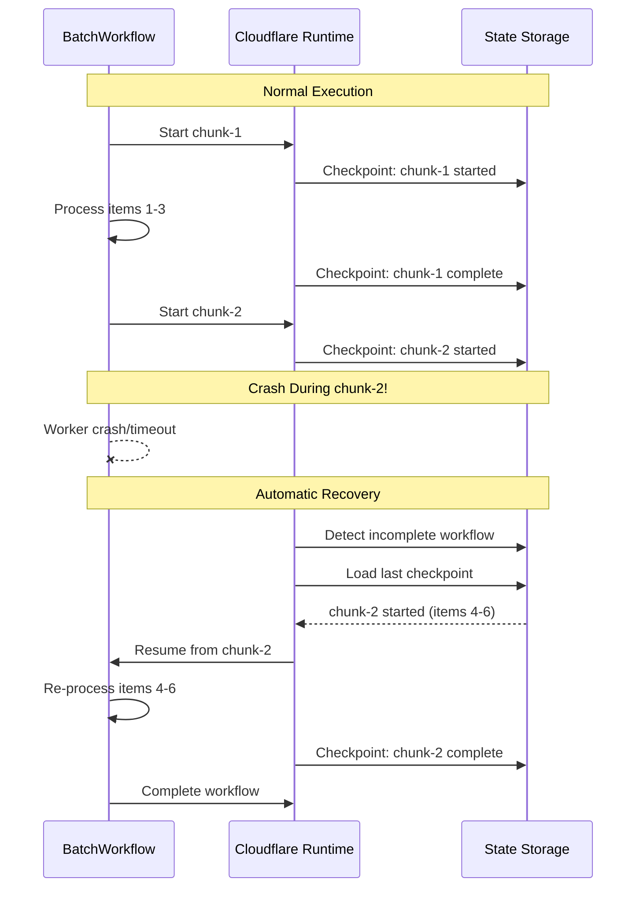

### CacheWarmingWorkflow

Pre-compiles and caches popular filter lists to reduce latency for end users.

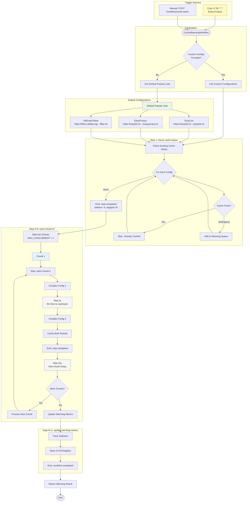

**Warming Schedule:**

```mermaid
gantt
    title Cache Warming Schedule (24-hour cycle)
    dateFormat HH:mm
    axisFormat %H:%M

    section Cron Triggers
    Cache Warm Run 1    :cron1, 00:00, 30m
    Cache Warm Run 2    :cron2, 06:00, 30m
    Cache Warm Run 3    :cron3, 12:00, 30m
    Cache Warm Run 4    :cron4, 18:00, 30m

    section Cache Validity
    EasyList Cache      :active, cache1, 00:00, 24h
    EasyPrivacy Cache   :active, cache2, 00:00, 24h
    AdGuard Cache       :active, cache3, 00:00, 24h
```

### HealthMonitoringWorkflow

Periodically checks availability and validity of upstream filter list sources.

```mermaid
flowchart TD
    subgraph "Trigger Sources"
        CRON[Cron: 0 * * * *<br/>Every hour]
        MANUAL[Manual: POST /workflow/health-check]
        ALERT_RECHECK[Alert-triggered Recheck]
    end

    subgraph "Initialization"
        CRON --> START
        MANUAL --> START
        ALERT_RECHECK --> START([HealthMonitoringWorkflow])
        START --> PARAMS{Custom Sources?}
        PARAMS -->|Yes| USE_CUSTOM[Use Provided Sources]
        PARAMS -->|No| USE_DEFAULT[Use Default Sources]
    end

    subgraph "Default Monitored Sources"
        USE_DEFAULT --> SOURCES[Default Sources]
        SOURCES --> S1[EasyList<br/>Expected: 50,000+ rules]
        SOURCES --> S2[EasyPrivacy<br/>Expected: 10,000+ rules]
        SOURCES --> S3[AdGuard Base<br/>Expected: 30,000+ rules]
        SOURCES --> S4[AdGuard Tracking<br/>Expected: 10,000+ rules]
        SOURCES --> S5[Peter Lowe's List<br/>Expected: 2,000+ rules]
    end

    subgraph "Step 1: load-health-history"
        USE_CUSTOM --> HISTORY
        S1 --> HISTORY
        S2 --> HISTORY
        S3 --> HISTORY
        S4 --> HISTORY
        S5 --> HISTORY
        HISTORY[Load Health History] --> HIST_FETCH[Fetch Last 30 Days]
        HIST_FETCH --> HIST_ANALYZE[Analyze Failure Patterns]
        HIST_ANALYZE --> HIST_EMIT[Emit: step:completed]
    end

    subgraph "Step 2-N: check-source-N"
        HIST_EMIT --> CHECK_LOOP[For Each Source]

        CHECK_LOOP --> CHECK_SRC[Step: check-source-N]
        CHECK_SRC --> EMIT_START[Emit: health:check:started]

        EMIT_START --> HTTP_REQ[HTTP HEAD/GET Request]
        HTTP_REQ --> MEASURE[Measure Response Time]

        MEASURE --> VALIDATE{Validate Response}

        VALIDATE --> V_STATUS{Status 200?}
        V_STATUS -->|No| MARK_UNHEALTHY[Mark Unhealthy<br/>Record Error]
        V_STATUS -->|Yes| V_TIME{Response < 30s?}
        V_TIME -->|No| MARK_SLOW[Mark Unhealthy<br/>Too Slow]
        V_TIME -->|Yes| V_RULES{Rules >= Expected?}
        V_RULES -->|No| MARK_LOW[Mark Unhealthy<br/>Low Rule Count]
        V_RULES -->|Yes| MARK_HEALTHY[Mark Healthy]

        MARK_UNHEALTHY --> RECORD
        MARK_SLOW --> RECORD
        MARK_LOW --> RECORD
        MARK_HEALTHY --> RECORD[Record Result]

        RECORD --> EMIT_DONE[Emit: health:check:completed]
        EMIT_DONE --> DELAY[Sleep 2s]
        DELAY --> MORE_SRC{More Sources?}
        MORE_SRC -->|Yes| CHECK_LOOP
        MORE_SRC -->|No| ANALYZE_STEP
    end

    subgraph "Step N+1: analyze-results"
        ANALYZE_STEP[Analyze All Results] --> CALC[Calculate Statistics]
        CALC --> CHECK_CONSEC{Consecutive<br/>Failures >= 3?}
        CHECK_CONSEC -->|Yes| NEED_ALERT[Flag for Alert]
        CHECK_CONSEC -->|No| NO_ALERT[No Alert Needed]
    end

    subgraph "Step N+2: send-alerts (conditional)"
        NEED_ALERT --> ALERT_CHECK{alertOnFailure?}
        ALERT_CHECK -->|Yes| SEND[Send Alert Notification]
        ALERT_CHECK -->|No| SKIP_ALERT[Skip Alert]
        NO_ALERT --> STORE_STEP
        SEND --> STORE_STEP
        SKIP_ALERT --> STORE_STEP
    end

    subgraph "Step N+3: store-results"
        STORE_STEP[Store Results] --> STORE_KV[Store in KV]
        STORE_KV --> STORE_AE[Track in Analytics]
        STORE_AE --> EMIT_COMPLETE[Emit: workflow:completed]
    end

    EMIT_COMPLETE --> RETURN[Return Health Report]
    RETURN --> END([End])

    style CRON fill:#fff9c4
    style MARK_HEALTHY fill:#c8e6c9
    style MARK_UNHEALTHY fill:#ffcdd2
    style MARK_SLOW fill:#ffcdd2
    style MARK_LOW fill:#ffcdd2
    style NEED_ALERT fill:#ffcdd2
```

**Health Check Response Structure:**

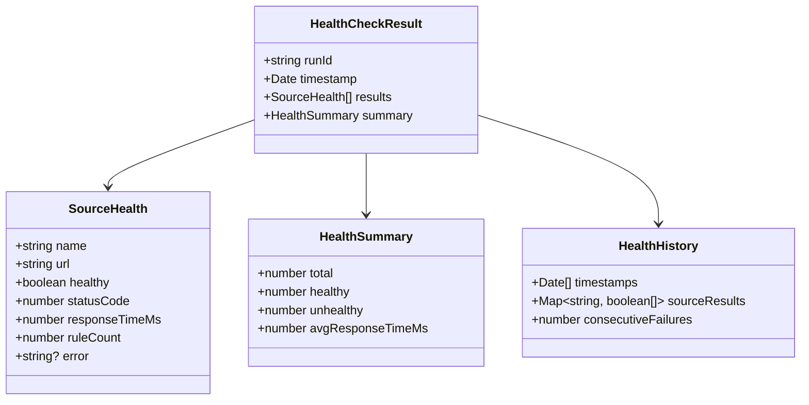

### Workflow Events & Progress Tracking

Real-time progress tracking for all workflows using the WorkflowEvents system.

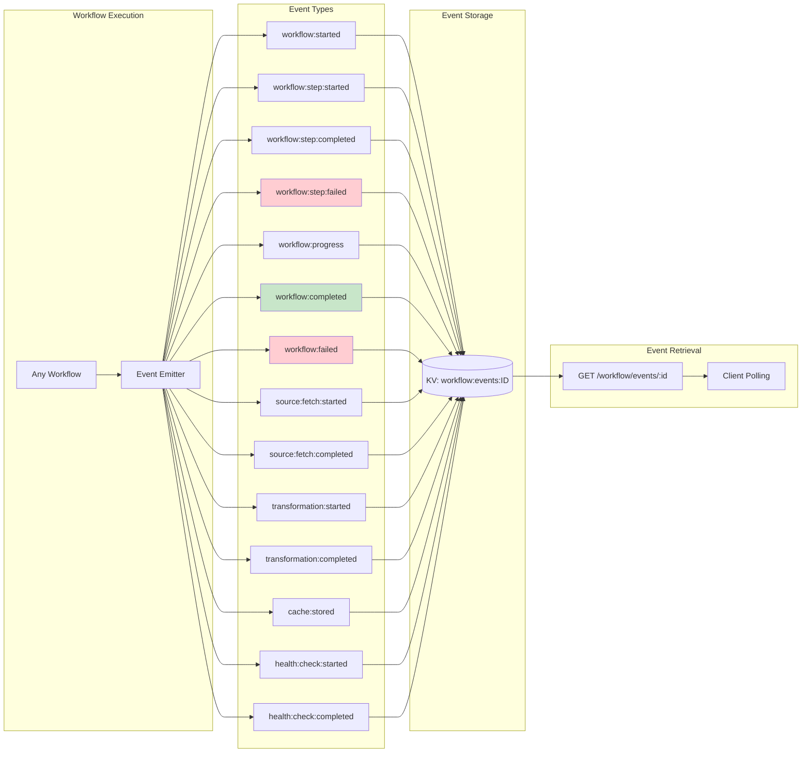

**Event Polling Sequence:**

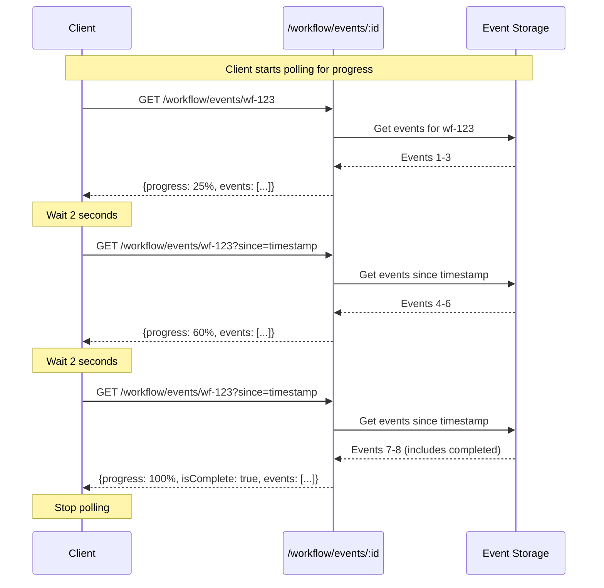

**Event Storage Limits:**

| Parameter | Value | Notes |
|-----------|-------|-------|
| TTL | 1 hour | Events auto-expire |
| Max Events | 100 per workflow | Oldest truncated |
| Key Format | `workflow:events:{workflowId}` | |
| Consistency | Eventual | Acceptable for progress |

---

## Queue System Workflows

### Async Compilation Flow

Complete end-to-end flow for asynchronous compilation requests.


### Queue Message Processing

Internal queue consumer flow showing message type dispatch and processing.


### Priority Queue Routing

Shows how messages are routed to different queues based on priority level.


### Batch Processing Flow

Detailed flow showing how batch compilations are processed with chunking.


### Cache Warming Flow

Process for pre-warming the cache with popular filter lists.

```mermaid
flowchart TD
    Start[processCacheWarmMessage] --> Extract[Extract configurations array]
    
    Extract --> LogStart[Log: Starting cache warming<br/>for N configurations]
    
    LogStart --> InitStats[Initialize:<br/>successful=0, failed=0, failures=[]]
    
    InitStats --> ChunkLoop[Process in Chunks of 3]
    
    ChunkLoop --> Chunk1{Chunk 1}
    Chunk1 --> Config1A[Configuration A]
    Chunk1 --> Config1B[Configuration B]
    Chunk1 --> Config1C[Configuration C]
    
    Config1A --> Compile1A[Create CompileQueueMessage<br/>Generate Request ID]
    Config1B --> Compile1B[Create CompileQueueMessage<br/>Generate Request ID]
    Config1C --> Compile1C[Create CompileQueueMessage<br/>Generate Request ID]
    
    Compile1A --> Process1A[processCompileMessage:<br/>Validate, Fetch, Compile]
    Compile1B --> Process1B[processCompileMessage:<br/>Validate, Fetch, Compile]
    Compile1C --> Process1C[processCompileMessage:<br/>Validate, Fetch, Compile]
    
    Process1A --> Cache1A[Cache Result in KV]
    Process1B --> Cache1B[Cache Result in KV]
    Process1C --> Cache1C[Cache Result in KV]
    
    Cache1A --> Result1A{Success?}
    Cache1B --> Result1B{Success?}
    Cache1C --> Result1C{Success?}
    
    Result1A -->|Yes| Inc1A[successful++]
    Result1A -->|No| Fail1A[failed++, Record Error]
    Result1B -->|Yes| Inc1B[successful++]
    Result1B -->|No| Fail1B[failed++, Record Error]
    Result1C -->|Yes| Inc1C[successful++]
    Result1C -->|No| Fail1C[failed++, Record Error]
    
    Inc1A --> ChunkDone
    Fail1A --> ChunkDone
    Inc1B --> ChunkDone
    Fail1B --> ChunkDone
    Inc1C --> ChunkDone
    Fail1C --> ChunkDone
    
    ChunkDone[Log: Chunk complete] --> MoreChunks{More Chunks?}
    
    MoreChunks -->|Yes| ChunkLoop
    MoreChunks -->|No| FinalCheck{Any Failures?}
    
    FinalCheck -->|Yes| LogErrors[Log: Failed configurations<br/>with details]
    FinalCheck -->|No| LogComplete[Log: Cache warming complete<br/>All successful]
    
    LogErrors --> ThrowError[Throw Error:<br/>Partially Failed]
    LogComplete --> Success[Cache Ready for<br/>Future Requests]
    
    ThrowError --> Retry[Message Retried]
    Success --> End[End]
    Retry --> End
    
    style Process1A fill:#e1f5ff
    style Process1B fill:#e1f5ff
    style Process1C fill:#e1f5ff
    style Cache1A fill:#fff9c4
    style Cache1B fill:#fff9c4
    style Cache1C fill:#fff9c4
    style Inc1A fill:#c8e6c9
    style Inc1B fill:#c8e6c9
    style Inc1C fill:#c8e6c9
    style Fail1A fill:#ffcdd2
    style Fail1B fill:#ffcdd2
    style Fail1C fill:#ffcdd2
    style Success fill:#4caf50
```

---

## Compilation Workflows

### Filter Compilation Process

Core compilation flow from configuration to final rules.

```mermaid
flowchart TD
    Start[FilterCompiler.compileWithMetrics] --> InitBenchmark{Benchmark Enabled?}
    
    InitBenchmark -->|Yes| CreateCollector[Create BenchmarkCollector]
    InitBenchmark -->|No| NoBenchmark[collector = null]
    
    CreateCollector --> StartTrace
    NoBenchmark --> StartTrace[Start Tracing: compileFilterList]
    
    StartTrace --> ValidateConfig[Validate Configuration]
    ValidateConfig --> ValidationCheck{Valid?}
    
    ValidationCheck -->|No| LogValidationError[Emit operationError<br/>Log Error]
    ValidationCheck -->|Yes| TraceValidation[Emit operationComplete<br/>valid: true]
    
    LogValidationError --> ThrowError[Throw ConfigurationError]
    
    TraceValidation --> LogConfig[Log Configuration JSON]
    LogConfig --> ExtractSources[Extract configuration.sources]
    
    ExtractSources --> StartSourceTrace[Start Tracing: compileSources]
    StartSourceTrace --> ParallelSources[Promise.all: Compile Sources in Parallel]
    
    ParallelSources --> Source1[SourceCompiler.compile<br/>Source 0 of N]
    ParallelSources --> Source2[SourceCompiler.compile<br/>Source 1 of N]
    ParallelSources --> Source3[SourceCompiler.compile<br/>Source N-1 of N]
    
    Source1 --> Rules1[rules: string[]]
    Source2 --> Rules2[rules: string[]]
    Source3 --> Rules3[rules: string[]]
    
    Rules1 --> CompleteTrace
    Rules2 --> CompleteTrace
    Rules3 --> CompleteTrace[Emit operationComplete<br/>totalRules count]
    
    CompleteTrace --> CombineResults[Combine Source Results<br/>Maintain Order]
    
    CombineResults --> AddHeaders[Add Source Headers]
    AddHeaders --> ApplyTransforms[Apply Transformations]
    
    ApplyTransforms --> Transform1[Transformation 1]
    Transform1 --> Transform2[Transformation 2]
    Transform2 --> TransformN[Transformation N]
    
    TransformN --> CompleteCompilation[Emit operationComplete:<br/>compileFilterList]
    
    CompleteCompilation --> GenerateHeader[Generate List Header]
    GenerateHeader --> AddChecksum[Add Checksum to Header]
    
    AddChecksum --> FinalRules[Combine: Header + Rules]
    FinalRules --> CollectMetrics{Benchmark?}
    
    CollectMetrics -->|Yes| StopCollector[collector.stop<br/>Gather Metrics]
    CollectMetrics -->|No| NoMetrics[metrics = undefined]
    
    StopCollector --> ReturnResult
    NoMetrics --> ReturnResult[Return: CompilationResult<br/>rules, metrics, diagnostics]
    
    ReturnResult --> End[End]
    ThrowError --> End
    
    style ParallelSources fill:#bbdefb
    style Source1 fill:#e1f5ff
    style Source2 fill:#e1f5ff
    style Source3 fill:#e1f5ff
    style ApplyTransforms fill:#fff9c4
    style ReturnResult fill:#c8e6c9
    style ThrowError fill:#ffcdd2
```

### Source Compilation

Individual source processing within the compiler.


### Transformation Pipeline

The transformation pipeline applies a series of rule transformations in a fixed order.

```mermaid
flowchart TD
    subgraph "Input"
        INPUT[Raw Rules Array<br/>from Source Fetch]
    end

    subgraph "Pre-Processing"
        INPUT --> EXCLUSIONS{Has Exclusion<br/>Patterns?}
        EXCLUSIONS -->|Yes| APPLY_EXCL[Apply Exclusions<br/>Remove matching rules]
        EXCLUSIONS -->|No| INCLUSIONS
        APPLY_EXCL --> INCLUSIONS{Has Inclusion<br/>Patterns?}
        INCLUSIONS -->|Yes| APPLY_INCL[Apply Inclusions<br/>Keep only matching rules]
        INCLUSIONS -->|No| TRANSFORM_START
        APPLY_INCL --> TRANSFORM_START[Start Transformation Pipeline]
    end

    subgraph "Transformation Pipeline (Fixed Order)"
        TRANSFORM_START --> T1[1. ConvertToAscii<br/>Non-ASCII → Punycode]
        T1 --> T2[2. TrimLines<br/>Remove whitespace]
        T2 --> T3[3. RemoveComments<br/>Remove ! and # lines]
        T3 --> T4[4. Compress<br/>Hosts → Adblock syntax]
        T4 --> T5[5. RemoveModifiers<br/>Strip unsupported modifiers]
        T5 --> T6[6. InvertAllow<br/>@@ → blocking rules]
        T6 --> T7[7. Validate<br/>Remove dangerous rules]
        T7 --> T8[8. ValidateAllowIp<br/>Validate preserving IPs]
        T8 --> T9[9. Deduplicate<br/>Remove duplicate rules]
        T9 --> T10[10. RemoveEmptyLines<br/>Remove blank lines]
        T10 --> T11[11. InsertFinalNewLine<br/>Add trailing newline]
    end

    subgraph "Output"
        T11 --> OUTPUT[Transformed Rules Array]
    end

    style T1 fill:#e3f2fd
    style T2 fill:#e3f2fd
    style T3 fill:#e3f2fd
    style T4 fill:#fff8e1
    style T5 fill:#fff8e1
    style T6 fill:#fff8e1
    style T7 fill:#fce4ec
    style T8 fill:#fce4ec
    style T9 fill:#e8f5e9
    style T10 fill:#e8f5e9
    style T11 fill:#e8f5e9
```

**Transformation Details:**

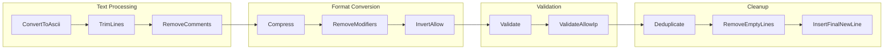

| Transformation | Purpose | Example |
|----------------|---------|---------|
| **ConvertToAscii** | Punycode encoding | `ädblock.com` → `xn--dblock-bua.com` |
| **TrimLines** | Clean whitespace | `  rule  ` → `rule` |
| **RemoveComments** | Strip comments | `! Comment` → (removed) |
| **Compress** | Hosts to adblock | `0.0.0.0 ads.com` → `||ads.com^` |
| **RemoveModifiers** | Strip modifiers | `||ads.com$third-party` → `||ads.com` |
| **InvertAllow** | Convert exceptions | `@@||safe.com^` → `||safe.com^` |
| **Validate** | Remove dangerous | `||*` → (removed) |
| **ValidateAllowIp** | Validate + IPs | Keep `127.0.0.1` rules |
| **Deduplicate** | Remove duplicates | `||a.com^, ||a.com^` → `||a.com^` |
| **RemoveEmptyLines** | Clean blanks | (blank lines removed) |
| **InsertFinalNewLine** | Add newline | Ensure file ends with `\n` |

**Pattern Matching Optimization:**

```mermaid
flowchart TD
    subgraph "Pattern Classification"
        PATTERN[Exclusion/Inclusion Pattern] --> CHECK{Contains Wildcard?}
        CHECK -->|No| PLAIN[Plain String Pattern]
        CHECK -->|Yes| REGEX[Wildcard Pattern]
    end

    subgraph "Plain String Matching"
        PLAIN --> INCLUDES[String.includes]
        INCLUDES --> FAST[O(n) per rule<br/>Very Fast]
    end

    subgraph "Wildcard Pattern Matching"
        REGEX --> COMPILE[Compile to Regex]
        COMPILE --> WILDCARDS[* → .*<br/>? → .]
        WILDCARDS --> MATCH[RegExp.test]
        MATCH --> SLOWER[O(n) with regex overhead]
    end

    subgraph "Optimization"
        FAST --> SET[Use Set for O(1) lookups<br/>when checking requested transformations]
        SLOWER --> SET
    end

    style PLAIN fill:#c8e6c9
    style REGEX fill:#fff9c4
    style SET fill:#e1f5ff
```

### Request Deduplication

In-flight request deduplication using cache keys.

```mermaid
flowchart TD
    Start[Incoming Request] --> ExtractConfig[Extract Configuration]
    
    ExtractConfig --> HasPreFetch{Has Pre-fetched<br/>Content?}
    
    HasPreFetch -->|Yes| BypassDedup[Skip Deduplication<br/>No Cache Key]
    HasPreFetch -->|No| GenerateKey[Generate Cache Key<br/>getCacheKey]
    
    GenerateKey --> NormalizeConfig[Normalize Config:<br/>Sort Keys, JSON.stringify]
    NormalizeConfig --> HashConfig[Hash String<br/>hashString]
    HashConfig --> CreateKey[cache:HASH]
    
    CreateKey --> CheckPending{Pending Request<br/>Exists?}
    
    CheckPending -->|Yes| WaitPending[Wait for Existing<br/>Promise to Resolve]
    CheckPending -->|No| CheckCache{Check KV Cache}
    
    WaitPending --> GetResult[Get Shared Result]
    GetResult --> ReturnCached[Return Cached Result]
    
    CheckCache -->|Hit| DecompressCache[Decompress gzip]
    CheckCache -->|Miss| AddPending[Add to pendingCompilations Map]
    
    DecompressCache --> ReturnCached
    
    AddPending --> StartCompile[Start New Compilation]
    StartCompile --> DoCompile[Execute Compilation]
    DoCompile --> Compress[Compress Result - gzip]
    Compress --> StoreCache[Store in KV Cache<br/>TTL: CACHE_TTL]
    StoreCache --> RemovePending[Remove from pendingCompilations]
    RemovePending --> ReturnResult[Return Fresh Result]
    
    BypassDedup --> DoCompile
    ReturnResult --> End[End]
    ReturnCached --> End
    
    style CheckPending fill:#fff9c4
    style WaitPending fill:#ffe0b2
    style AddPending fill:#e1f5ff
    style ReturnCached fill:#c8e6c9
    style ReturnResult fill:#c8e6c9
```

---

## Supporting Processes

### Rate Limiting

Rate limiting check for incoming requests.

```mermaid
flowchart TD
    Start[checkRateLimit] --> ExtractIP[Extract Client IP]
    
    ExtractIP --> CreateKey[Create Key:<br/>ratelimit:IP]
    CreateKey --> GetCurrent[Get Current Count from KV]
    
    GetCurrent --> CheckData{Data Exists?}
    
    CheckData -->|No| FirstRequest[First Request or Expired]
    CheckData -->|Yes| CheckExpired{now > resetAt?}
    
    CheckExpired -->|Yes| WindowExpired[Window Expired]
    CheckExpired -->|No| CheckLimit{count >= MAX_REQUESTS?}
    
    FirstRequest --> StartWindow[Create New Window:<br/>count=1, resetAt=now+WINDOW]
    WindowExpired --> StartWindow
    
    StartWindow --> StoreNew[Store in KV<br/>TTL: WINDOW + 10s]
    StoreNew --> AllowRequest[Return: true - Allow]
    
    CheckLimit -->|Yes| DenyRequest[Return: false - Deny]
    CheckLimit -->|No| IncrementCount[Increment count++]
    
    IncrementCount --> UpdateKV[Update KV:<br/>Same resetAt, New count]
    UpdateKV --> AllowRequest
    
    AllowRequest --> End[End]
    DenyRequest --> End
    
    style AllowRequest fill:#c8e6c9
    style DenyRequest fill:#ffcdd2
    style StartWindow fill:#e1f5ff
```

### Caching Strategy

Comprehensive caching flow with compression.

```mermaid
flowchart LR
    subgraph "Write Path"
        CompileComplete[Compilation Complete] --> CreateResult[Create CompilationResult:<br/>success, rules, ruleCount, metrics, compiledAt]
        CreateResult --> MeasureSize[Measure Uncompressed Size]
        MeasureSize --> Compress[Compress with gzip]
        Compress --> MeasureCompressed[Measure Compressed Size]
        MeasureCompressed --> CalcRatio[Calculate Compression Ratio:<br/>70-80% typical]
        CalcRatio --> StoreKV[Store in KV:<br/>Key: cache:HASH<br/>TTL: 3600s]
        StoreKV --> LogCache[Log: Cache stored<br/>Size & Compression]
    end
    
    subgraph "Read Path"
        Request[Incoming Request] --> GenerateKey[Generate Cache Key]
        GenerateKey --> LookupKV[Lookup in KV]
        LookupKV --> Found{Found?}
        Found -->|No| CacheMiss[Cache Miss]
        Found -->|Yes| ReadCompressed[Read Compressed Data]
        ReadCompressed --> Decompress[Decompress gzip]
        Decompress --> ParseJSON[Parse JSON]
        ParseJSON --> ReturnCached[Return Result<br/>cached: true]
        CacheMiss --> CompileNew[Start New Compilation]
    end
    
    LogCache -.->|Later Request| Request
    
    style Compress fill:#fff9c4
    style StoreKV fill:#e1f5ff
    style ReturnCached fill:#c8e6c9
    style CacheMiss fill:#ffcdd2
```

### Error Handling & Retry

Queue message retry strategy with exponential backoff.

```mermaid
stateDiagram-v2
    [*] --> Enqueued: Message Sent to Queue
    
    Enqueued --> Batched: Queue Batching
    Batched --> Processing: Consumer Receives
    
    Processing --> Validating: Extract & Validate
    
    Validating --> Compiling: Valid Message
    Validating --> UnknownType: Unknown Type
    
    UnknownType --> Acknowledged: ACK (Prevent Loop)
    Acknowledged --> [*]
    
    Compiling --> CachingResult: Compilation Success
    Compiling --> Error: Compilation Failed
    
    CachingResult --> Acknowledged: ACK Success
    
    Error --> Retry1: 1st Retry (Backoff: 2s)
    Retry1 --> Compiling
    
    Retry1 --> Retry2: Still Failed
    Retry2 --> Compiling: 2nd Retry (Backoff: 4s)
    
    Retry2 --> Retry3: Still Failed
    Retry3 --> Compiling: 3rd Retry (Backoff: 8s)
    
    Retry3 --> RetryN: Still Failed
    RetryN --> Compiling: Nth Retry (Backoff: 2^n s)
    
    RetryN --> DeadLetterQueue: Max Retries Exceeded
    DeadLetterQueue --> [*]: Manual Investigation
    
    note right of Error
        Retries triggered by:
        - Network failures
        - Source download errors
        - Compilation errors
        - KV storage errors
    end note
    
    note right of Acknowledged
        Success metrics tracked:
        - Request ID
        - Config name
        - Rule count
        - Duration
        - Cache key
    end note
```

---

## Queue Statistics & Monitoring

Queue statistics tracking for observability.

```mermaid
flowchart TD
    subgraph "Statistics Tracked"
        Enqueued[Enqueued Count]
        Completed[Completed Count]
        Failed[Failed Count]
        Processing[Processing Count]
    end
    
    subgraph "Per Job Metadata"
        RequestID[Request ID]
        ConfigName[Config Name]
        RuleCount[Rule Count]
        Duration[Duration ms]
        CacheKey[Cache Key]
        Error[Error Message]
    end
    
    subgraph "Storage"
        MetricsKV[(Metrics KV Store)]
        Logs[Console Logs]
        TailWorker[Tail Worker Events]
    end
    
    Enqueued --> MetricsKV
    Completed --> MetricsKV
    Failed --> MetricsKV
    Processing --> MetricsKV
    
    RequestID --> Logs
    ConfigName --> Logs
    RuleCount --> Logs
    Duration --> Logs
    CacheKey --> Logs
    Error --> Logs
    
    Logs --> TailWorker
    MetricsKV --> Dashboard[Cloudflare Dashboard]
    TailWorker --> ExternalMonitoring[External Monitoring<br/>Datadog, Splunk, etc.]
    
    style MetricsKV fill:#e1f5ff
    style Logs fill:#fff9c4
    style TailWorker fill:#ffe0b2
```

---

## Message Type Reference

Quick reference for the three queue message types:

| Message Type | Purpose | Processing | Chunking |
|--------------|---------|------------|----------|
| **compile** | Single compilation job | Direct compilation → cache | N/A |
| **batch-compile** | Multiple compilations | Parallel chunks of 3 | Yes (3 items) |
| **cache-warm** | Pre-compile popular lists | Parallel chunks of 3 | Yes (3 items) |

## Priority Level Comparison

| Priority | Queue | max_batch_size | max_batch_timeout | Use Case |
|----------|-------|----------------|-------------------|----------|
| **standard** | `adblock-compiler-worker-queue` | 10 | 5s | Batch operations, scheduled jobs |
| **high** | `adblock-compiler-worker-queue-high-priority` | 5 | 2s | Premium users, urgent requests |

---

## Notes

- All queue processing is asynchronous and non-blocking
- Parallel processing is limited to chunks of 3 to prevent resource exhaustion
- Cache TTL is 1 hour (3600s) by default
- Compression typically achieves 70-80% size reduction
- Rate limiting window is 60 seconds with max 10 requests per IP
- All operations include comprehensive logging with structured prefixes
- Diagnostic events are emitted to tail worker for centralized monitoring
- Error recovery uses exponential backoff with automatic retry
- Unknown message types are acknowledged to prevent infinite retry loops
