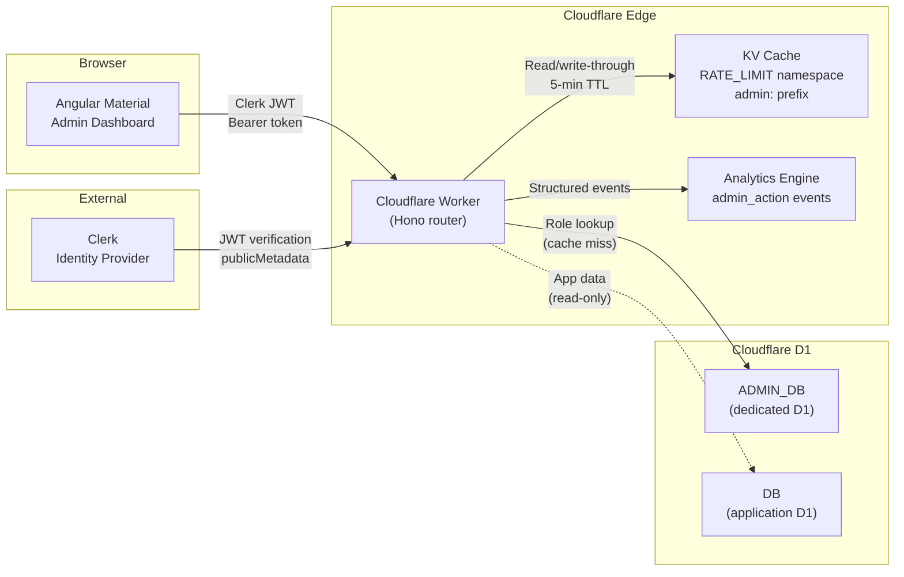

# Admin System

The adblock-compiler admin system is a 10-panel Angular Material dashboard backed by a Cloudflare Worker API. It provides granular, role-based control over every runtime aspect of the platform — tiers, scopes, feature flags, endpoint overrides, announcements, and user management — without redeploying.

## Architecture

## Key Design Decisions

### Dedicated ADMIN_DB for blast-radius isolation

The admin system uses its own D1 database (`ADMIN_DB`) rather than sharing the application's `DB` binding. This ensures:

- **Schema isolation** — Admin migrations live in `admin-migrations/` and cannot interfere with application tables.
- **Blast-radius containment** — A bad admin migration or runaway query cannot corrupt application data.
- **Independent scaling** — Admin traffic patterns (low volume, write-heavy) are separated from application traffic (high volume, read-heavy).

### KV write-through caching

Role resolution is the hottest path in the admin system — every authenticated request evaluates it. Results are cached in the `RATE_LIMIT` KV namespace with a 5-minute TTL and `admin:role:{clerkUserId}` key pattern. Cache entries are invalidated on role assignment or revocation.

### Clerk identity + D1 policy for role management

Authentication and identity live in Clerk. Authorization policy lives in D1. The split works like this:

1. **Clerk JWT** proves _who you are_ (identity, `publicMetadata.role === 'admin'` gate).
2. **ADMIN_DB** determines _what you can do_ (role → permissions mapping).
3. **KV cache** makes it fast at the edge.

This avoids coupling Clerk's metadata model to fine-grained permission logic while keeping the auth flow simple.

## Documentation

| Document | Description |
|----------|-------------|
| [Roles & Permissions](roles-permissions.md) | RBAC model, 3 built-in roles, 27 granular permissions, middleware pipeline |
| [API Reference](api-reference.md) | All 27 admin API endpoints with request/response schemas |
| [Database Schema](database-schema.md) | 8 tables in ADMIN_DB, ER diagram, seed data, migrations |
| [Feature Flags](feature-flags.md) | Flag CRUD, rollout percentages, deterministic evaluation, KV caching |
| [Observability & Audit](observability.md) | Structured logging, Analytics Engine events, audit log queries |
| [Operator Guide](operator-guide.md) | Deployment, first super-admin setup, migrations, KV management |

## Related Documentation

- [Admin Access (Auth)](../auth/admin-access.md) — Legacy `ADMIN_KEY` → Clerk migration path
- [Zero Trust Architecture](../security/ZERO_TRUST_ARCHITECTURE.md) — Security model the admin system implements
- [Cloudflare D1](../cloudflare/CLOUDFLARE_D1.md) — D1 database fundamentals
