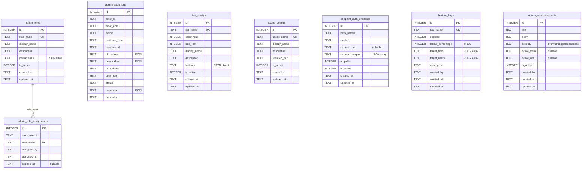

# Database Schema

The admin system stores all configuration and audit data in a dedicated D1 database (`ADMIN_DB`), separate from the application database (`DB`). This blast-radius isolation ensures admin operations cannot affect application data.

## Migration

The schema is defined in a single migration file:

```
admin-migrations/0001_admin_schema.sql
```

Apply it locally or remotely:

```bash
# Local development
wrangler d1 migrations apply adblock-compiler-admin-d1 --local

# Production
wrangler d1 migrations apply adblock-compiler-admin-d1 --remote
```

## Tables Overview

| Table | Purpose | Records |
|-------|---------|---------|
| `admin_roles` | Role definitions with permission arrays | 3 seeded |
| `admin_role_assignments` | Maps Clerk users → roles | Dynamic |
| `admin_audit_logs` | Immutable append-only action log | Append-only |
| `tier_configs` | Runtime-editable tier registry | 4 seeded |
| `scope_configs` | Runtime-editable scope registry | 3 seeded |
| `endpoint_auth_overrides` | Per-endpoint auth requirements | Dynamic |
| `feature_flags` | Feature flags with rollout targeting | Dynamic |
| `admin_announcements` | System-wide banners/notifications | Dynamic |

## Entity Relationship Diagram



## Table Details

### admin_roles

Stores role definitions with JSON permission arrays.

```sql
CREATE TABLE IF NOT EXISTS admin_roles (
    id          INTEGER PRIMARY KEY AUTOINCREMENT,
    role_name   TEXT    NOT NULL UNIQUE,
    display_name TEXT   NOT NULL,
    description TEXT    NOT NULL DEFAULT '',
    permissions TEXT    NOT NULL DEFAULT '[]',   -- JSON array of permission strings
    is_active   INTEGER NOT NULL DEFAULT 1,
    created_at  TEXT    NOT NULL DEFAULT (datetime('now')),
    updated_at  TEXT    NOT NULL DEFAULT (datetime('now'))
);
```

**Indexes**: `idx_admin_roles_active(is_active)`

### admin_role_assignments

Maps Clerk user IDs to admin roles. Supports expiration and tracks who made the assignment.

```sql
CREATE TABLE IF NOT EXISTS admin_role_assignments (
    id              INTEGER PRIMARY KEY AUTOINCREMENT,
    clerk_user_id   TEXT    NOT NULL,
    role_name       TEXT    NOT NULL,
    assigned_by     TEXT    NOT NULL,
    assigned_at     TEXT    NOT NULL DEFAULT (datetime('now')),
    expires_at      TEXT,                      -- NULL = never expires
    FOREIGN KEY (role_name) REFERENCES admin_roles(role_name) ON DELETE CASCADE,
    UNIQUE(clerk_user_id, role_name)
);
```

**Indexes**: `idx_role_assignments_user(clerk_user_id)`, `idx_role_assignments_role(role_name)`, `idx_role_assignments_expiry(expires_at)`

> The `UNIQUE(clerk_user_id, role_name)` constraint enables upsert semantics via `INSERT ... ON CONFLICT ... DO UPDATE` when re-assigning roles.

### admin_audit_logs

Immutable append-only audit trail. No UPDATE or DELETE operations are expected on this table.

```sql
CREATE TABLE IF NOT EXISTS admin_audit_logs (
    id            INTEGER PRIMARY KEY AUTOINCREMENT,
    actor_id      TEXT    NOT NULL,
    actor_email   TEXT,
    action        TEXT    NOT NULL,            -- e.g. 'tier.update', 'flag.create'
    resource_type TEXT    NOT NULL,            -- e.g. 'tier_config', 'feature_flag'
    resource_id   TEXT,
    old_values    TEXT,                        -- JSON snapshot before change
    new_values    TEXT,                        -- JSON snapshot after change
    ip_address    TEXT,
    user_agent    TEXT,
    status        TEXT    NOT NULL DEFAULT 'success',
    metadata      TEXT,
    created_at    TEXT    NOT NULL DEFAULT (datetime('now'))
);
```

**Indexes**: `idx_audit_actor(actor_id)`, `idx_audit_action(action)`, `idx_audit_resource(resource_type, resource_id)`, `idx_audit_created(created_at)`, `idx_audit_status(status)`

### tier_configs

Runtime-editable tier registry. Replaces the hardcoded `TIER_REGISTRY` in `worker/types.ts`.

```sql
CREATE TABLE IF NOT EXISTS tier_configs (
    id           INTEGER PRIMARY KEY AUTOINCREMENT,
    tier_name    TEXT    NOT NULL UNIQUE,
    order_rank   INTEGER NOT NULL DEFAULT 0,    -- higher = more privileged
    rate_limit   INTEGER NOT NULL DEFAULT 10,   -- requests/min (0 = unlimited)
    display_name TEXT    NOT NULL,
    description  TEXT    NOT NULL DEFAULT '',
    features     TEXT    NOT NULL DEFAULT '{}',  -- JSON object
    is_active    INTEGER NOT NULL DEFAULT 1,
    created_at   TEXT    NOT NULL DEFAULT (datetime('now')),
    updated_at   TEXT    NOT NULL DEFAULT (datetime('now'))
);
```

### scope_configs

Runtime-editable scope registry. Replaces the hardcoded `SCOPE_REGISTRY`.

```sql
CREATE TABLE IF NOT EXISTS scope_configs (
    id            INTEGER PRIMARY KEY AUTOINCREMENT,
    scope_name    TEXT    NOT NULL UNIQUE,
    display_name  TEXT    NOT NULL,
    description   TEXT    NOT NULL DEFAULT '',
    required_tier TEXT    NOT NULL DEFAULT 'free',
    is_active     INTEGER NOT NULL DEFAULT 1,
    created_at    TEXT    NOT NULL DEFAULT (datetime('now')),
    updated_at    TEXT    NOT NULL DEFAULT (datetime('now'))
);
```

### endpoint_auth_overrides

Per-endpoint authentication requirement overrides. The `path_pattern` supports wildcards (`*`).

```sql
CREATE TABLE IF NOT EXISTS endpoint_auth_overrides (
    id              INTEGER PRIMARY KEY AUTOINCREMENT,
    path_pattern    TEXT    NOT NULL,
    method          TEXT    NOT NULL DEFAULT '*',
    required_tier   TEXT,
    required_scopes TEXT,                       -- JSON array
    is_public       INTEGER NOT NULL DEFAULT 0,
    is_active       INTEGER NOT NULL DEFAULT 1,
    created_at      TEXT    NOT NULL DEFAULT (datetime('now')),
    updated_at      TEXT    NOT NULL DEFAULT (datetime('now')),
    UNIQUE(path_pattern, method)
);
```

### feature_flags

Feature flags with rollout percentages and tier/user targeting.

```sql
CREATE TABLE IF NOT EXISTS feature_flags (
    id                  INTEGER PRIMARY KEY AUTOINCREMENT,
    flag_name           TEXT    NOT NULL UNIQUE,
    enabled             INTEGER NOT NULL DEFAULT 0,
    rollout_percentage  INTEGER NOT NULL DEFAULT 100,
    target_tiers        TEXT    NOT NULL DEFAULT '[]',    -- JSON array
    target_users        TEXT    NOT NULL DEFAULT '[]',    -- JSON array
    description         TEXT    NOT NULL DEFAULT '',
    created_by          TEXT,
    created_at          TEXT    NOT NULL DEFAULT (datetime('now')),
    updated_at          TEXT    NOT NULL DEFAULT (datetime('now'))
);
```

### admin_announcements

System-wide banners and notifications with time-based activation.

```sql
CREATE TABLE IF NOT EXISTS admin_announcements (
    id          INTEGER PRIMARY KEY AUTOINCREMENT,
    title       TEXT    NOT NULL,
    body        TEXT    NOT NULL DEFAULT '',
    severity    TEXT    NOT NULL DEFAULT 'info',
    active_from TEXT,
    active_until TEXT,
    is_active   INTEGER NOT NULL DEFAULT 1,
    created_by  TEXT,
    created_at  TEXT    NOT NULL DEFAULT (datetime('now')),
    updated_at  TEXT    NOT NULL DEFAULT (datetime('now'))
);
```

## Seed Data

The migration seeds initial data to match the current hardcoded values in `worker/types.ts`.

### Roles (3)

| Role | Permissions Count | Key Permissions |
|------|------------------|-----------------|
| `viewer` | 6 | `admin:read`, `audit:read`, `metrics:read`, `config:read`, `users:read`, `flags:read` |
| `editor` | 16 | All viewer + `config:write`, `flags:write`, `tiers:write`, `scopes:write`, `endpoints:write`, `announcements:write` |
| `super-admin` | 27 | All permissions |

### Tiers (4)

| Tier | Order | Rate Limit | Features |
|------|-------|-----------|----------|
| `anonymous` | 0 | 10/min | maxSources: 3, maxBatchSize: 1 |
| `free` | 1 | 60/min | maxSources: 10, maxBatchSize: 5 |
| `pro` | 2 | 300/min | maxSources: 50, maxBatchSize: 25, priorityQueue |
| `admin` | 3 | Unlimited | maxSources: -1, maxBatchSize: -1, priorityQueue, rawSqlAccess |

### Scopes (3)

| Scope | Required Tier | Description |
|-------|--------------|-------------|
| `compile` | free | Compile and download filter lists |
| `rules` | free | CRUD custom filter rules |
| `admin` | admin | Full administrative access |
