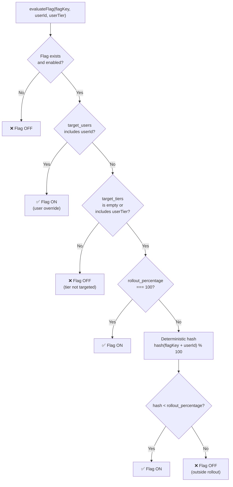
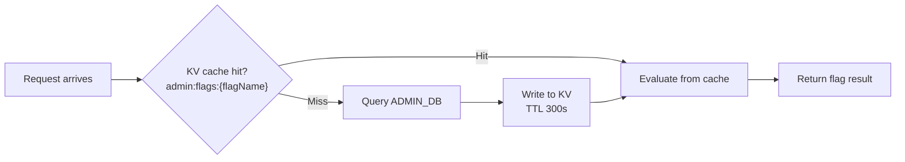

# Feature Flags

The admin system includes a feature flag engine for controlling rollouts, A/B testing, and tier-based feature gating — all without redeploying.

## Overview

Feature flags are stored in the `feature_flags` table in ADMIN_DB and managed via the admin API. Each flag supports:

- **Global enable/disable** — Kill-switch for any feature.
- **Rollout percentage** — Gradual rollout from 0% to 100%.
- **Tier targeting** — Restrict a feature to specific user tiers.
- **User targeting** — Override for specific Clerk user IDs.

## CRUD Operations

### Create a Flag

```bash
curl -X POST /admin/system/flags \
  -H "Authorization: Bearer $JWT" \
  -H "Content-Type: application/json" \
  -d '{
    "flag_name": "streaming-api-beta",
    "enabled": true,
    "rollout_percentage": 10,
    "target_tiers": ["pro", "admin"],
    "target_users": [],
    "description": "Server-sent events streaming API"
  }'
```

### Update a Flag

Toggle rollout percentage without touching other settings:

```bash
curl -X PATCH /admin/system/flags/1 \
  -H "Authorization: Bearer $JWT" \
  -H "Content-Type: application/json" \
  -d '{ "rollout_percentage": 50 }'
```

### Emergency Kill-Switch

Disable a flag immediately:

```bash
curl -X PATCH /admin/system/flags/1 \
  -H "Authorization: Bearer $JWT" \
  -H "Content-Type: application/json" \
  -d '{ "enabled": false }'
```

### Delete a Flag

```bash
curl -X DELETE /admin/system/flags/1 \
  -H "Authorization: Bearer $JWT"
```

> **Permission**: All write operations require `flags:write`. Read operations require `admin:read`.

## Evaluation Logic

Flag evaluation follows a deterministic pipeline:



### Step-by-step

1. **Existence check** — If the flag doesn't exist or `enabled === false`, return OFF.
2. **User targeting** — If `target_users` is non-empty and contains the caller's Clerk user ID, return ON (bypasses rollout percentage).
3. **Tier targeting** — If `target_tiers` is non-empty and does NOT include the caller's tier, return OFF.
4. **Rollout percentage** — If `rollout_percentage === 100`, return ON. Otherwise, compute a deterministic hash.

### Deterministic Hash

The rollout uses a deterministic hash of `flagKey + userId` to ensure a user consistently sees the same flag state:

```typescript
function isInRollout(flagKey: string, userId: string, percentage: number): boolean {
    // Simple deterministic hash
    const input = `${flagKey}:${userId}`;
    let hash = 0;
    for (let i = 0; i < input.length; i++) {
        hash = ((hash << 5) - hash + input.charCodeAt(i)) | 0;
    }
    return (Math.abs(hash) % 100) < percentage;
}
```

This means:
- A user at 10% rollout who sees the feature will continue seeing it when rollout increases to 20%, 50%, etc.
- Rollout is stable across requests — no flickering.
- Different flags produce different hash distributions (the flag key is part of the input).

## Database Schema

```sql
CREATE TABLE IF NOT EXISTS feature_flags (
    id                  INTEGER PRIMARY KEY AUTOINCREMENT,
    flag_name           TEXT    NOT NULL UNIQUE,
    enabled             INTEGER NOT NULL DEFAULT 0,
    rollout_percentage  INTEGER NOT NULL DEFAULT 100,  -- 0-100
    target_tiers        TEXT    NOT NULL DEFAULT '[]',  -- JSON array
    target_users        TEXT    NOT NULL DEFAULT '[]',  -- JSON array
    description         TEXT    NOT NULL DEFAULT '',
    created_by          TEXT,
    created_at          TEXT    NOT NULL DEFAULT (datetime('now')),
    updated_at          TEXT    NOT NULL DEFAULT (datetime('now'))
);
```

### Fields

| Field | Type | Description |
|-------|------|-------------|
| `flag_name` | TEXT | Unique identifier (e.g. `streaming-api-beta`) |
| `enabled` | INTEGER | `1` = active, `0` = disabled (global kill-switch) |
| `rollout_percentage` | INTEGER | 0–100. Percentage of eligible users who see the feature |
| `target_tiers` | TEXT (JSON) | Array of tier names. Empty = all tiers |
| `target_users` | TEXT (JSON) | Array of Clerk user IDs for explicit overrides |
| `description` | TEXT | Human-readable description shown in dashboard |
| `created_by` | TEXT | Clerk user ID of the creator |

## KV Cache Pattern

For flag evaluation at the edge, flags are cached in KV to avoid D1 round-trips on every request:



### Cache key format

```
admin:flags:{flagName}
```

### Cache invalidation

Flag cache entries are invalidated (deleted from KV) whenever a flag is created, updated, or deleted via the admin API. The invalidation happens synchronously before the API response is returned.

### Example cached value

```json
{
  "flag_name": "streaming-api-beta",
  "enabled": true,
  "rollout_percentage": 10,
  "target_tiers": ["pro", "admin"],
  "target_users": ["user_2special123"]
}
```

## Common Patterns

### Gradual Rollout

Start at 0%, increase over days:

```bash
# Day 1: internal testing
curl -X PATCH /admin/system/flags/1 -d '{"rollout_percentage": 0, "target_users": ["user_internal1"]}'

# Day 3: 5% of pro users
curl -X PATCH /admin/system/flags/1 -d '{"rollout_percentage": 5, "target_tiers": ["pro"], "target_users": []}'

# Day 7: 25% of all users
curl -X PATCH /admin/system/flags/1 -d '{"rollout_percentage": 25, "target_tiers": []}'

# Day 14: full rollout
curl -X PATCH /admin/system/flags/1 -d '{"rollout_percentage": 100}'
```

### Tier-Gated Beta

Make a feature available only to `pro` and `admin` tiers:

```bash
curl -X POST /admin/system/flags \
  -d '{
    "flag_name": "advanced-diagnostics",
    "enabled": true,
    "rollout_percentage": 100,
    "target_tiers": ["pro", "admin"],
    "description": "Advanced diagnostic panels in dashboard"
  }'
```

### Emergency Disable

Kill a feature instantly for all users:

```bash
curl -X PATCH /admin/system/flags/1 -d '{"enabled": false}'
```

The KV cache is invalidated immediately, so the flag is disabled at the edge within seconds.
