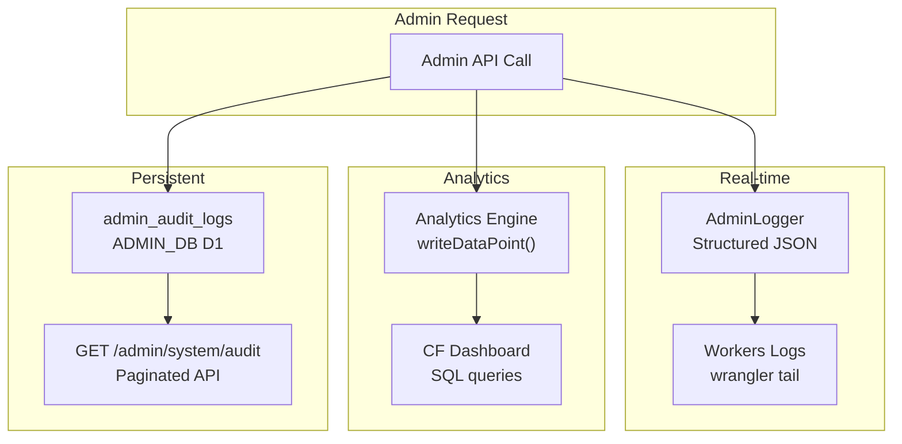

# Observability & Audit

The admin system provides three layers of observability: structured logging, Analytics Engine events, and a queryable audit log.

## Structured Logging

All admin operations produce structured JSON logs via `AdminLogger` (`worker/services/admin-logger.ts`). Logs are emitted to `console.log()` which Cloudflare Workers captures in Workers Logs.

### Log Format

Every log entry includes:

```json
{
  "level": "info",
  "message": "Role assigned successfully",
  "requestId": "a1b2c3d4",
  "operation": "role.assign",
  "actorId": "user_2abc123",
  "resourceType": "admin_role_assignment",
  "resourceId": "user_2xyz789",
  "durationMs": 42,
  "status": "success",
  "timestamp": "2025-01-15T10:30:00.000Z"
}
```

### Log Fields

| Field | Type | Description |
|-------|------|-------------|
| `level` | string | `info`, `warn`, or `error` |
| `message` | string | Human-readable description |
| `requestId` | string | 8-char hex trace ID (unique per request) |
| `operation` | string | Action identifier (e.g. `role.assign`, `tier.update`) |
| `actorId` | string | Clerk user ID of the admin performing the action |
| `resourceType` | string | What kind of resource was affected |
| `resourceId` | string | Specific resource identifier |
| `durationMs` | number | Operation duration in milliseconds |
| `status` | string | `success`, `error`, or `denied` |
| `timestamp` | string | ISO 8601 timestamp |

### Request Tracing

Each request gets a unique `requestId` generated by slicing a UUID:

```typescript
function createRequestId(): string {
    return crypto.randomUUID().replace(/-/g, '').slice(0, 8);
}
```

This ID is included in every log line for the request, making it easy to correlate related log entries:

```bash
# Find all logs for a specific request
wrangler tail --format json | jq 'select(.requestId == "a1b2c3d4")'
```

### Operation Tracing

The `withAdminTracing()` wrapper automatically logs operation start, duration, and success/failure:

```typescript
const result = await withAdminTracing(logger, 'tier.update', async () => {
    // Operation code here
    return updatedTier;
});
// Automatically logs: start, success + durationMs, or error + durationMs
```

### PII Sanitization

Before logging objects that may contain sensitive data, the `sanitizeForLog()` function deep-clones the object and redacts any keys matching:

```
/^(password|secret|token|key|authorization)$/i
```

Redacted values are replaced with `'[REDACTED]'`.

### Logger API

```typescript
// Create a logger for a request
const logger = createAdminLogger(requestId, { operation: 'role.assign' });

// Chain context
const scopedLogger = logger
    .withOperation('tier.update')
    .withActor('user_2abc123');

// Log at different levels
scopedLogger.info('Tier updated', { tierName: 'pro', newRateLimit: 500 });
scopedLogger.warn('Deprecated tier referenced', { tierName: 'legacy' });
scopedLogger.error('D1 query failed', { error: err.message });
```

## Analytics Engine Events

Admin actions are reported to Cloudflare Analytics Engine for dashboarding and alerting. Events use the `ANALYTICS` binding.

### Event Types

| Event | Trigger | Key Data Points |
|-------|---------|-----------------|
| `admin_action` | Any successful admin mutation | actor, action, resource_type, duration_ms |
| `admin_auth_failure` | JWT validation failure or missing admin role | ip_address, user_agent, attempted_path |
| `admin_config_change` | Tier, scope, or endpoint override modified | resource_type, old_value_hash, new_value_hash |
| `flag_evaluation` | Feature flag evaluated at the edge | flag_name, result (on/off), user_tier |

### Writing Events

```typescript
env.ANALYTICS.writeDataPoint({
    blobs: ['admin_action', actorId, action, resourceType],
    doubles: [durationMs],
    indexes: [requestId],
});
```

### Querying (Workers Analytics Engine SQL API)

```sql
-- Admin actions in the last 24 hours
SELECT
    blob1 AS event_type,
    blob2 AS actor_id,
    blob3 AS action,
    COUNT(*) AS count
FROM adblock_compiler_analytics
WHERE blob1 = 'admin_action'
    AND timestamp > NOW() - INTERVAL '24' HOUR
GROUP BY blob1, blob2, blob3
ORDER BY count DESC;
```

## Audit Log

The `admin_audit_logs` table in ADMIN_DB provides a persistent, append-only audit trail for all admin mutations.

### What Gets Logged

Every state-changing admin operation creates an audit entry:

| Action Pattern | Resource Type | Example |
|---------------|---------------|---------|
| `role.create` | `admin_role` | New role definition created |
| `role.update` | `admin_role` | Role permissions modified |
| `role.assign` | `admin_role_assignment` | Role assigned to user |
| `role.revoke` | `admin_role_assignment` | Role revoked from user |
| `tier.update` | `tier_config` | Tier rate limit changed |
| `tier.delete` | `tier_config` | Tier removed |
| `scope.update` | `scope_config` | Scope configuration changed |
| `scope.delete` | `scope_config` | Scope removed |
| `endpoint.create` | `endpoint_auth_override` | New endpoint override |
| `endpoint.update` | `endpoint_auth_override` | Override modified |
| `endpoint.delete` | `endpoint_auth_override` | Override removed |
| `flag.create` | `feature_flag` | New feature flag |
| `flag.update` | `feature_flag` | Flag settings changed |
| `flag.delete` | `feature_flag` | Flag removed |
| `announcement.create` | `admin_announcement` | New announcement |
| `announcement.update` | `admin_announcement` | Announcement modified |
| `announcement.delete` | `admin_announcement` | Announcement removed |

### Audit Entry Structure

Each entry captures the complete change context:

```json
{
  "id": 42,
  "actor_id": "user_2abc123",
  "actor_email": "admin@example.com",
  "action": "tier.update",
  "resource_type": "tier_config",
  "resource_id": "pro",
  "old_values": "{\"rate_limit\": 300}",
  "new_values": "{\"rate_limit\": 500}",
  "ip_address": "203.0.113.1",
  "user_agent": "Mozilla/5.0...",
  "status": "success",
  "metadata": null,
  "created_at": "2025-01-15T10:30:00"
}
```

### Querying the Audit Log

Use `GET /admin/system/audit` with query parameters:

```bash
# All actions by a specific admin
curl "/admin/system/audit?actor_id=user_2abc123&limit=50" \
  -H "Authorization: Bearer $JWT"

# All tier changes in the last week
curl "/admin/system/audit?resource_type=tier_config&since=2025-01-08T00:00:00Z" \
  -H "Authorization: Bearer $JWT"

# Failed or denied actions
curl "/admin/system/audit?status=denied&limit=100" \
  -H "Authorization: Bearer $JWT"

# Specific action type with date range
curl "/admin/system/audit?action=flag.update&since=2025-01-01T00:00:00Z&until=2025-01-31T23:59:59Z" \
  -H "Authorization: Bearer $JWT"
```

### Available Filters

| Parameter | Type | Description |
|-----------|------|-------------|
| `actor_id` | string | Filter by Clerk user ID |
| `action` | string | Filter by action (e.g. `tier.update`) |
| `resource_type` | string | Filter by resource type (e.g. `feature_flag`) |
| `resource_id` | string | Filter by specific resource |
| `status` | string | `success`, `failure`, or `denied` |
| `since` | string | ISO 8601 start date (inclusive) |
| `until` | string | ISO 8601 end date (inclusive) |
| `limit` | number | Results per page (default: 50, max: 100) |
| `offset` | number | Pagination offset |

### Permission

Querying audit logs requires the `audit:read` permission. All three built-in roles (viewer, editor, super-admin) include this permission.

## Observability Stack Summary



| Layer | Purpose | Retention | Query Method |
|-------|---------|-----------|-------------|
| **Structured Logs** | Real-time debugging and tracing | ~24 hours (Workers Logs) | `wrangler tail`, Logpush |
| **Analytics Engine** | Dashboards, alerting, trends | 90 days | Workers Analytics Engine SQL API |
| **Audit Log** | Compliance, forensics, change history | Indefinite (D1) | `GET /admin/system/audit` API |
