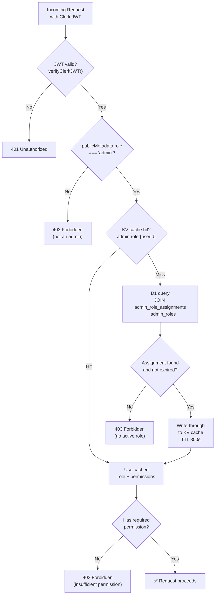
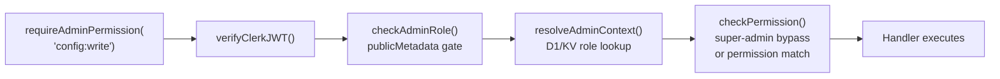

# Roles & Permissions

The admin system uses a role-based access control (RBAC) model with granular permissions. Roles are stored in the `ADMIN_DB` D1 database and cached at the edge via KV.

## Built-in Roles

Three roles are seeded by the migration and cover the most common access patterns:

| Role | Display Name | Description | Permissions |
|------|-------------|-------------|-------------|
| `viewer` | Viewer | Read-only access to admin dashboards and logs | 6 permissions |
| `editor` | Editor | Read and write access to configuration, flags, and tiers | 16 permissions |
| `super-admin` | Super Admin | Full administrative access including user management and role assignment | 27 permissions (all) |

> **Super-admin bypass**: Users with the `super-admin` role skip all permission checks — similar to Unix root. This is enforced in the middleware before any permission evaluation occurs.

### Viewer Permissions

```
admin:read, audit:read, metrics:read, config:read, users:read, flags:read
```

### Editor Permissions

```
admin:read, audit:read, metrics:read, config:read, config:write,
users:read, flags:read, flags:write, tiers:read, tiers:write,
scopes:read, scopes:write, endpoints:read, endpoints:write,
announcements:read, announcements:write
```

### Super-Admin Permissions

All 27 permissions (see full list below). Super-admins also bypass the permission check entirely.

## All 27 Permissions

Defined in `AdminPermissionSchema` (`worker/schemas.ts`):

| Permission | Category | Description |
|------------|----------|-------------|
| `admin:read` | Admin | View admin dashboard and system state |
| `admin:write` | Admin | Modify admin system configuration |
| `audit:read` | Audit | Query audit log entries |
| `metrics:read` | Metrics | View system metrics and analytics |
| `config:read` | Config | Read tier, scope, and endpoint configuration |
| `config:write` | Config | Modify tier, scope, and endpoint configuration |
| `users:read` | Users | View user list and user details |
| `users:write` | Users | Update user records |
| `users:manage` | Users | Suspend, activate, and manage user lifecycle |
| `flags:read` | Flags | View feature flags |
| `flags:write` | Flags | Create, update, and delete feature flags |
| `tiers:read` | Tiers | View tier configuration |
| `tiers:write` | Tiers | Create, update, and delete tier configuration |
| `scopes:read` | Scopes | View scope configuration |
| `scopes:write` | Scopes | Create, update, and delete scope configuration |
| `endpoints:read` | Endpoints | View endpoint auth overrides |
| `endpoints:write` | Endpoints | Create, update, and delete endpoint auth overrides |
| `announcements:read` | Announcements | View system announcements |
| `announcements:write` | Announcements | Create, update, and delete announcements |
| `roles:read` | Roles | View role definitions |
| `roles:write` | Roles | Create and modify role definitions |
| `roles:assign` | Roles | Assign and revoke roles for users |
| `keys:read` | API Keys | View API key metadata |
| `keys:write` | API Keys | Create API keys |
| `keys:revoke` | API Keys | Revoke API keys |
| `storage:read` | Storage | View storage statistics and data |
| `storage:write` | Storage | Clear cache, run vacuum, and manage storage |

## Role Resolution Flow

Every admin API request resolves the caller's role and permissions before evaluating access. The flow prioritizes speed via KV caching:



### Cache Details

- **Key format**: `admin:role:{clerkUserId}`
- **Namespace**: `RATE_LIMIT` (shared KV namespace, uses `admin:` prefix)
- **TTL**: 300 seconds (5 minutes)
- **Invalidation**: Explicit delete on role assign/revoke via `invalidateRoleCache()`
- **Stored value**: JSON `{ role_name, permissions[], expires_at }`

## Middleware Pipeline

Admin routes are protected by middleware functions defined in `worker/middleware/admin-role-middleware.ts`. The pipeline runs in order:



### Guard Functions

Three middleware variants are exported for different use cases:

```typescript
// Require a single permission
requireAdminPermission('config:write')

// Require at least one of several permissions (OR logic)
requireAnyAdminPermission(['config:write', 'tiers:write'])

// Require all listed permissions (AND logic)
requireAllAdminPermissions(['audit:read', 'metrics:read'])
```

There is also `extractAdminContext()` which resolves the caller's role and permissions without enforcing a specific permission check. This is used by the "my context" endpoint.

### AdminGuardResult

Every guard returns a discriminated union:

```typescript
type AdminGuardResult =
    | { authorized: true; context: ResolvedAdminContext }
    | { authorized: false; error: string; status: 401 | 403 };
```

Handlers check `.authorized` and return the appropriate HTTP status if access is denied.

## Role Management API

Roles are managed via the admin API. Only users with the `roles:write` or `roles:assign` permission can modify roles.

| Operation | Endpoint | Permission |
|-----------|----------|------------|
| List roles | `GET /admin/system/roles` | `admin:read` |
| Create role | `POST /admin/system/roles` | `roles:write` |
| Update role | `PATCH /admin/system/roles/:id` | `roles:write` |
| List assignments | `GET /admin/system/roles/assignments` | `admin:read` |
| Assign role | `POST /admin/system/roles/assign` | `roles:assign` |
| Revoke role | `DELETE /admin/system/roles/revoke` | `roles:assign` |

### Example: Assign a role

```bash
curl -X POST https://your-worker.workers.dev/admin/system/roles/assign \
  -H "Authorization: Bearer $CLERK_JWT" \
  -H "Content-Type: application/json" \
  -d '{
    "clerk_user_id": "user_2abc123",
    "role_name": "editor",
    "expires_at": "2025-12-31T23:59:59Z"
  }'
```

### Example: Revoke a role

```bash
curl -X DELETE https://your-worker.workers.dev/admin/system/roles/revoke \
  -H "Authorization: Bearer $CLERK_JWT" \
  -H "Content-Type: application/json" \
  -d '{
    "clerk_user_id": "user_2abc123",
    "role_name": "editor"
  }'
```

## Custom Roles

Beyond the three built-in roles, you can create custom roles with any combination of the 27 permissions:

```bash
curl -X POST https://your-worker.workers.dev/admin/system/roles \
  -H "Authorization: Bearer $CLERK_JWT" \
  -H "Content-Type: application/json" \
  -d '{
    "role_name": "flag-manager",
    "display_name": "Flag Manager",
    "description": "Can manage feature flags but nothing else",
    "permissions": ["admin:read", "flags:read", "flags:write"]
  }'
```

Custom roles follow the same resolution flow and caching behavior as built-in roles.
