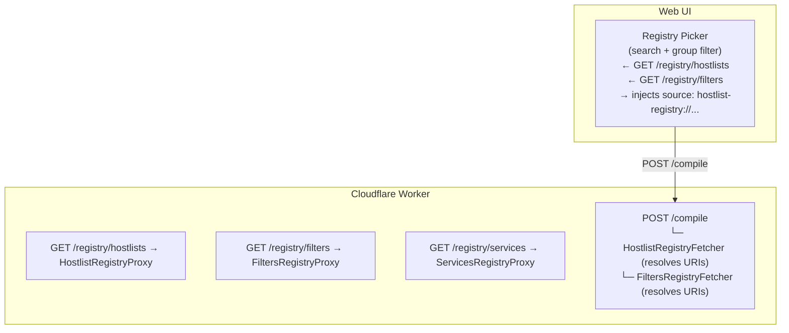

# Registry ↔ UI Integration

← [Back to API docs](README.md)

This document describes the design and implementation plan for wiring the **HostlistsRegistry** and **FiltersRegistry** public indexes into the Web UI as a first-class list picker, eliminating the need for users to supply raw source URLs manually.

---

## Background

Both upstream registries publish machine-readable JSON indexes that are ideal for populating a UI picker:

| Registry | Index URL | Key Fields |
|---|---|---|
| **HostlistsRegistry** (DNS-level) | `https://adguardteam.github.io/HostlistsRegistry/assets/filters.json` | `filterKey`, `name`, `downloadUrl`, `description` |
| **FiltersRegistry** (browser-level) | `https://filters.adtidy.org/extension/chromium/filters.json` | `filterId`, `name`, `downloadUrl`, `groupId` |
| **ServicesRegistry** (service blocks) | `https://adguardteam.github.io/HostlistsRegistry/assets/services.json` | `id`, `name`, `rules[]` |

Today, the `CompileRequest` schema requires the caller to supply raw `source` URLs or pre-fetched content.  
No endpoint exists to surface these registries to the UI — that is what this document specifies.

---

## Goals

1. **UI list picker** — the Web UI can present a browsable, searchable catalog of well-known filter lists without the user needing to know any URLs.
2. **Symbolic source URIs** — `CompileRequest` sources may reference lists by key (e.g. `hostlist-registry://adguard_dns_filter`) instead of raw URLs. The Worker resolves the key at compile time.
3. **Edge caching** — registry index fetches are cached at the Worker layer (KV or in-memory with TTL) so the UI never directly depends on the upstream CDN.

---

## Architecture



---

## New Endpoints

### `GET /registry/hostlists`

Returns the HostlistsRegistry index, proxied and cached by the Worker.

**Response** `200 application/json`:

```json
{
  "timestamp": "2026-03-10T00:00:00Z",
  "ttl": 3600,
  "lists": [
    {
      "filterKey": "adguard_dns_filter",
      "name": "AdGuard DNS Filter",
      "description": "AdGuard DNS filter is a combination of several filters...",
      "downloadUrl": "https://adguardteam.github.io/HostlistsRegistry/assets/filter_1.txt",
      "tags": ["adguard", "dns"],
      "homepage": "https://github.com/AdguardTeam/AdguardSDNSFilter"
    }
  ]
}
```

### `GET /registry/filters`

Returns the FiltersRegistry (browser) index.

**Response** `200 application/json`:

```json
{
  "timestamp": "2026-03-10T00:00:00Z",
  "ttl": 3600,
  "lists": [
    {
      "filterId": 2,
      "name": "AdGuard Base Filter",
      "description": "...",
      "downloadUrl": "https://filters.adtidy.org/extension/chromium/filters/2.txt",
      "groupId": 1
    }
  ]
}
```

### `GET /registry/services`

Returns the ServicesRegistry index (service-level blocking entries).

---

## Symbolic Source URI Scheme

Once the fetchers are implemented, `CompileRequest` sources accept:

| URI scheme | Example | Resolved by |
|---|---|---|
| `hostlist-registry://<filterKey>` | `hostlist-registry://adguard_dns_filter` | `HostlistRegistryFetcher` |
| `filters-registry://<filterId>` | `filters-registry://2` | `FiltersRegistryFetcher` |

**Example `CompileRequest`:**

```json
{
  "configuration": {
    "name": "My DNS Block List",
    "sources": [
      { "source": "hostlist-registry://adguard_dns_filter" },
      { "source": "hostlist-registry://goodbye_ads" }
    ],
    "transformations": ["Deduplicate", "RemoveComments"]
  }
}
```

The Worker expands the symbolic URI to the real `downloadUrl` before invoking the compiler.

---

## Implementation Plan

### Phase 1 — Registry Proxy Endpoints

- [ ] Add `GET /registry/hostlists` handler in `worker/`
- [ ] Add `GET /registry/filters` handler in `worker/`
- [ ] Add `GET /registry/services` handler in `worker/`
- [ ] Cache responses in KV (key: `registry:hostlists`, TTL: 1 hour)
- [ ] Add OpenAPI paths + schemas to `docs/api/openapi.yaml`
- [ ] Regenerate `docs/api/README.md` and `docs/api/index.html` via `deno task openapi:docs`

### Phase 2 — Fetcher Implementations

- [ ] `HostlistRegistryFetcher` — resolves `hostlist-registry://` URIs
  - On first use, fetches and caches the HostlistsRegistry `filters.json`
  - Looks up `filterKey` → `downloadUrl`, then delegates to `HttpFetcher`
- [ ] `FiltersRegistryFetcher` — resolves `filters-registry://` URIs
- [ ] Register both fetchers in `CompositeFetcher` chain inside `WorkerCompiler`
- [ ] Update `SourceSchema` to accept the new URI schemes (Zod `.refine()`)

### Phase 3 — UI List Picker

- [ ] `public/` — add `RegistryPicker` component
  - On mount: `GET /registry/hostlists` + `GET /registry/filters`
  - Renders a searchable list grouped by tag / groupId
  - On selection: pushes `{ source: "hostlist-registry://<key>" }` into the sources array
- [ ] Update UI `CompileForm` to accept symbolic sources alongside raw URLs

### Phase 4 — Contract Tests & Docs

- [ ] Add contract tests for `GET /registry/*` endpoints in `worker/openapi-contract.test.ts`
- [ ] Add `REGISTRY_UI_INTEGRATION.md` link to `docs/SUMMARY.md`
- [ ] Add entry to `docs/api/OPENAPI_SUPPORT.md` endpoint table

---

## Caching Strategy

| Layer | Mechanism | TTL |
|---|---|---|
| Worker KV | `registry:hostlists`, `registry:filters` keys | 1 hour |
| Worker in-memory | Module-level `Map` fallback if KV unavailable | 5 minutes |
| `Cache-Control` header | `public, max-age=3600, stale-while-revalidate=300` | 1 hour |

---

## OpenAPI Schema Additions

```yaml
# To be added to docs/api/openapi.yaml

/registry/hostlists:
  get:
    tags: [Registry]
    summary: List HostlistsRegistry filter lists
    operationId: getHostlistsRegistry
    responses:
      '200':
        description: Cached HostlistsRegistry index
        content:
          application/json:
            schema:
              $ref: '#/components/schemas/RegistryIndex'

/registry/filters:
  get:
    tags: [Registry]
    summary: List FiltersRegistry filter lists
    operationId: getFiltersRegistry
    responses:
      '200':
        description: Cached FiltersRegistry index
        content:
          application/json:
            schema:
              $ref: '#/components/schemas/RegistryIndex'

/registry/services:
  get:
    tags: [Registry]
    summary: List ServicesRegistry entries
    operationId: getServicesRegistry
    responses:
      '200':
        description: Cached ServicesRegistry index
        content:
          application/json:
            schema:
              $ref: '#/components/schemas/RegistryIndex'
```

New schemas:

```yaml
RegistryIndex:
  type: object
  required: [timestamp, ttl, lists]
  properties:
    timestamp:
      type: string
      format: date-time
    ttl:
      type: integer
      description: Cache TTL in seconds
    lists:
      type: array
      items:
        $ref: '#/components/schemas/RegistryListEntry'

RegistryListEntry:
  type: object
  required: [name, downloadUrl]
  properties:
    filterKey:
      type: string
    filterId:
      type: integer
    name:
      type: string
    description:
      type: string
    downloadUrl:
      type: string
      format: uri
    tags:
      type: array
      items:
        type: string
    groupId:
      type: integer
    homepage:
      type: string
      format: uri
```

---

## Related Documents

- [API README](README.md)
- [Platform Support](PLATFORM_SUPPORT.md) — `CompositeFetcher` / `HttpFetcher` chaining
- [Zod Validation](ZOD_VALIDATION.md) — `SourceSchema` URI refinement
- [OpenAPI Support](OPENAPI_SUPPORT.md) — endpoint table and spec
- [Streaming API](STREAMING_API.md) — `source:start` / `source:complete` events for registry-resolved sources
