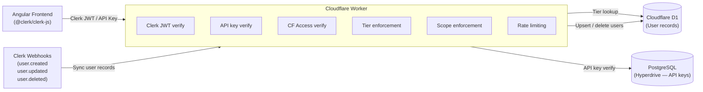

# Authentication & Authorization

The adblock-compiler uses [Clerk](https://clerk.com) for user identity management and a tiered authorization system built on JWT tokens, API keys, and Cloudflare Access.

## Documentation

| Document | Audience | Description |
|----------|----------|-------------|
| [Clerk Dashboard Setup](clerk-setup.md) | Operators | Step-by-step Clerk application configuration |
| [Configuration Guide](configuration.md) | Operators / DevOps | Environment variables, secrets, and deployment setup |
| [Developer Guide](developer-guide.md) | Developers | Architecture, extensibility, and code patterns |
| [API Authentication](api-authentication.md) | API Consumers | How to authenticate API requests |
| [Postman Testing](postman-testing.md) | Developers / API Consumers | How to set up Postman to test Clerk-authenticated API requests |
| [Removing Anonymous Access](removing-anonymous-access.md) | All | Migration plan for mandatory authentication |
| [Admin Access](admin-access.md) | Operators | Admin endpoint protection and dashboard access |
| [Cloudflare Access](cloudflare-access.md) | Operators / DevOps | Cloudflare Zero Trust Access setup for admin routes |
| [Clerk + Cloudflare Integration](clerk-cloudflare-integration.md) | Developers / DevOps | How Clerk integrates with Workers, KV, D1, Hyperdrive, Turnstile |

## Architecture Overview

## Authentication Methods

The system supports three authentication methods, tried in order:

1. **Clerk JWT** — Primary method for browser users. The Angular frontend obtains a JWT from Clerk and sends it as `Authorization: Bearer <jwt>`.
2. **API Key** — For programmatic access. Users create API keys via the dashboard; sent as `Authorization: Bearer abc_...`.
3. **Anonymous** — Unauthenticated access with lowest rate limits. Will be removed in a future release.

## Tier System

| Tier | Rate Limit | Description |
|------|-----------|-------------|
| Anonymous | 10 req/min | Unauthenticated — basic access (being deprecated) |
| Free | 60 req/min | Registered user — standard access |
| Pro | 300 req/min | Paid subscriber — higher limits |
| Admin | Unlimited | Administrator — full system access |

## Quick Links

- **Clerk Dashboard**: [dashboard.clerk.com](https://dashboard.clerk.com)
- **Clerk Docs**: [clerk.com/docs](https://clerk.com/docs)
- **Cloudflare Access**: [Cloudflare Zero Trust](https://one.dash.cloudflare.com)
- **GitHub Issue**: [#980 — Implement Authentication & Authorization](https://github.com/user/adblock-compiler/issues/980)