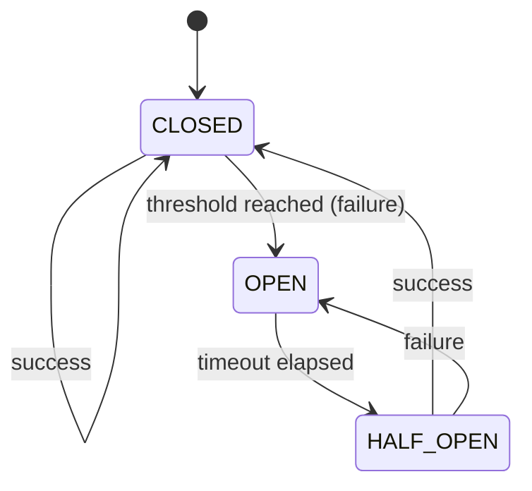

# Circuit Breaker

The adblock-compiler includes a circuit breaker pattern for fault-tolerant filter list downloads. When a source URL fails repeatedly, the circuit breaker temporarily blocks requests to that URL, preventing cascading failures and wasted retries.

## Overview

Each remote source URL gets its own circuit breaker that transitions through three states:

1. **CLOSED** — Normal operation. Requests pass through. Consecutive failures are counted.
2. **OPEN** — Failure threshold reached. All requests are immediately rejected. When using the `CircuitBreaker` directly this surfaces as a `CircuitBreakerOpenError`; when using `FilterDownloader`, the open breaker is exposed as a `NetworkError`. After a timeout period the breaker moves to HALF_OPEN.
3. **HALF_OPEN** — Recovery probe. The next request is allowed through. If it succeeds the breaker returns to CLOSED; if it fails the breaker reopens.



## Default Configuration

Circuit breaker settings are defined in `src/config/defaults.ts` under `NETWORK_DEFAULTS`:

| Setting | Default | Description |
|---------|---------|-------------|
| `CIRCUIT_BREAKER_THRESHOLD` | `5` | Consecutive failures before opening the circuit |
| `CIRCUIT_BREAKER_TIMEOUT_MS` | `60000` (60 s) | Time to wait before attempting recovery |

## Usage with FilterDownloader

The circuit breaker is enabled by default in `FilterDownloader`. Each URL automatically gets its own breaker instance.

```typescript
import { FilterDownloader } from '@jk-com/adblock-compiler';

// Defaults: threshold=5, timeout=60s, enabled=true
const downloader = new FilterDownloader();

// Override circuit breaker settings
const customDownloader = new FilterDownloader({
    enableCircuitBreaker: true,
    circuitBreakerThreshold: 3,    // open after 3 failures
    circuitBreakerTimeout: 120000, // wait 2 minutes before recovery
});

const rules = await customDownloader.download('https://example.com/filters.txt');
```

### Disabling the Circuit Breaker

```typescript
const downloader = new FilterDownloader({
    enableCircuitBreaker: false,
});
```

## Standalone Usage

You can also use `CircuitBreaker` directly to protect any async operation:

```typescript
import { CircuitBreaker, CircuitBreakerOpenError } from '@jk-com/adblock-compiler';

const breaker = new CircuitBreaker({
    threshold: 5,
    timeout: 60000,
    name: 'my-service',
});

try {
    const result = await breaker.execute(() => fetch('https://api.example.com/data'));
    console.log('Success:', result.status);
} catch (error) {
    if (error instanceof CircuitBreakerOpenError) {
        console.log('Circuit is open — skipping request');
    } else {
        console.error('Request failed:', error.message);
    }
}
```

### Inspecting State

```typescript
// Current state: CLOSED, OPEN, or HALF_OPEN
console.log(breaker.getState());

// Full statistics
const stats = breaker.getStats();
// {
//   state: 'CLOSED',
//   failureCount: 2,
//   threshold: 5,
//   timeout: 60000,
//   lastFailureTime: undefined,
//   timeUntilRecovery: 0,
// }
```

### Manual Reset

```typescript
breaker.reset(); // Force back to CLOSED, clear failure count
```

## Troubleshooting

### "Circuit breaker is OPEN. Retry in Xs"

This means a source URL has exceeded the failure threshold. Options:

1. **Wait** for the timeout to elapse — the breaker will automatically move to HALF_OPEN and attempt recovery.
2. **Check the source URL** — verify it is reachable and returning valid content.
3. **Increase the threshold** if the source is known to be intermittent:

```typescript
const downloader = new FilterDownloader({
    circuitBreakerThreshold: 10, // tolerate more failures
});
```

### Source permanently failing

If a source is permanently unavailable, the circuit breaker will continue cycling between OPEN and HALF_OPEN. Consider removing or disabling the source in your `sources` configuration. If you only need to exclude specific rules from an otherwise healthy source, use `exclusions_sources` to point to files containing rule exclusion patterns.

## Related Documentation

- [Troubleshooting](../guides/TROUBLESHOOTING.md) — General troubleshooting guide
- [Diagnostics](DIAGNOSTICS.md) — Event emission and tracing
- [Extensibility](EXTENSIBILITY.md) — Custom transformations and fetchers
