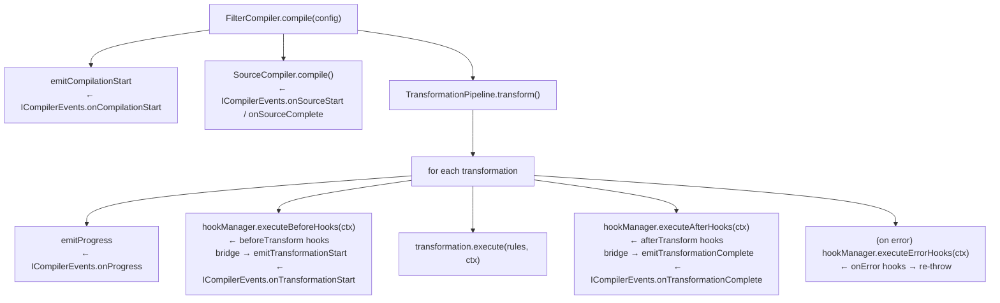

# Transformation Hooks

The **transformation hooks system** gives you fine-grained, per-transformation
observability hooks that fire before, after, and on error for every
transformation in the compilation pipeline.

## Table of Contents

- [Overview](#overview)
- [Architecture](#architecture)
- [Hook types](#hook-types)
- [TransformationHookManager](#transformationhookmanager)
- [Using hooks with FilterCompiler](#using-hooks-with-filtercompiler)
- [Built-in hook factories](#built-in-hook-factories)
  - [createLoggingHook](#createlogginghook)
  - [createMetricsHook](#createmetricshook)
  - [createEventBridgeHook](#createeventbridgehook)
- [Relationship to ICompilerEvents](#relationship-to-icompilerevents)
- [onCompilationStart event](#oncompilationstart-event)
- [NoOpHookManager](#nooophookmanager)
- [Advanced: combining hooks and events](#advanced-combining-hooks-and-events)
- [Design decisions](#design-decisions)

---

## Overview

The `adblock-compiler` has two complementary observability layers:

| Layer | What it covers | Async? | Error hooks? |
|---|---|---|---|
| `ICompilerEvents` | Compiler-level events (sources, progress, completion) | No | No |
| `TransformationHookManager` | Per-transformation lifecycle (before/after/error) | Yes | Yes |

The hooks system was always **fully implemented** in `TransformationHooks.ts`
but was previously never wired into the pipeline. This guide documents the
completed wiring and how to use both layers.

---

## Architecture



The bridge between the two layers is `createEventBridgeHook`, which is
automatically registered by `FilterCompiler` and `WorkerCompiler` when
`ICompilerEvents` listeners are present.

---

## Hook types

### `beforeTransform`

Fires immediately before a transformation processes its input rules.

```typescript
type BeforeTransformHook = (context: TransformationHookContext) => void | Promise<void>;
```

The `context` object contains:

| Field | Type | Description |
|---|---|---|
| `name` | `string` | Transformation type string (e.g. `"RemoveComments"`) |
| `type` | `TransformationType` | Enum value for type-safe comparison |
| `ruleCount` | `number` | Number of rules entering the transformation |
| `timestamp` | `number` | `Date.now()` at hook call time |
| `metadata` | `Record<string, unknown>?` | Optional free-form metadata |

### `afterTransform`

Fires immediately after a transformation completes successfully.

```typescript
type AfterTransformHook = (
  context: TransformationHookContext & {
    inputCount: number;
    outputCount: number;
    durationMs: number;
  }
) => void | Promise<void>;
```

The extended `context` adds:

| Field | Type | Description |
|---|---|---|
| `inputCount` | `number` | Rule count entering the transformation |
| `outputCount` | `number` | Rule count exiting the transformation |
| `durationMs` | `number` | Wall-clock execution time in milliseconds |

### `onError`

Fires when a transformation throws an unhandled error.

```typescript
type TransformErrorHook = (
  context: TransformationHookContext & { error: Error }
) => void | Promise<void>;
```

> **Important:** Error hooks are **observers only**. They cannot suppress or
> replace the error. After all registered error hooks have been awaited the
> pipeline re-throws the original error unchanged.

---

## TransformationHookManager

`TransformationHookManager` holds the registered hooks and exposes the fluent
`on*` API for registering them.

### Constructing with a config object

```typescript
import { TransformationHookManager } from '@jk-com/adblock-compiler';

const manager = new TransformationHookManager({
  beforeTransform: [
    (ctx) => console.log(`▶ ${ctx.name} — ${ctx.ruleCount} rules`),
  ],
  afterTransform: [
    (ctx) => console.log(`✔ ${ctx.name} — ${ctx.durationMs.toFixed(2)}ms`),
  ],
  onError: [
    (ctx) => console.error(`✖ ${ctx.name}`, ctx.error),
  ],
});
```

### Fluent registration

```typescript
const manager = new TransformationHookManager()
  .onBeforeTransform((ctx) => console.log(`▶ ${ctx.name}`))
  .onAfterTransform((ctx) => console.log(`✔ ${ctx.name} — ${ctx.durationMs.toFixed(2)}ms`))
  .onTransformError((ctx) => console.error(`✖ ${ctx.name}`, ctx.error));
```

### Async hooks

Hooks can return a `Promise`. The pipeline awaits each hook before proceeding:

```typescript
manager.onAfterTransform(async (ctx) => {
  // Safely awaited — the pipeline waits for this before the next transformation
  await fetch('https://metrics.example.com/record', {
    method: 'POST',
    body: JSON.stringify({ name: ctx.name, durationMs: ctx.durationMs }),
  });
});
```

---

## Using hooks with FilterCompiler

Pass a `hookManager` in `FilterCompilerOptions`:

```typescript
import {
  FilterCompiler,
  TransformationHookManager,
  createLoggingHook,
} from '@jk-com/adblock-compiler';

const hookManager = new TransformationHookManager(createLoggingHook(console));

const compiler = new FilterCompiler({
  hookManager,
  events: {
    onCompilationComplete: (e) => console.log(`Done in ${e.totalDurationMs}ms`),
  },
});

await compiler.compile(config);
// → [Transform] Starting RemoveComments with 4123 rules
// → [Transform] Completed RemoveComments: 4123 → 3891 rules (-232) in 1.40ms
// → Done in 847ms
```

### Hook manager resolution rules

`FilterCompiler` resolves the internal hook manager in the following order:

| Condition | Result |
|---|---|
| `hookManager` provided, transformation events registered | Internal composed manager: bridge hook + delegate to user's manager |
| `hookManager` provided, no transformation events | Internal composed manager: delegate to user's manager only |
| No `hookManager`, `onTransformationStart`/`Complete` registered | Bridge-only manager |
| Neither | `NoOpHookManager` (zero overhead) |

**Important**: `FilterCompiler` never mutates the caller's `hookManager` instance. An
internal composed manager is always created, so the same `hookManager` can safely
be shared across multiple `FilterCompiler` instances. This also means that passing a
`NoOpHookManager` as `hookManager` works correctly — user hooks are skipped, but
the bridge fires if transformation events are registered.

**Targeted listener check**: the bridge hook is installed only when
`onTransformationStart` or `onTransformationComplete` is registered. Providing
other listeners such as `onProgress` alone does **not** cause hook overhead on
every transformation.

---

## Built-in hook factories

### `createLoggingHook`

Logs transformation start, completion, and errors to any
`{ info, error }` logger.

```typescript
import { createLoggingHook, TransformationHookManager } from '@jk-com/adblock-compiler';

const manager = new TransformationHookManager(createLoggingHook(myLogger));
```

Output format:
```
[Transform] Starting RemoveComments with 4123 rules
[Transform] Completed RemoveComments: 4123 → 3891 rules (-232) in 1.40ms
[Transform] Error in Deduplicate: out of memory
```

### `createMetricsHook`

Records per-transformation timing and rule-count diff to a custom collector.

```typescript
import { createMetricsHook, TransformationHookManager } from '@jk-com/adblock-compiler';

const timings: Record<string, number> = {};
const manager = new TransformationHookManager(
  createMetricsHook({
    record: (name, durationMs, rulesDiff) => {
      timings[name] = durationMs;
      console.log(`${name}: ${durationMs.toFixed(2)}ms, ${rulesDiff >= 0 ? '-' : '+'}${Math.abs(rulesDiff)} rules`);
    },
  }),
);
```

Wire `collector.record` to Prometheus, StatsD, OpenTelemetry, or any custom
metrics sink.

### `createEventBridgeHook`

Bridges the hook system into the `ICompilerEvents` event bus. This is used
**automatically** by `FilterCompiler` and `WorkerCompiler` — you do not
normally need to call it directly.

It is useful if you are constructing `TransformationPipeline` manually and
want `ICompilerEvents.onTransformationStart` / `onTransformationComplete` to
still fire:

```typescript
import {
  createEventBridgeHook,
  CompilerEventEmitter,
  TransformationHookManager,
  TransformationPipeline,
} from '@jk-com/adblock-compiler';

const eventEmitter = new CompilerEventEmitter({ onTransformationStart: (e) => console.log(e) });
const hookManager = new TransformationHookManager(createEventBridgeHook(eventEmitter));
const pipeline = new TransformationPipeline(undefined, logger, eventEmitter, hookManager);
```

---

## Relationship to ICompilerEvents

`ICompilerEvents.onTransformationStart` and `onTransformationComplete` were
previously fired by direct calls inside the `TransformationPipeline` loop.
Those calls were removed when the hook system was wired in. The bridge hook
re-implements that forwarding inside the hook system:

```
before hook fires → bridge hook → emitTransformationStart → onTransformationStart
after hook fires  → bridge hook → emitTransformationComplete → onTransformationComplete
```

### Auto-wiring in TransformationPipeline

`TransformationPipeline` itself auto-wires the bridge hook in its constructor
when an `eventEmitter` with transformation listeners is passed but no
`hookManager` is provided:

```typescript
// TransformationPipeline auto-detects this and wires the bridge:
new TransformationPipeline(undefined, logger, eventEmitterWithTransformListeners)
//                                            ↑ has onTransformationStart/Complete
```

This covers call sites like `SourceCompiler` that construct the pipeline
without knowing about the hook system — they only pass an `eventEmitter`.

### Targeted listener check

Both `FilterCompiler`, `WorkerCompiler`, and `TransformationPipeline` check
specifically for `onTransformationStart` / `onTransformationComplete` rather
than the general `hasListeners()` before installing a bridge hook. This means
registering only `onProgress` or `onCompilationComplete` does not cause any
hook execution overhead per transformation.

This means existing code that uses `ICompilerEvents` continues to work with no
changes.

---

## onCompilationStart event

A new `onCompilationStart` event was added to `ICompilerEvents` to complete
the compiler lifecycle:

```typescript
const compiler = new FilterCompiler({
  events: {
    onCompilationStart: (e) => {
      console.log(
        `Compiling "${e.configName}": ` +
        `${e.sourceCount} sources, ${e.transformationCount} transformations`
      );
    },
    onCompilationComplete: (e) => {
      console.log(`Completed in ${e.totalDurationMs}ms, ${e.ruleCount} output rules`);
    },
  },
});
```

The `ICompilationStartEvent` shape:

| Field | Type | Description |
|---|---|---|
| `configName` | `string` | `IConfiguration.name` |
| `sourceCount` | `number` | Number of sources to be compiled |
| `transformationCount` | `number` | Number of global transformations configured |
| `timestamp` | `number` | `Date.now()` at emission time |

The event fires **after validation passes** but before any source is fetched.
This guarantees that `sourceCount` and `transformationCount` are correct (the
configuration has been validated at this point).

---

## NoOpHookManager

`NoOpHookManager` is the zero-cost default used when no hooks are registered.
All three `execute*` methods are empty overrides and `hasHooks()` always
returns `false`, so the pipeline's guard:

```typescript
if (this.hookManager.hasHooks()) {
  await this.hookManager.executeBeforeHooks(context);
}
```

short-circuits immediately with no virtual dispatch overhead.

You never need to construct `NoOpHookManager` directly. It is the automatic
default in:
- `new TransformationPipeline()` (no `hookManager` arg)
- `new FilterCompiler()` (no `hookManager` in options)
- `new FilterCompiler(logger)` (legacy constructor)

---

## Advanced: combining hooks and events

You can use both `hookManager` and `events` together. `FilterCompiler`
automatically detects this combination and appends the bridge hook so both
systems fire without double-registration:

```typescript
import {
  FilterCompiler,
  TransformationHookManager,
  createMetricsHook,
} from '@jk-com/adblock-compiler';

const timings: Record<string, number> = {};

const compiler = new FilterCompiler({
  // Compiler-level events (fires at source and compilation boundaries)
  events: {
    onCompilationStart: (e) => console.log(`Starting: ${e.configName}`),
    onTransformationStart: (e) => console.log(`→ ${e.name}`),   // still fires via bridge
    onTransformationComplete: (e) => console.log(`← ${e.name}`), // still fires via bridge
    onCompilationComplete: (e) => console.log(`Done: ${e.totalDurationMs}ms`),
  },
  // Per-transformation hooks (async, with error hooks)
  hookManager: new TransformationHookManager(
    createMetricsHook({ record: (name, ms) => { timings[name] = ms; } }),
  ),
});

await compiler.compile(config);
```

---

## Design decisions

### Why hooks instead of modifying the Transformation base class?

Adding observability points to the `Transformation` base class would require
every transformation to call `super.beforeExecute()` / `super.afterExecute()`,
which ties the observability concern to the transformation's inheritance chain.
External hooks are opt-in decorators — they attach to the **pipeline**, not to
individual transformations, and work uniformly across all transformation types
including third-party ones.

### Why `TransformationHookManager` instead of bare callbacks?

A dedicated manager class keeps the `TransformationPipeline`'s interface clean
(three well-typed methods: `executeBeforeHooks`, `executeAfterHooks`,
`executeErrorHooks`), while the manager handles ordering, registration, and the
`hasHooks()` fast path. The pipeline has no knowledge of how many hooks are
registered or how to call them.

### Why the `hasHooks()` fast-path guard?

Without the guard, the pipeline would construct a context object, call
`executeBeforeHooks`, and `await` it on every iteration — even when there are
no hooks and every method is a no-op. The guard ensures the hot path (no hooks
registered) has exactly zero overhead beyond a `false` boolean check.
`NoOpHookManager.hasHooks()` is always `false`, so the guard always
short-circuits for the default case.

### Why fire `onCompilationStart` after validation?

Firing before validation would mean `sourceCount` and `transformationCount`
could be undefined or wrong (the configuration hasn't been validated yet).
Firing after validation guarantees that when `onCompilationStart` arrives at
your handler, the numbers are accurate and the compilation will proceed — only
fetch/download errors can still fail at that point.

Both `FilterCompiler` and `WorkerCompiler` fire this event at the equivalent
point (after their respective validation passes), keeping the `ICompilerEvents`
lifecycle consistent across both compiler implementations.

### Why compose an internal manager instead of mutating the caller's hookManager?

The original code appended bridge hooks directly to the caller-supplied
`hookManager`. This caused two problems:

1. **Duplicate events on reuse**: if the same `hookManager` instance was passed
   to multiple `FilterCompiler` instances, each one would append another set of
   bridge hooks, causing `onTransformationStart`/`Complete` to fire multiple
   times per transformation.
2. **Broken for `NoOpHookManager`**: `NoOpHookManager.hasHooks()` always returns
   `false`, so any hooks appended to it would never execute in the pipeline.

The fix: always compose a fresh internal manager. The bridge hook (if needed)
and a delegation wrapper (if the user's manager has hooks) are both registered
on the new internal manager, which is then passed to the pipeline. The caller's
instance is never touched.

### Why check only for transformation-specific listeners?

`hasListeners()` returns `true` if *any* `ICompilerEvents` handler is registered
— including `onProgress`, `onCompilationComplete`, etc. Installing the bridge
hook whenever any event is registered would add `await` overhead on every
transformation iteration even when `onTransformationStart`/`Complete` are not
subscribed.

The fix: check `options?.events?.onTransformationStart || onTransformationComplete`
directly. Only when one of these two is present does a bridge hook get installed.

### Why does `createEventBridgeHook` exist?

Before the hooks system was wired in, `TransformationPipeline` called
`eventEmitter.emitTransformationStart` / `emitTransformationComplete` directly
in the loop. When those calls were removed (to route everything through hooks),
existing callers using `ICompilerEvents.onTransformationStart` /
`onTransformationComplete` would have stopped receiving events. The bridge hook
re-implements exactly that forwarding inside the hook system, maintaining full
backward compatibility.
