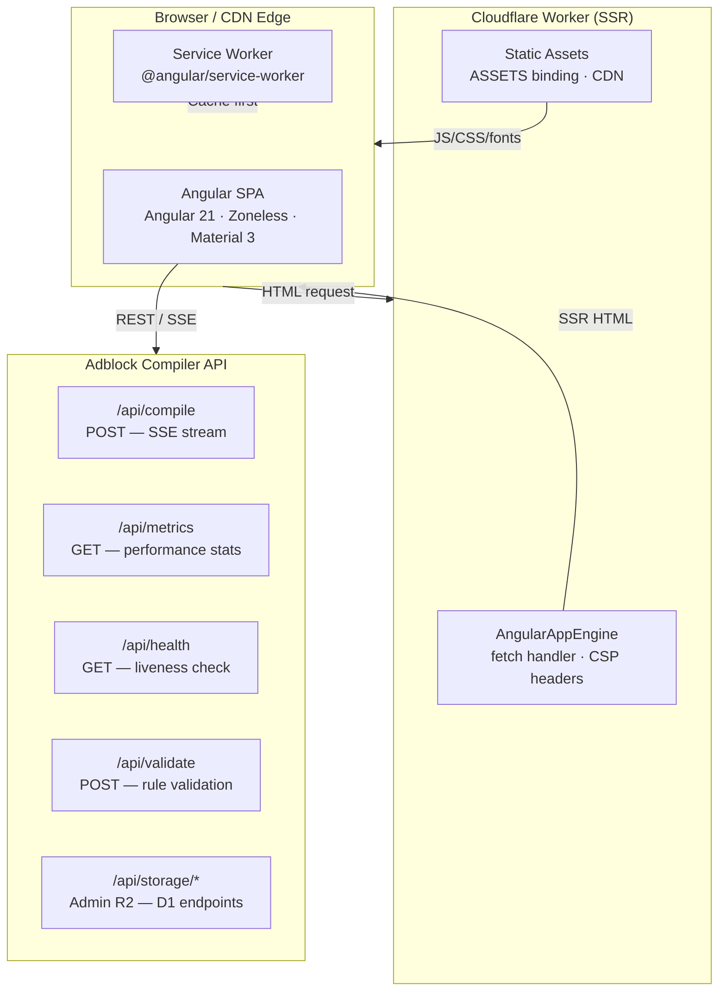
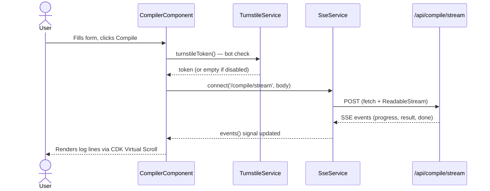
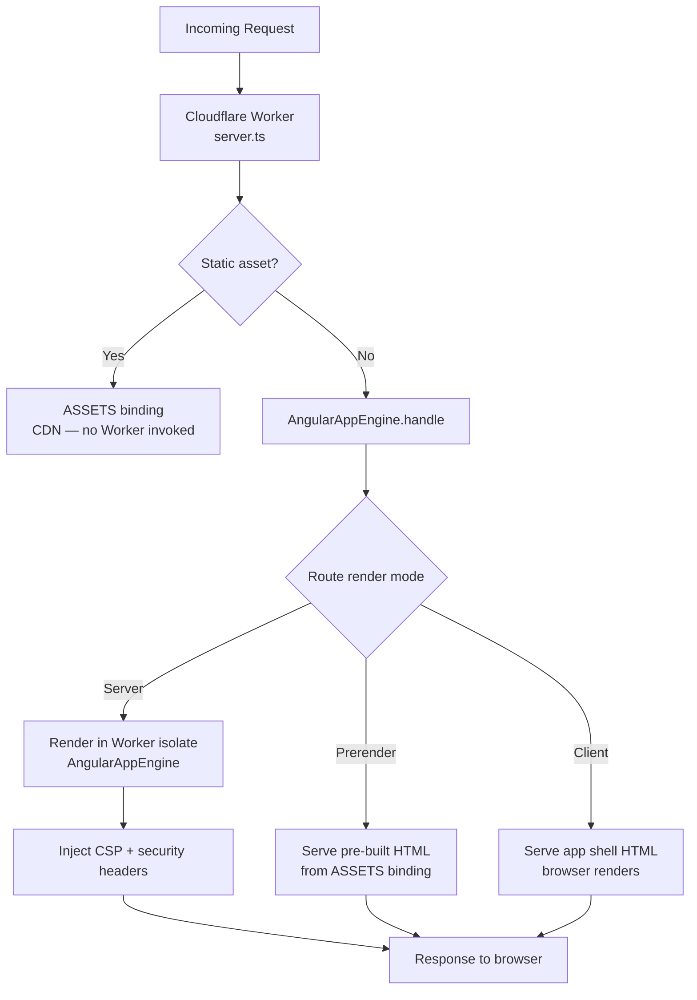
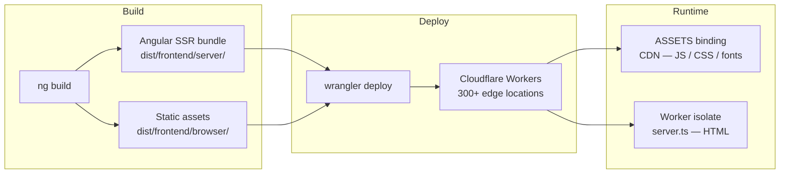

# Angular Frontend — Developer Reference

> **Audience:** Contributors and integrators working on the Angular frontend.
> **Location:** `frontend/` directory of the adblock-compiler monorepo.
> **Status:** Production-ready reference implementation — Angular 21, zoneless, SSR, Cloudflare Workers.

---

## Table of Contents

1. [Overview](#overview)
2. [Quick Start](#quick-start)
3. [Architecture Overview](#architecture-overview)
4. [Project Structure](#project-structure)
5. [Technology Stack](#technology-stack)
6. [Angular 21 API Patterns](#angular-21-api-patterns)
   - [Signals: `signal()` / `computed()` / `effect()`](#1-signal--computed--effect)
   - [Signal Component API: `input()` / `output()` / `model()`](#2-input--output--model)
   - [Signal Queries: `viewChild()` / `viewChildren()`](#3-viewchild--viewchildren)
   - [Deferrable Views: `@defer`](#4-defer--deferrable-views)
   - [Signal-Native HTTP: `rxResource()` / `httpResource()`](#5-rxresource--httpresource)
   - [Linked Signals: `linkedSignal()`](#6-linkedsignal)
   - [Post-Render Effects: `afterRenderEffect()`](#7-afterrendereffect)
   - [App Bootstrap Hook: `provideAppInitializer()`](#8-provideappinitializer)
   - [Observable Bridge: `toSignal()` / `takeUntilDestroyed()`](#9-tosignal--takeuntildestroyed)
   - [Built-in Control Flow: `@if` / `@for` / `@switch`](#10-if--for--switch)
   - [Functional DI: `inject()`](#11-inject)
   - [Zoneless Change Detection](#12-zoneless-change-detection)
   - [Multi-Mode SSR](#13-multi-mode-ssr)
   - [Functional HTTP Interceptors](#14-functional-http-interceptors)
   - [Functional Route Guards](#15-functional-route-guards)
7. [Component Catalog](#component-catalog)
8. [Services Catalog](#services-catalog)
9. [State Management](#state-management)
10. [Routing](#routing)
11. [SSR and Rendering Modes](#ssr-and-rendering-modes)
12. [Accessibility (WCAG 2.1)](#accessibility-wcag-21)
13. [Security](#security)
14. [Testing](#testing)
15. [Cloudflare Workers Deployment](#cloudflare-workers-deployment)
16. [Configuration Tokens](#configuration-tokens)
17. [Extending the Frontend](#extending-the-frontend)
18. [Migration Reference (v16 → v21)](#migration-reference-v16--v21)
19. [Further Reading](#further-reading)

---

## Overview

The `frontend/` directory contains a complete Angular 21 application that serves as the production UI for the Adblock Compiler API. It is designed as a **showcase of every major modern Angular API**, covering:

- Zoneless change detection (no `zone.js`)
- Signal-first state and component API
- Server-Side Rendering (SSR) on Cloudflare Workers
- Angular Material 3 design system
- PWA / Service Worker support
- End-to-end Playwright tests
- Vitest unit tests with `@analogjs/vitest-angular`

The application connects to the Cloudflare Worker API (`/api/*`) and provides six pages: **Home**, **Compiler**, **Performance**, **Validation**, **API Docs**, and **Admin**.

---

## Quick Start

```bash
# 1. Install dependencies
cd frontend
npm install

# 2. Start the CSR dev server (fastest iteration)
npm start              # → http://localhost:4200

# 3. Build SSR bundle
npm run build

# 4. Preview with Wrangler (mirrors Cloudflare Workers production)
npm run preview        # → http://localhost:8787

# 5. Deploy to Cloudflare Workers
deno task wrangler:deploy

# 6. Run unit tests (Vitest)
npm test               # single pass
npm run test:watch     # watch mode
npm run test:coverage  # V8 coverage report in coverage/

# 7. Run E2E tests (Playwright — requires dev server running)
npx playwright test
```

---

## Architecture Overview



### Data Flow for a Compilation Request



---

## Project Structure

```
frontend/
├── src/
│   ├── app/
│   │   ├── app.component.ts            # Root shell: sidenav, toolbar, theme toggle
│   │   ├── app.config.ts               # Browser providers: zoneless, router, HTTP, SSR hydration
│   │   ├── app.config.server.ts        # SSR providers: mergeApplicationConfig(), absolute API URL
│   │   ├── app.routes.ts               # Lazy-loaded routes with titles + route data
│   │   ├── app.routes.server.ts        # Per-route render mode (Server / Prerender / Client)
│   │   ├── tokens.ts                   # InjectionToken declarations (API_BASE_URL, TURNSTILE_SITE_KEY)
│   │   ├── route-animations.ts         # Angular Animations trigger for route transitions
│   │   │
│   │   ├── compiler/
│   │   │   └── compiler.component.ts   # rxResource(), linkedSignal(), SSE streaming, Turnstile, CDK Virtual Scroll
│   │   ├── home/
│   │   │   └── home.component.ts       # MetricsStore, @defer on viewport, skeleton loading
│   │   ├── performance/
│   │   │   └── performance.component.ts  # httpResource(), MetricsStore, SparklineComponent
│   │   ├── admin/
│   │   │   └── admin.component.ts      # Auth guard, rxResource(), CDK Virtual Scroll, SQL console
│   │   ├── api-docs/
│   │   │   └── api-docs.component.ts   # httpResource() for /api/version endpoint
│   │   ├── validation/
│   │   │   └── validation.component.ts # Rule validation, color-coded output
│   │   │
│   │   ├── error/
│   │   │   ├── global-error-handler.ts         # Custom ErrorHandler with signal state
│   │   │   └── error-boundary.component.ts     # Dismissible error overlay
│   │   ├── guards/
│   │   │   └── admin.guard.ts          # Functional CanActivateFn for admin route
│   │   ├── interceptors/
│   │   │   └── error.interceptor.ts    # Functional HttpInterceptorFn (401, 429, 5xx)
│   │   ├── skeleton/
│   │   │   ├── skeleton-card.component.ts      # mat-card (outlined) + mat-progress-bar buffer + shimmer card placeholder
│   │   │   └── skeleton-table.component.ts     # mat-card (outlined) + mat-progress-bar buffer + shimmer table placeholder
│   │   ├── sparkline/
│   │   │   └── sparkline.component.ts  # mat-card (outlined) wrapper, Canvas 2D mini chart (zero dependencies)
│   │   ├── stat-card/
│   │   │   ├── stat-card.component.ts  # input() / output() / model() demo component
│   │   │   └── stat-card.component.spec.ts
│   │   ├── store/
│   │   │   └── metrics.store.ts        # Shared singleton signal store with SWR cache
│   │   ├── turnstile/
│   │   │   └── turnstile.component.ts  # mat-card (outlined) wrapper, Cloudflare Turnstile CAPTCHA widget
│   │   ├── services/
│   │   │   ├── auth.service.ts         # Admin key management (sessionStorage)
│   │   │   ├── compiler.service.ts     # POST /api/compile — Observable HTTP
│   │   │   ├── filter-parser.service.ts  # Web Worker bridge for off-thread parsing
│   │   │   ├── metrics.service.ts      # GET /api/metrics, /api/health
│   │   │   ├── sse.service.ts          # Generic fetch-based SSE client returning signals
│   │   │   ├── storage.service.ts      # Admin R2/D1 storage endpoints
│   │   │   ├── swr-cache.service.ts    # Generic stale-while-revalidate signal cache
│   │   │   ├── theme.service.ts        # Dark/light theme signal state, SSR-safe
│   │   │   ├── turnstile.service.ts    # Turnstile widget lifecycle + token signal
│   │   │   └── validation.service.ts   # POST /api/validate
│   │   └── workers/
│   │       └── filter-parser.worker.ts # Off-thread Web Worker: filter list parsing
│   │
│   ├── e2e/                            # Playwright E2E tests
│   │   ├── playwright.config.ts
│   │   ├── home.spec.ts
│   │   ├── compiler.spec.ts
│   │   └── navigation.spec.ts
│   ├── index.html                      # App shell: Turnstile script tag, npm fonts
│   ├── main.ts                         # bootstrapApplication()
│   ├── main.server.ts                  # Server bootstrap (imported by server.ts)
│   ├── styles.css                      # @fontsource/roboto + material-symbols imports
│   └── test-setup.ts                   # Vitest global setup: imports @angular/compiler
│
├── server.ts                           # Cloudflare Workers fetch handler + CSP headers
├── ngsw-config.json                    # PWA / Service Worker cache config
├── angular.json                        # Angular CLI workspace configuration
├── vitest.config.ts                    # Vitest + @analogjs/vitest-angular configuration
├── wrangler.toml                       # Cloudflare Workers deployment configuration
├── tsconfig.json                       # Base TypeScript config
├── tsconfig.app.json                   # App-specific TS config
└── tsconfig.spec.json                  # Spec-specific TS config (vitest/globals types)
```

---

## Technology Stack

| Technology | Version | Role |
|---|---|---|
| **Angular** | ^21.0.0 | Application framework |
| **Angular Material** | ^21.0.0 | Material Design 3 component library |
| **@angular/ssr** | ^21.0.0 | Server-Side Rendering (edge-fetch adapter) |
| **@angular/cdk** | ^21.0.0 | Layout, virtual scrolling, accessibility (a11y) utilities |
| **@angular/service-worker** | ^21.0.0 | PWA / Service Worker support |
| **RxJS** | ~7.8.2 | Async streams for HTTP and route params |
| **TypeScript** | ~5.8.0 | Type safety throughout |
| **Cloudflare Workers** | — | Edge SSR deployment platform |
| **Wrangler** | — | Cloudflare Workers CLI (deploy + local dev) |
| **Vitest** | ^3.0.0 | Fast unit test runner (replaces Karma) |
| **@analogjs/vitest-angular** | ^1.0.0 | Angular compiler plugin for Vitest |
| **TailwindCSS** | ^4.x | Utility-first CSS; bridged to Angular Material M3 tokens via `@theme inline` |
| **Playwright** | — | E2E browser test framework |
| **@fontsource/roboto** | ^5.x | Roboto font — npm package, no CDN dependency |
| **material-symbols** | ^0.31.0 | Material Symbols icon font — npm package, no CDN |

---

## Angular 21 API Patterns

This section documents every modern Angular API demonstrated in the frontend, with annotated code samples drawn directly from the source.

---

### 1. `signal()` / `computed()` / `effect()`

The foundation of Angular's reactive model. All mutable component state uses `signal()`. Derived values use `computed()`. Side-effects use `effect()`.

```typescript
import { signal, computed, effect } from '@angular/core';

// Writable signal
readonly compilationCount = signal(0);

// Computed signal — automatically re-derives when compilationCount changes
readonly doubleCount = computed(() => this.compilationCount() * 2);

constructor() {
    // effect() runs once immediately, then again whenever any read signal changes
    effect(() => {
        console.log('Count:', this.compilationCount());
    });
}

// Mutate with .set() or .update()
this.compilationCount.set(5);
this.compilationCount.update(n => n + 1);
```

**Template binding:**
```html
<p>Count: {{ compilationCount() }}</p>
<p>Double: {{ doubleCount() }}</p>
<button (click)="compilationCount.update(n => n + 1)">Increment</button>
```

> **See:** `services/theme.service.ts`, `store/metrics.store.ts`

---

### 2. `input()` / `output()` / `model()`

Replaces `@Input()`, `@Output() + EventEmitter`, and the `@Input()`/`@Output()` pair for two-way binding.

```typescript
import { input, output, model } from '@angular/core';

@Component({ selector: 'app-stat-card', standalone: true, /* … */ })
export class StatCardComponent {
    // input.required() — compile error if parent omits this binding
    readonly label = input.required<string>();

    // input() with default value
    readonly color = input<string>('#1976d2');

    // output() — replaces @Output() clicked = new EventEmitter<string>()
    readonly cardClicked = output<string>();

    // model() — two-way writable signal (replaces @Input()/@Output() pair)
    // Parent uses [(highlighted)]="isHighlighted"
    readonly highlighted = model<boolean>(false);

    click(): void {
        this.cardClicked.emit(this.label());
        this.highlighted.update(h => !h);   // write back to parent via model()
    }
}
```

**Parent template:**
```html
<app-stat-card
    label="Filter Lists"
    color="primary"
    [(highlighted)]="isHighlighted"
    (cardClicked)="onCardClick($event)"
/>
```

> **See:** `stat-card/stat-card.component.ts`

---

### 3. `viewChild()` / `viewChildren()`

Replaces `@ViewChild` / `@ViewChildren` decorators. Returns `Signal<T | undefined>` — no `AfterViewInit` hook needed.

```typescript
import { viewChild, viewChildren, ElementRef } from '@angular/core';
import { MatSidenav } from '@angular/material/sidenav';

@Component({ /* … */ })
export class AppComponent {
    // Replaces: @ViewChild('sidenav') sidenav!: MatSidenav;
    readonly sidenavRef = viewChild<MatSidenav>('sidenav');

    // Read the signal like any other — resolves after view initialises
    openSidenav(): void {
        this.sidenavRef()?.open();
    }
}
```

> **See:** `app.component.ts`, `home/home.component.ts`

---

### 4. `@defer` — Deferrable Views

Lazily loads and renders a template block when a trigger fires. Enables incremental hydration in SSR: the placeholder HTML ships in the initial payload and the heavy component chunk hydrates progressively.

```html
<!-- Load when the block enters the viewport -->
@defer (on viewport; prefetch on hover) {
    <app-feature-highlights />
} @placeholder (minimum 200ms) {
    <app-skeleton-card lines="3" />
} @loading (minimum 300ms; after 100ms) {
    <mat-spinner diameter="32" />
} @error {
    <p>Failed to load</p>
}

<!-- Load when the browser is idle -->
@defer (on idle) {
    <app-summary-stats />
} @placeholder {
    <mat-spinner diameter="24" />
}
```

**Available triggers:**

| Trigger | When it fires |
|---|---|
| `on viewport` | Block enters the viewport (IntersectionObserver) |
| `on idle` | `requestIdleCallback` fires |
| `on interaction` | First click or focus inside the placeholder |
| `on timer(n)` | After `n` milliseconds |
| `when (expr)` | When a signal/boolean becomes truthy |
| `prefetch on hover` | Pre-fetches the chunk on hover but delays render |

> **See:** `home/home.component.ts`

---

### 5. `rxResource()` / `httpResource()`

**`rxResource()`** (from `@angular/core/rxjs-interop`) — replaces the `loading / error / result` signal trio and manual subscribe/unsubscribe boilerplate. The loader returns an `Observable`.

```typescript
import { rxResource } from '@angular/core/rxjs-interop';

@Component({ /* … */ })
export class CompilerComponent {
    // pendingRequest drives the resource — undefined keeps it Idle
    private readonly pendingRequest = signal<CompileRequest | undefined>(undefined);

    readonly compileResource = rxResource<CompileResponse, CompileRequest | undefined>({
        request: () => this.pendingRequest(),
        loader: ({ request }) => this.compilerService.compile(
            request.urls,
            request.transformations,
        ),
    });

    submit(): void {
        this.pendingRequest.set({ urls: ['https://…'], transformations: ['Deduplicate'] });
    }
}
```

**Template:**
```html
@if (compileResource.isLoading()) {
    <mat-spinner />
} @else if (compileResource.value(); as result) {
    <pre>{{ result | json }}</pre>
} @else if (compileResource.error(); as err) {
    <p class="error">{{ err }}</p>
}
```

**`httpResource()`** (Angular 21, from `@angular/common/http`) — declarative HTTP fetching that wires directly to a URL signal. No service needed for simple GET requests.

```typescript
import { httpResource } from '@angular/common/http';

@Component({ /* … */ })
export class ApiDocsComponent {
    readonly versionResource = httpResource<{ version: string }>('/api/version');

    // In template:
    // versionResource.value()?.version
    // versionResource.isLoading()
    // versionResource.error()
}
```

> **See:** `compiler/compiler.component.ts`, `api-docs/api-docs.component.ts`, `performance/performance.component.ts`

---

### 6. `linkedSignal()`

A writable signal whose value automatically **resets** when a source signal changes, but can be overridden manually between resets. Useful for preset-driven form defaults that the user can still customise.

```typescript
import { signal, linkedSignal } from '@angular/core';

readonly selectedPreset = signal<string>('EasyList');
readonly presets = [
    { label: 'EasyList',   urls: ['https://easylist.to/easylist/easylist.txt'] },
    { label: 'AdGuard DNS', urls: ['https://adguardteam.github.io/…'] },
];

// Resets to preset URLs when selectedPreset changes
// but the user can still edit them manually
readonly presetUrls = linkedSignal(() => {
    const preset = this.presets.find(p => p.label === this.selectedPreset());
    return preset?.urls ?? [''];
});

// User can override without triggering a reset:
this.presetUrls.set(['https://my-custom-list.txt']);

// Switching preset resets back to preset defaults:
this.selectedPreset.set('AdGuard DNS');
// presetUrls() is now ['https://adguardteam.github.io/…']
```

> **See:** `compiler/compiler.component.ts`

---

### 7. `afterRenderEffect()`

The correct API for reading or writing the DOM after Angular commits a render. Unlike `effect()` in the constructor, this is guaranteed to run after layout is complete.

```typescript
import { viewChild, signal, afterRenderEffect, ElementRef } from '@angular/core';

@Component({ /* … */ })
export class BenchmarkComponent {
    readonly tableHeight = signal(0);
    readonly benchmarkTableRef = viewChild<ElementRef>('benchmarkTable');

    constructor() {
        afterRenderEffect(() => {
            const el = this.benchmarkTableRef()?.nativeElement as HTMLElement | undefined;
            if (el) {
                // Safe: DOM is fully committed at this point
                this.tableHeight.set(el.offsetHeight);
            }
        });
    }
}
```

**Use cases:** chart integrations, scroll position restore, focus management, third-party DOM libraries, canvas sizing.

---

### 8. `provideAppInitializer()`

Replaces the verbose `APP_INITIALIZER` injection token + factory function. Available and stable since Angular v19.

```typescript
import { provideAppInitializer, inject } from '@angular/core';
import { ThemeService } from './services/theme.service';

// OLD pattern (still works but verbose):
{
    provide: APP_INITIALIZER,
    useFactory: (theme: ThemeService) => () => theme.loadPreferences(),
    deps: [ThemeService],
    multi: true,
}

// NEW pattern — no deps array, inject() works directly:
provideAppInitializer(() => {
    inject(ThemeService).loadPreferences();
})
```

The callback runs synchronously before the first render. Return a `Promise` or `Observable` to block rendering until async initialisation completes. Used here to apply the saved theme class to `<body>` before the first paint, preventing theme flash on load.

> **See:** `app.config.ts`, `services/theme.service.ts`

---

### 9. `toSignal()` / `takeUntilDestroyed()`

Both helpers come from `@angular/core/rxjs-interop` and bridge RxJS Observables with the Signals world.

**`toSignal()`** — converts any Observable to a Signal. Auto-unsubscribes when the component is destroyed.

```typescript
import { toSignal } from '@angular/core/rxjs-interop';
import { BreakpointObserver, Breakpoints } from '@angular/cdk/layout';
import { map } from 'rxjs/operators';

@Component({ /* … */ })
export class AppComponent {
    private readonly breakpointObserver = inject(BreakpointObserver);

    // Observable → Signal; initialValue prevents undefined on first render
    readonly isMobile = toSignal(
        this.breakpointObserver.observe([Breakpoints.Handset])
            .pipe(map(result => result.matches)),
        { initialValue: false },
    );
}
```

**`takeUntilDestroyed()`** — replaces the `Subject<void>` + `ngOnDestroy` teardown pattern.

```typescript
import { takeUntilDestroyed } from '@angular/core/rxjs-interop';
import { DestroyRef, inject } from '@angular/core';

@Component({ /* … */ })
export class CompilerComponent {
    private readonly destroyRef = inject(DestroyRef);

    ngOnInit(): void {
        this.route.queryParamMap
            .pipe(takeUntilDestroyed(this.destroyRef))
            .subscribe(params => {
                // Handles unsubscription automatically on destroy
            });
    }
}
```

> **See:** `app.component.ts`, `compiler/compiler.component.ts`

---

### 10. `@if` / `@for` / `@switch`

Angular 17+ built-in control flow. Replaces `*ngIf`, `*ngFor`, and `*ngSwitch` structural directives. No `NgIf`, `NgFor`, or `NgSwitch` import needed.

```html
<!-- @if with else-if chain -->
@if (compileResource.isLoading()) {
    <mat-spinner />
} @else if (compileResource.value(); as result) {
    <pre>{{ result | json }}</pre>
} @else {
    <p>No results yet.</p>
}

<!-- @for with empty block — track is required -->
@for (item of runs(); track item.run) {
    <tr>
        <td>{{ item.run }}</td>
        <td>{{ item.duration }}</td>
    </tr>
} @empty {
    <tr><td colspan="2">No runs yet</td></tr>
}

<!-- @switch -->
@switch (status()) {
    @case ('loading')  { <mat-spinner /> }
    @case ('error')    { <p class="error">Error</p> }
    @default           { <p>Idle</p> }
}
```

---

### 11. `inject()`

Functional Dependency Injection — replaces constructor parameter injection. Works in components, services, directives, pipes, and `provideAppInitializer()` callbacks.

```typescript
import { inject } from '@angular/core';
import { HttpClient } from '@angular/common/http';
import { Router } from '@angular/router';

@Injectable({ providedIn: 'root' })
export class CompilerService {
    // No constructor() needed for DI
    private readonly http   = inject(HttpClient);
    private readonly router = inject(Router);
}
```

> **See:** Every service and component in the frontend.

---

### 12. Zoneless Change Detection

Enabled in `app.config.ts` via `provideZonelessChangeDetection()`. `zone.js` is not loaded. Change detection is driven purely by signal writes and the microtask scheduler.

```typescript
// app.config.ts
import { provideZonelessChangeDetection } from '@angular/core';

export const appConfig: ApplicationConfig = {
    providers: [
        provideZonelessChangeDetection(),
        // …
    ],
};
```

**Benefits:**
- Smaller initial bundle (no `zone.js` polyfill)
- Predictable rendering — only components consuming changed signals re-render
- Simpler mental model — no hidden monkey-patching of `setTimeout`, `fetch`, etc.
- Required for SSR edge runtimes that do not support `zone.js`

**Gotcha:** Never mutate state outside Angular's scheduler without calling `signal.set()`. Imperative DOM mutations (e.g. jQuery, direct `innerHTML` writes) will not trigger re-renders.

---

### 13. Multi-Mode SSR

Defined in `src/app/app.routes.server.ts`, Angular 21 supports three per-route rendering strategies:

| Mode | Behaviour | Best for |
|---|---|---|
| `RenderMode.Prerender` | HTML generated once at build time (SSG) | Fully static content |
| `RenderMode.Server` | HTML rendered per request inside the Worker | Dynamic / user-specific pages |
| `RenderMode.Client` | No server rendering, pure CSR | Routes with DOM-dependent Material components (e.g. `mat-slide-toggle`) |

```typescript
// app.routes.server.ts
import { RenderMode, ServerRoute } from '@angular/ssr';

export const serverRoutes: ServerRoute[] = [
    // Home and Compiler use CSR: mat-slide-toggle bound via ngModel
    // calls writeValue() during SSR, which crashes the server renderer.
    { path: '',        renderMode: RenderMode.Client },
    { path: 'compiler', renderMode: RenderMode.Client },
    // All other routes use per-request SSR.
    { path: '**',      renderMode: RenderMode.Server },
];
```

> **See:** [SSR and Rendering Modes](#ssr-and-rendering-modes) for the full deployment picture.

---

### 14. Functional HTTP Interceptors

Replaces the class-based `HttpInterceptor` interface. Registered in `provideHttpClient(withInterceptors([…]))`.

```typescript
// interceptors/error.interceptor.ts
import { HttpInterceptorFn, HttpErrorResponse } from '@angular/common/http';
import { inject } from '@angular/core';
import { catchError, throwError } from 'rxjs';
import { AuthService } from '../services/auth.service';

export const errorInterceptor: HttpInterceptorFn = (req, next) => {
    const auth = inject(AuthService);

    return next(req).pipe(
        catchError((error: HttpErrorResponse) => {
            if (error.status === 401) {
                auth.clearKey();
            }
            return throwError(() => error);
        }),
    );
};
```

**Registration:**
```typescript
// app.config.ts
provideHttpClient(withFetch(), withInterceptors([errorInterceptor]))
```

> **See:** `interceptors/error.interceptor.ts`

---

### 15. Functional Route Guards

Replaces class-based `CanActivate`. A `CanActivateFn` is a plain function that returns `boolean | UrlTree | Observable | Promise` of those types.

```typescript
// guards/admin.guard.ts
import { inject } from '@angular/core';
import { CanActivateFn, Router } from '@angular/router';
import { AuthService } from '../services/auth.service';

export const adminGuard: CanActivateFn = () => {
    const auth = inject(AuthService);
    // Soft check: the admin component renders an inline auth form if no key is set.
    // For strict blocking, return a UrlTree instead:
    //   return auth.hasKey() || inject(Router).createUrlTree(['/']);
    return true;
};
```

**Registration (static import — recommended for new guards):**
```typescript
// app.routes.ts
import { adminGuard } from './guards/admin.guard';

{
    path: 'admin',
    loadComponent: () => import('./admin/admin.component').then(m => m.AdminComponent),
    canActivate: [adminGuard],
}
```

> **See:** `guards/admin.guard.ts`, `app.routes.ts`

---

## Component Catalog

| Component | Route | Key Patterns |
|---|---|---|
| `AppComponent` | Shell (no route) | `viewChild()`, `toSignal()`, `effect()`, `inject()`, route animations |
| `HomeComponent` | `/` | `@defer on viewport`, `MetricsStore`, `StatCardComponent`, skeleton loading |
| `CompilerComponent` | `/compiler` | `rxResource()`, `linkedSignal()`, `SseService`, Turnstile, `FilterParserService`, CDK Virtual Scroll |
| `PerformanceComponent` | `/performance` | `httpResource()`, `MetricsStore`, `SparklineComponent` |
| `ValidationComponent` | `/validation` | `ValidationService`, color-coded output |
| `ApiDocsComponent` | `/api-docs` | `httpResource()` |
| `AdminComponent` | `/admin` | `rxResource()`, `AuthService`, CDK Virtual Scroll, D1 SQL console |
| `StatCardComponent` | Shared | `input.required()`, `output()`, `model()` |
| `SkeletonCardComponent` | Shared | `mat-card appearance="outlined"` + `mat-progress-bar` (buffer mode), shimmer CSS animation, configurable line count |
| `SkeletonTableComponent` | Shared | `mat-card appearance="outlined"` + `mat-progress-bar` (buffer mode), shimmer CSS animation, configurable rows/columns |
| `SparklineComponent` | Shared | `mat-card appearance="outlined"` wrapper, Canvas 2D line/area chart, zero dependencies |
| `TurnstileComponent` | Shared | `mat-card appearance="outlined"` wrapper, Cloudflare Turnstile CAPTCHA widget, `TurnstileService` |
| `ErrorBoundaryComponent` | Shared | Reads `GlobalErrorHandler` signals, dismissible overlay |

---

## Services Catalog

| Service | Scope | Responsibility |
|---|---|---|
| `CompilerService` | `root` | `POST /api/compile` — returns `Observable<CompileResponse>` |
| `SseService` | `root` | Generic fetch-based SSE client; returns `SseConnection` with `events()` / `status()` signals |
| `MetricsService` | `root` | `GET /api/metrics`, `GET /api/health` — returns Observables |
| `ValidationService` | `root` | `POST /api/validate` — rule validation |
| `StorageService` | `root` | Admin R2/D1 storage endpoints |
| `AuthService` | `root` | Admin key management via `sessionStorage` |
| `ThemeService` | `root` | Dark/light signal state; SSR-safe via `inject(DOCUMENT)` |
| `TurnstileService` | `root` | Cloudflare Turnstile widget lifecycle + token signal |
| `FilterParserService` | `root` | Web Worker bridge; `result`, `isParsing`, `progress`, `error` signals |
| `SwrCacheService` | `root` | Generic stale-while-revalidate signal cache |

---

## State Management

The application uses **Angular Signals** for all state. There is no NgRx or other external state library.

### Local Component State

Transient UI state (loading spinner, form values, open panels) lives in `signal()` fields on the component class:

```typescript
readonly isOpen = signal(false);
readonly searchQuery = signal('');
```

### Shared Singleton Stores

Cross-component state that must survive navigation lives in injectable stores (no `NgModule` needed):

```typescript
// store/metrics.store.ts — shared by HomeComponent and PerformanceComponent
@Injectable({ providedIn: 'root' })
export class MetricsStore {
    private readonly swrCache = inject(SwrCacheService);

    private readonly metricsSwr = this.swrCache.get<ExtendedMetricsResponse>(
        'metrics',
        () => firstValueFrom(this.metricsService.getMetrics()),
        30_000,   // TTL: 30 s
    );

    // Expose read-only signals to consumers
    readonly metrics = this.metricsSwr.data;
    readonly isLoading = computed(() => this.metricsSwr.isRevalidating());
}
```

### Stale-While-Revalidate Cache

`SwrCacheService` backs `MetricsStore`. On first access it fetches data and caches it. On subsequent accesses it returns the cached value immediately and revalidates in the background if the TTL has elapsed.

```
First call          → cache MISS  → fetch  → store data in signal → render
Second call (fresh) → cache HIT   → return immediately
Second call (stale) → cache HIT   → return stale immediately + revalidate in background → signal updates
```

### Signal Store Pattern

```mermaid
graph LR
    A[Component A] -->|inject| S[MetricsStore]
    B[Component B] -->|inject| S
    S -->|get| C[SwrCacheService]
    C -->|firstValueFrom| M[MetricsService]
    M -->|HTTP GET| API[/api/metrics]
    C -->|data signal| S
    S -->|readonly signal| A
    S -->|readonly signal| B
```

---

## Routing

All routes use **lazy loading** via `loadComponent()`. The Angular build pipeline emits a separate JS chunk per route that is only fetched when the user navigates to that route.

```typescript
// app.routes.ts
export const routes: Routes = [
    {
        path: '',
        loadComponent: () => import('./home/home.component').then(m => m.HomeComponent),
        title: 'Home',
    },
    {
        path: 'compiler',
        loadComponent: () => import('./compiler/compiler.component').then(m => m.CompilerComponent),
        title: 'Compiler',
        data: { description: 'Configure and run filter list compilations' },
    },
    {
        path: 'api-docs',
        loadComponent: () => import('./api-docs/api-docs.component').then(m => m.ApiDocsComponent),
        title: 'API Reference',
    },
    // … more routes
    {
        path: 'admin',
        loadComponent: () => import('./admin/admin.component').then(m => m.AdminComponent),
        canActivate: [() => import('./guards/admin.guard').then(m => m.adminGuard)],
        title: 'Admin',
    },
    { path: '**', redirectTo: '' },
];
```

Route `title` values are short labels (e.g. `'Compiler'`). The `AppTitleStrategy` appends the application name automatically, producing titles like **"Compiler | Adblock Compiler"** (see [Page Titles](#page-titles) below).

**Router features enabled:**

| Feature | Provider option | Effect |
|---|---|---|
| Component input binding | `withComponentInputBinding()` | Route params auto-bound to `input()` signals |
| View Transitions API | `withViewTransitions()` | Native browser cross-document transition animations |
| Preload all | `withPreloading(PreloadAllModules)` | All lazy chunks prefetched after initial navigation |
| Custom title strategy | `{ provide: TitleStrategy, useClass: AppTitleStrategy }` | Appends app name to every route title (WCAG 2.4.2) |

### Page Titles

`src/app/title-strategy.ts` implements a custom `TitleStrategy` that formats every page's `<title>` element as:

```
<route title> | Adblock Compiler
```

When a route has no `title`, the fallback is just `"Adblock Compiler"`. This satisfies **WCAG 2.4.2 (Page Titled — Level A)**.

```typescript
// title-strategy.ts
@Injectable({ providedIn: 'root' })
export class AppTitleStrategy extends TitleStrategy {
    private readonly title = inject(Title);

    override updateTitle(snapshot: RouterStateSnapshot): void {
        const routeTitle = this.buildTitle(snapshot);
        this.title.setTitle(routeTitle ? `${routeTitle} | Adblock Compiler` : 'Adblock Compiler');
    }
}
```

Register it in `app.config.ts`:

```typescript
{ provide: TitleStrategy, useClass: AppTitleStrategy }
```

---

## SSR and Rendering Modes



### Cloudflare Workers Entry Point (`server.ts`)

```typescript
import { AngularAppEngine } from '@angular/ssr';
import './src/main.server';   // registers the app with AngularAppEngine

const angularApp = new AngularAppEngine();

export default {
    async fetch(request: Request): Promise<Response> {
        const response = await angularApp.handle(request);
        if (!response) return new Response('Not found', { status: 404 });

        // Inject security headers on HTML responses
        if (response.headers.get('Content-Type')?.includes('text/html')) {
            const headers = new Headers(response.headers);
            headers.set('Content-Security-Policy', /* … see Security section */);
            headers.set('X-Content-Type-Options', 'nosniff');
            headers.set('X-Frame-Options', 'DENY');
            headers.set('Referrer-Policy', 'strict-origin-when-cross-origin');
            return new Response(response.body, { status: response.status, headers });
        }

        return response;
    },
};
```

### SSR vs CSR vs Prerender

| Strategy | When to use | Example route |
|---|---|---|
| `RenderMode.Server` | Dynamic content, user-specific data | `/admin`, `/performance`, `/api-docs` |
| `RenderMode.Prerender` | Static content, SEO landing pages | — |
| `RenderMode.Client` | Components with DOM-dependent Material widgets (e.g. `mat-slide-toggle`) | `/` (Home), `/compiler` |

### HTTP Transfer Cache

`provideClientHydration(withHttpTransferCacheOptions({ includePostRequests: false }))` prevents double-fetching: data fetched during SSR is serialised into the HTML payload and replayed client-side without a second network request.

---

## Accessibility (WCAG 2.1)

The Angular frontend targets **WCAG 2.1 Level AA** compliance. The following features are implemented:

| Feature | Location | Standard |
|---|---|---|
| Skip navigation link | `app.component.html` | WCAG 2.4.1 — Bypass Blocks |
| Unique per-route page titles | `AppTitleStrategy` | WCAG 2.4.2 — Page Titled |
| Single `<h1>` per page | Route components | WCAG 1.3.1 — Info and Relationships |
| `aria-label` on `<nav>` | `app.component.html` | WCAG 4.1.2 — Name, Role, Value |
| `aria-live="polite"` on toast container | `notification-container.component.ts` | WCAG 4.1.3 — Status Messages |
| `aria-hidden="true"` on decorative icons | Home, Admin, Compiler components | WCAG 1.1.1 — Non-text Content |
| `.visually-hidden` utility class | `styles.css` | Screen-reader-only text pattern |
| `prefers-reduced-motion` media query | `styles.css` | WCAG 2.3.3 — Animation from Interactions |
| `id="main-content"` on `<main>` | `app.component.html` | Skip link target |

### Skip Link

The app shell renders a visually-hidden skip link as the first focusable element on every page:

```html
<a class="skip-link" href="#main-content">Skip to main content</a>
<!-- … header/nav … -->
<main id="main-content" tabindex="-1">
    <router-outlet />
</main>
```

The `.skip-link` class in `styles.css` positions it off-screen until focused, then brings it into view for keyboard users.

### Reduced Motion

All CSS transitions and animations respect the user's OS preference:

```css
@media (prefers-reduced-motion: reduce) {
    *, *::before, *::after {
        animation-duration: 0.01ms !important;
        transition-duration: 0.01ms !important;
    }
}
```

---

## Security

### Content Security Policy

`server.ts` injects the following CSP on all HTML responses:

| Directive | Value | Rationale |
|---|---|---|
| `default-src` | `'self'` | Block everything by default |
| `script-src` | `'self'` + Cloudflare origins | Allow app scripts + Turnstile |
| `style-src` | `'self' 'unsafe-inline'` | Material's inline styles |
| `img-src` | `'self' data:` | Allow inline SVG/data URIs |
| `font-src` | `'self'` | npm-bundled fonts only |
| `connect-src` | `'self'` | API calls to same origin |
| `frame-src` | `https://challenges.cloudflare.com` | Turnstile iframe |
| `object-src` | `'none'` | Block plugins |
| `base-uri` | `'self'` | Prevent base-tag injection |

### Bot Protection (Cloudflare Turnstile)

`TurnstileService` manages the widget lifecycle. `CompilerComponent` gates form submission on a valid Turnstile token:

```typescript
// compiler.component.ts
submit(): void {
    const token = this.turnstileService.token();
    if (!token && this.turnstileSiteKey) {
        console.warn('Turnstile token not yet available');
        return;
    }
    this.pendingRequest.set({ /* … token included */ });
}
```

`TURNSTILE_SITE_KEY` is provided via an `InjectionToken`. An empty string disables the widget for local development.

### Admin Authentication

`AuthService` stores the admin API key in `sessionStorage` (cleared on tab close). The `errorInterceptor` automatically clears the key on HTTP 401 responses.

---

## Testing

### Unit Tests (Vitest)

Tests use **Vitest** with **`@analogjs/vitest-angular`** instead of Karma + Jasmine. All tests are **zoneless** and use `provideZonelessChangeDetection()`.

```typescript
// stat-card.component.spec.ts
import { TestBed } from '@angular/core/testing';
import { provideZonelessChangeDetection } from '@angular/core';
import { StatCardComponent } from './stat-card.component';

describe('StatCardComponent', () => {
    it('renders required label input', async () => {
        await TestBed.configureTestingModule({
            imports: [StatCardComponent],
            providers: [provideZonelessChangeDetection()],
        }).compileComponents();

        const fixture = TestBed.createComponent(StatCardComponent);

        // Signal input setter API (replaces fixture.debugElement.setInput)
        fixture.componentRef.setInput('label', 'Filter Lists');

        await fixture.whenStable();   // flush microtask scheduler (replaces fixture.detectChanges())
        expect(fixture.nativeElement.textContent).toContain('Filter Lists');
    });
});
```

**Testing HTTP services:**

```typescript
// compiler.service.spec.ts
import { provideHttpClient } from '@angular/common/http';
import { provideHttpClientTesting, HttpTestingController } from '@angular/common/http/testing';
import { API_BASE_URL } from '../tokens';

beforeEach(async () => {
    await TestBed.configureTestingModule({
        providers: [
            provideZonelessChangeDetection(),
            provideHttpClient(),
            provideHttpClientTesting(),
            { provide: API_BASE_URL, useValue: '/api' },
        ],
    }).compileComponents();

    httpTesting = TestBed.inject(HttpTestingController);
});

it('POSTs to /api/compile', () => {
    service.compile(['https://example.com/list.txt'], ['Deduplicate'])
        .subscribe(result => expect(result.success).toBe(true));

    const req = httpTesting.expectOne('/api/compile');
    expect(req.request.method).toBe('POST');
    req.flush({ success: true, ruleCount: 42, sources: 1, transformations: [], message: 'OK' });
});
```

**Test commands:**

```bash
npm test               # vitest run  — single pass
npm run test:watch     # vitest      — watch mode
npm run test:coverage  # coverage report in coverage/index.html
```

**Coverage config** (`vitest.config.ts`): provider `v8`, reporters `['text', 'json', 'html']`, includes `src/app/**/*.ts`, excludes `*.spec.ts`.

### E2E Tests (Playwright)

Located in `src/e2e/`. Tests target the dev server at `http://localhost:4200`.

```bash
# Run all E2E tests (dev server must be running)
npx playwright test

# Run a specific spec
npx playwright test src/e2e/home.spec.ts
```

**Spec files:**

| File | Covers |
|---|---|
| `home.spec.ts` | Dashboard renders, stat cards, defer blocks |
| `compiler.spec.ts` | Form submission, SSE stream, transformation checkboxes |
| `navigation.spec.ts` | Sidenav links, route transitions, 404 redirect |

---

## Cloudflare Workers Deployment



### `wrangler.toml` Key Settings

```toml
name            = "adblock-compiler-frontend"
main            = "dist/frontend/server/server.mjs"
compatibility_date = "2025-01-01"

[assets]
directory = "dist/frontend/browser"
binding   = "ASSETS"
```

### Build and Deploy Steps

```bash
# 1. Full production build (SSR bundle + static assets)
#    The `postbuild` npm lifecycle hook runs automatically after ng build,
#    copying index.csr.html → index.html so the ASSETS binding serves the SPA shell.
npm run build

# 2. Preview locally (mirrors Workers runtime exactly)
npm run preview        # wrangler dev → http://localhost:8787

# 3. Deploy to production
deno task wrangler:deploy  # wrangler deploy
```

> **Note:** `RenderMode.Client` routes cause Angular's SSR builder to emit
> `index.csr.html` (CSR = client-side render) instead of `index.html`. The
> `scripts/postbuild.js` script copies it to `index.html` so the Cloudflare
> Worker `ASSETS` binding and Cloudflare Pages can locate the SPA shell.
> A `src/_redirects` file (`/* /index.html 200`) provides the SPA fallback
> rule for Cloudflare Pages deployments.

### Edge Compatibility

`server.ts` uses only the standard `fetch` `Request`/`Response` API and `@angular/ssr`'s `AngularAppEngine`. It is compatible with any [WinterCG](https://wintercg.org/)-compliant runtime:

- ✅ Cloudflare Workers
- ✅ Deno Deploy
- ✅ Fastly Compute
- ✅ Node.js (with `@hono/node-server` or similar adapter)

---

## Configuration Tokens

Declared in `src/app/tokens.ts`. Provide overrides in `app.config.ts` (browser) or `app.config.server.ts` (SSR).

| Token | Type | Default | Description |
|---|---|---|---|
| `API_BASE_URL` | `string` | `'/api'` | Base URL for all HTTP service calls. SSR overrides this to an absolute Worker URL to avoid same-origin issues. |
| `TURNSTILE_SITE_KEY` | `string` | `''` | Cloudflare Turnstile public site key. Empty string disables the widget. |

**How to override:**
```typescript
// app.config.server.ts (SSR only)
import { mergeApplicationConfig } from '@angular/core';
import { appConfig } from './app.config';

const serverConfig: ApplicationConfig = {
    providers: [
        // Absolute URL required in the Worker isolate
        { provide: API_BASE_URL, useValue: 'https://adblock-compiler.workers.dev/api' },
    ],
};

export const config = mergeApplicationConfig(appConfig, serverConfig);
```

---

## Extending the Frontend

### Adding a New Page

1. Create `src/app/my-feature/my-feature.component.ts` (standalone component).
2. Add a lazy route in `app.routes.ts`:
   ```typescript
   {
       path: 'my-feature',
       loadComponent: () => import('./my-feature/my-feature.component').then(m => m.MyFeatureComponent),
       title: 'My Feature - Adblock Compiler',
   }
   ```
3. Add a nav item in `app.component.ts`:
   ```typescript
   { path: '/my-feature', label: 'My Feature', icon: 'star' }
   ```
4. Add a server render mode in `app.routes.server.ts` if needed (the catch-all `**` covers new routes automatically).

### Adding a New Service

1. Create `src/app/services/my.service.ts`:
   ```typescript
   import { Injectable, inject } from '@angular/core';
   import { HttpClient } from '@angular/common/http';
   import { Observable } from 'rxjs';
   import { API_BASE_URL } from '../tokens';

   @Injectable({ providedIn: 'root' })
   export class MyService {
       private readonly http = inject(HttpClient);
       private readonly baseUrl = inject(API_BASE_URL);

       getData(): Observable<MyResponse> {
           return this.http.get<MyResponse>(`${this.baseUrl}/my-endpoint`);
       }
   }
   ```
2. Inject in components with `inject(MyService)` — no module registration needed.
3. Add `src/app/services/my.service.spec.ts` with `provideHttpClientTesting()`.

### Adding a New Shared Component

1. Create `src/app/my-widget/my-widget.component.ts` as a standalone component.
2. Implement `input()`, `output()`, or `model()` for the public API.
3. Import it directly in any consuming component's `imports: [MyWidgetComponent]`.

---

## Migration Reference (v16 → v21)

| Pattern | Angular ≤ v16 | Angular 21 |
|---|---|---|
| Component inputs | `@Input() label!: string` | `readonly label = input.required<string>()` |
| Component outputs | `@Output() clicked = new EventEmitter<string>()` | `readonly clicked = output<string>()` |
| Two-way binding | `@Input() val` + `@Output() valChange` | `readonly val = model<T>()` |
| View queries | `@ViewChild('ref') el!: ElementRef` | `readonly el = viewChild<ElementRef>('ref')` |
| Async data | `Observable` + manual `subscribe` + `ngOnDestroy` | `rxResource()` / `httpResource()` |
| Linked state | `effect()` writing a signal | `linkedSignal()` |
| Post-render DOM | `ngAfterViewInit` | `afterRenderEffect()` |
| App init | `APP_INITIALIZER` token | `provideAppInitializer()` |
| Observable → template | `AsyncPipe` | `toSignal()` |
| Subscription teardown | `Subject<void>` + `ngOnDestroy` | `takeUntilDestroyed(destroyRef)` |
| Lazy rendering | None | `@defer` with triggers |
| Change detection | Zone.js | `provideZonelessChangeDetection()` |
| SSR server | Express.js | Cloudflare Workers `AngularAppEngine` fetch handler |
| DI style | Constructor params | `inject()` functional DI |
| NgModules | Required | Standalone components (no modules) |
| HTTP interceptors | Class `HttpInterceptor` | Functional `HttpInterceptorFn` |
| Route guards | Class `CanActivate` | Functional `CanActivateFn` |
| Structural directives | `*ngIf`, `*ngFor`, `*ngSwitch` | `@if`, `@for`, `@switch` |
| Test runner | Karma + Jasmine | Vitest + `@analogjs/vitest-angular` |
| Fonts | Google Fonts CDN | `@fontsource` / `material-symbols` npm packages |

---

## Further Reading

- [Angular Signals Guide](https://angular.dev/guide/signals)
- [New Control Flow (`@if`, `@for`)](https://angular.dev/guide/templates/control-flow)
- [Deferrable Views (`@defer`)](https://angular.dev/guide/defer)
- [`resource()` / `rxResource()`](https://angular.dev/guide/signals/resource)
- [`linkedSignal()`](https://angular.dev/guide/signals/linked-signal)
- [`afterRenderEffect()`](https://angular.dev/api/core/afterRenderEffect)
- [`provideAppInitializer()`](https://angular.dev/api/core/provideAppInitializer)
- [SSR with Angular](https://angular.dev/guide/ssr)
- [Angular Material 3](https://material.angular.io/)
- [Cloudflare Workers](https://developers.cloudflare.com/workers/)
- [Wrangler CLI](https://developers.cloudflare.com/workers/wrangler/)
- [Vitest](https://vitest.dev/)
- [AnalogJS vitest-angular](https://analogjs.org/docs/testing)
- [`frontend/README.md`](../frontend/README.md) — quick-start and feature list
- [`frontend/ANGULAR_SIGNALS.md`](../frontend/ANGULAR_SIGNALS.md) — deep-dive signals guide
- [`docs/ARCHITECTURE.md`](../development/ARCHITECTURE.md) — full system architecture
