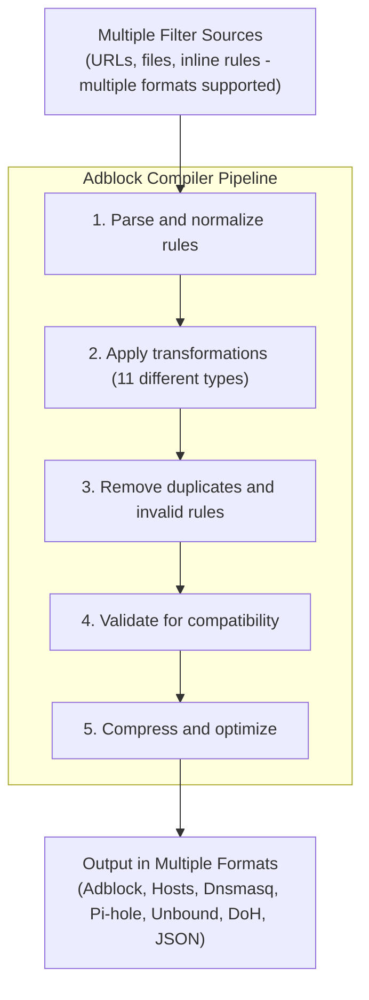
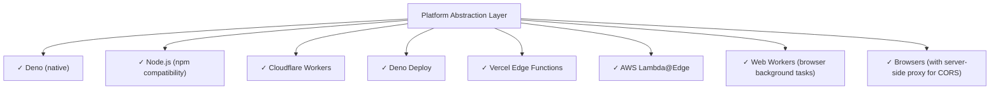

# Introducing Adblock Compiler: A Compiler-as-a-Service for Filter Lists

**Published: 2026**

Combining filter lists from multiple sources shouldn't be complex. Whether you're managing a DNS blocker, ad blocker, or content filtering system, the ability to merge, validate, and optimize rules is essential. Today, we're excited to introduce **Adblock Compiler**—a modern, production-ready solution for transforming and compiling filter lists at scale.

## What is Adblock Compiler?

**Adblock Compiler** is a powerful **Compiler-as-a-Service** package (v0.11.4) that simplifies the creation and management of filter lists. It's a Deno-native rewrite of the original `@adguard/hostlist-compiler`, offering improved performance, no Node.js dependencies, and support for modern edge platforms.

At its core, Adblock Compiler does one thing exceptionally well: **it transforms, optimizes, and combines adblock filter lists from multiple sources into production-ready blocklists.**



## Why Adblock Compiler?

Managing filter lists manually is tedious and error-prone. You need to:

- Combine lists from multiple sources and maintainers
- Handle different formats (adblock syntax, /etc/hosts, etc.)
- Remove duplicates while maintaining performance
- Validate rules for your specific platform
- Optimize for cache and memory
- Automate updates and deployments

**Adblock Compiler handles all of this automatically.**

## Key Features

### 1. 🎯 Multi-Source Compilation

Merge filter lists from any combination of sources:

```json
{
  "name": "My Custom Blocklist",
  "sources": [
    {
      "source": "https://adguardteam.github.io/AdGuardSDNSFilter/Filters/filter.txt",
      "type": "adblock",
      "transformations": ["RemoveComments", "Validate"]
    },
    {
      "source": "/etc/hosts.local",
      "type": "hosts",
      "transformations": ["Compress"]
    },
    {
      "source": "https://example.com/custom-rules.txt",
      "exclusions": ["whitelist.example.com"]
    }
  ],
  "transformations": ["Deduplicate", "RemoveEmptyLines"]
}
```

### 2. ⚡ Performance & Optimization

Adblock Compiler delivers impressive performance metrics:

- **Gzip compression**: 70-80% cache size reduction
- **Smart deduplication**: Removes redundant rules while preserving order
- **Request deduplication**: Avoids fetching the same source twice
- **Intelligent caching**: Detects changes and rebuilds only when needed
- **Batch processing**: Compile up to 10 lists in parallel

### 3. 🔄 11 Built-in Transformations

Transform and clean your filter lists with a comprehensive suite:

1. **ConvertToAscii** - Convert internationalized domains (IDN) to ASCII
2. **RemoveComments** - Strip comment lines (! and # prefixes)
3. **Compress** - Convert hosts→adblock syntax, remove redundancies
4. **RemoveModifiers** - Remove unsupported rule modifiers for DNS blockers
5. **Validate** - Remove invalid/incompatible rules for DNS blockers
6. **ValidateAllowIp** - Like Validate, but preserves IP addresses
7. **Deduplicate** - Remove duplicates while preserving order
8. **InvertAllow** - Convert blocking rules to whitelist rules
9. **RemoveEmptyLines** - Clean up empty lines
10. **TrimLines** - Remove leading/trailing whitespace
11. **InsertFinalNewLine** - Ensure proper file termination

**Important**: Transformations always execute in this specific order, ensuring predictable results.

### 4. 🌐 Platform Support

Adblock Compiler runs everywhere:



The platform abstraction layer means you write code once and deploy anywhere. A production-ready Cloudflare Worker implementation is included in the repository.

### 5. 📡 Real-time Progress & Async Processing

Three ways to compile filter lists:

**Synchronous**:
```bash
# Simple command-line compilation
adblock-compiler -c config.json -o output.txt
```

**Streaming**:
```typescript
// Real-time progress with Server-Sent Events
POST /compile/stream
Response: event stream with progress updates
```

**Asynchronous**:
```typescript
// Background queue-based compilation
POST /compile/async
Response: { jobId: "uuid", queuePosition: 2 }
```

### 6. 🎨 Modern Web Interface

The included web UI provides:

- **Dashboard** - Real-time metrics and queue monitoring
- **Compiler Interface** - Visual filter list configuration
- **Admin Panel** - Storage and configuration management
- **API Testing** - Direct endpoint testing interface
- **Validation UI** - Rule validation and AST visualization

```
┌────────────────────────────────────────────────────┐
│  Adblock Compiler - Interactive Web Dashboard      │
├────────────────────────────────────────────────────┤
│                                                    │
│  Compilation Queue: [████████░░] 8 pending       │
│  Average Time: 2.3s                              │
│                                                    │
│  ┌─────────────────────────────────────────────┐ │
│  │ Configuration                               │ │
│  ├─────────────────────────────────────────────┤ │
│  │ Name:        My Blocklist                  │ │
│  │ Sources:     3 configured                  │ │
│  │ Rules (in):  500,000                       │ │
│  │ Rules (out): 125,000 (after optimization)  │ │
│  │ Size (raw):  12.5 MB                       │ │
│  │ Size (gz):   1.8 MB (85% reduction)        │ │
│  │                                             │ │
│  │ [Compile] [Download] [Share]               │ │
│  └─────────────────────────────────────────────┘ │
│                                                    │
└────────────────────────────────────────────────────┘
```

### 7. 📚 Full OpenAPI 3.0.3 Documentation

Complete REST API with:

- Interactive HTML documentation (Redoc)
- Postman collections for testing
- Contract testing for CI/CD
- Client SDK code generation support
- Full request/response examples

### 8. 🎪 Batch Processing

Compile multiple lists simultaneously:

```typescript
POST /compile/batch
{
  "configurations": [
    { "name": "List 1", ... },
    { "name": "List 2", ... },
    { "name": "List 3", ... }
  ]
}
```

Process up to 10 lists in parallel with automatic queuing and deduplication.

## Getting Started

### Installation

**Using Deno (recommended)**:
```bash
deno run --allow-read --allow-write --allow-net jsr:@jk-com/adblock-compiler \
  -c config.json -o output.txt
```

**Using Docker**:
```bash
git clone https://github.com/jaypatrick/adblock-compiler.git
cd adblock-compiler
docker compose up -d
# Access at http://localhost:8787
```

**Build from source**:
```bash
deno task build
# Creates standalone `adblock-compiler` executable
```

### Quick Example

Convert and compress a blocklist:

```bash
adblock-compiler \
  -i hosts.txt \
  -i adblock.txt \
  -o compiled-blocklist.txt
```

Or use a configuration file for complex scenarios:

```bash
adblock-compiler -c config.json -o output.txt
```

### TypeScript API

```typescript
import { compile } from 'jsr:@jk-com/adblock-compiler';
import type { IConfiguration } from 'jsr:@jk-com/adblock-compiler';

const config: IConfiguration = {
  name: 'Custom Blocklist',
  sources: [
    {
      source: 'https://adguardteam.github.io/AdGuardSDNSFilter/Filters/filter.txt',
      transformations: ['RemoveComments', 'Validate'],
    },
  ],
  transformations: ['Deduplicate'],
};

const result = await compile(config);
await Deno.writeTextFile('blocklist.txt', result.join('\n'));
```

## Architecture & Extensibility

### Core Components

**FilterCompiler** - The main orchestrator that validates configuration, compiles sources, and applies transformations.

**WorkerCompiler** - A platform-agnostic compiler that works in edge runtimes (Cloudflare Workers, Lambda@Edge, etc.) without file system access.

**TransformationRegistry** - A plugin system for rule transformations. Extensible and composable.

**PlatformDownloader** - Handles network requests with retry logic, cycle detection for includes, and preprocessor directives.

### Extensibility

Create custom transformations:

```typescript
import { SyncTransformation, TransformationType } from '@jk-com/adblock-compiler';

class RemoveSocialMediaTransformation extends SyncTransformation {
  public readonly type = 'RemoveSocialMedia' as TransformationType;
  public readonly name = 'Remove Social Media';

  private socialDomains = ['facebook.com', 'twitter.com', 'instagram.com'];

  public executeSync(rules: string[]): string[] {
    return rules.filter((rule) => {
      return !this.socialDomains.some((domain) => rule.includes(domain));
    });
  }
}

// Register and use
const registry = new TransformationRegistry();
registry.register('RemoveSocialMedia' as any, new RemoveSocialMediaTransformation());
```

Implement custom content fetchers:

```typescript
class RedisBackedFetcher implements IContentFetcher {
  async canHandle(source: string): Promise<boolean> {
    return source.startsWith('redis://');
  }

  async fetch(source: string): Promise<string> {
    const key = source.replace('redis://', '');
    return await redis.get(key);
  }
}
```

## Use Cases

### 1. **DNS Blockers** (AdGuard Home, Pi-hole)
Compile DNS-compatible filter lists from multiple sources, validate rules, and automatically deploy updates.

### 2. **Ad Blockers**
Merge multiple ad-blocking lists, convert between formats, and optimize for performance.

### 3. **Content Filtering**
Combine content filters from different maintainers with custom exclusions and inclusions.

### 4. **List Maintenance**
Automate filter list generation, updates, and quality assurance in CI/CD pipelines.

### 5. **Multi-Source Compilation**
Create master lists that aggregate specialized blocklists (malware, tracking, spam, etc.).

### 6. **Format Conversion**
Convert between /etc/hosts, adblock, Dnsmasq, Pi-hole, and other formats.

## Deployment Options

### Local CLI

```bash
adblock-compiler -c config.json -o output.txt
```

### Cloudflare Workers

Production-ready worker with web UI, REST API, WebSocket support, and queue integration:

```bash
npm install
deno task wrangler:dev   # Local development
deno task wrangler:deploy  # Deploy to Cloudflare
```

Access at your Cloudflare Workers URL with:
- **Web UI** at `/`
- **API** at `POST /compile`
- **Streaming** at `POST /compile/stream`
- **Async Queue** at `POST /compile/async`

### Docker

Complete containerized deployment with:

```bash
docker compose up -d
# Access at http://localhost:8787
```

Includes multi-stage build, health checks, and production-ready configuration.

### Edge Functions (Vercel, AWS Lambda@Edge, etc.)

Deploy anywhere with standard Fetch API support:

```typescript
export default async function handler(request: Request) {
  const compiler = new WorkerCompiler({
    preFetchedContent: { /* sources */ },
  });
  const result = await compiler.compile(config);
  return new Response(result.join('\n'));
}
```

## Advanced Features

### Circuit Breaker with Exponential Backoff

Automatic retry logic for unreliable sources:

```
Request fails
      ↓
Retry after 1s (2^0)
      ↓
Retry after 2s (2^1)
      ↓
Retry after 4s (2^2)
      ↓
Retry after 8s (2^3)
      ↓
Max retries exceeded → Fallback or error
```

### Preprocessor Directives

Advanced compilation with conditional includes:

```txt
!#if (os == "windows")
! Windows-specific rules
||example.com^$os=windows
!#endif

!#include https://example.com/rules.txt
```

### Visual Diff Reporting

Track what changed between compilations:

```
Rules added:     2,341 (+12%)
Rules removed:   1,203 (-6%)
Rules modified:  523
Size change:     +2.1 MB (→ 12.5 MB)
Compression:     85% → 87%
```

### Incremental Compilation

Cache source content and detect changes:

- Skip recompilation if sources haven't changed
- Automatic cache invalidation with checksums
- Configurable storage backends

### Conflict Detection

Identify and report conflicting rules:

- Rules that contradict each other
- Incompatible modifiers
- Optimization suggestions

## Performance Metrics

The package includes built-in benchmarking and diagnostics:

```typescript
// Compile with metrics
const result = await compiler.compileWithMetrics(config, true);

// Output includes:
// - Parse time
// - Transformation times (per transformation)
// - Compilation time (total)
// - Output size (raw and compressed)
// - Cache hit rate
// - Memory usage
```

Integration with Cloudflare Tail Workers for real-time monitoring and error tracking.

## Real-World Example

Here's a complete example: creating a master blocklist from multiple sources:

```json
{
  "name": "Master Security Blocklist",
  "description": "Comprehensive blocklist combining security, privacy, and tracking filters",
  "homepage": "https://example.com",
  "license": "GPL-3.0",
  "version": "1.0.0",
  "sources": [
    {
      "name": "AdGuard DNS Filter",
      "source": "https://adguardteam.github.io/AdGuardSDNSFilter/Filters/filter.txt",
      "type": "adblock",
      "transformations": ["RemoveComments", "Validate"]
    },
    {
      "name": "Steven Black's Hosts",
      "source": "https://raw.githubusercontent.com/StevenBlack/hosts/master/hosts",
      "type": "hosts",
      "transformations": ["Compress"],
      "exclusions": ["whitelist.txt"]
    },
    {
      "name": "Local Rules",
      "source": "local-rules.txt",
      "type": "adblock",
      "transformations": ["RemoveComments"]
    }
  ],
  "transformations": ["Deduplicate", "RemoveEmptyLines", "InsertFinalNewLine"],
  "exclusions": ["trusted-domains.txt"]
}
```

Compile and deploy:

```bash
adblock-compiler -c blocklist-config.json -o blocklist.txt

# Or use CI/CD automation
deno run --allow-read --allow-write --allow-net --allow-env \
  jsr:@jk-com/adblock-compiler/cli -c config.json -o output.txt
```

## Community & Feedback

Adblock Compiler is open-source and actively maintained:

- **Repository**: https://github.com/jaypatrick/adblock-compiler
- **JSR Package**: https://jsr.io/@jk-com/adblock-compiler
- **Issues & Discussions**: https://github.com/jaypatrick/adblock-compiler/issues
- **Live Demo**: https://adblock.jaysonknight.com/

## Summary

Adblock Compiler brings modern development practices to filter list management. Whether you're:

- **Managing a single blocklist** - Use the CLI for quick compilation
- **Running a production service** - Deploy to Cloudflare Workers or Docker
- **Building an application** - Import the library and use the TypeScript API
- **Automating updates** - Integrate into CI/CD pipelines

Adblock Compiler provides the tools, performance, and flexibility you need.

Key takeaways:

✅ **Multi-source** - Combine lists from any source
✅ **Universal** - Run anywhere (Deno, Node, Workers, browsers)
✅ **Optimized** - 11 transformations for maximum performance
✅ **Extensible** - Plugin system for custom transformations and fetchers
✅ **Production-ready** - Used in real-world deployments
✅ **Developer-friendly** - Full TypeScript support, OpenAPI docs, web UI

Get started today:

```bash
# Try it immediately
deno run --allow-read --allow-write --allow-net jsr:@jk-com/adblock-compiler \
  -i https://adguardteam.github.io/AdGuardSDNSFilter/Filters/filter.txt \
  -o my-blocklist.txt

# Or explore the interactive web UI
docker compose up -d
```

## Resources

- 📚 **[Quick Start Guide](guides/quick-start.md)** - Get started in minutes
- 🔧 **[API Documentation](api/README.md)** - REST API reference
- 🐳 **[Docker Deployment](deployment/docker.md)** - Production deployment
- 📖 **[Extensibility Guide](../development/EXTENSIBILITY.md)** - Build custom features
- 🌐 **[Live Demo](https://adblock.jaysonknight.com/)** - Try it now

---

**Ready to simplify your filter list management? [Get started with Adblock Compiler](guides/quick-start.md) today.**
